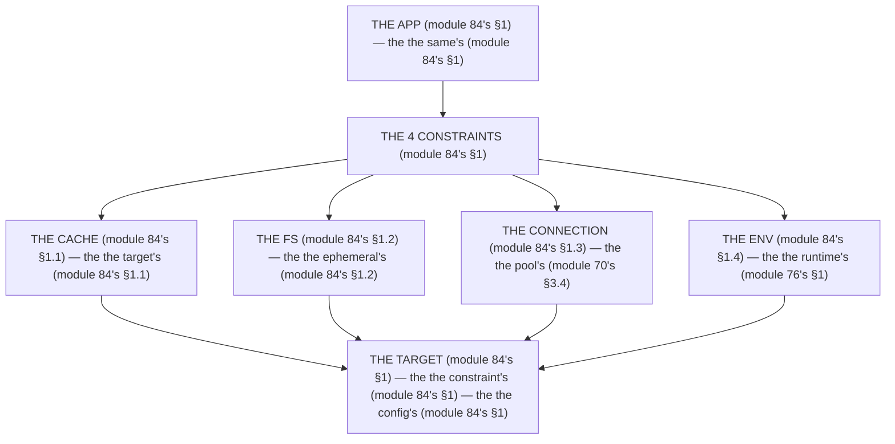

# Module 84 — Deployment Targets: Vercel vs Docker/Node vs Other

**Phase 22: Deployment · Module 84 of 101**

> **Where does this run?** Deployment is **infra** (the target, module 84's §1); the app is the *same* (module 84's §1) — the *implications* are the *constraint* (module 84's §1). The module-84's standing rule (module 70's pool rule + module 66's fs rule, now the target level): **the target is the *constraint* (module 84's §1) — Vercel owns the *cache + the scale + the fs* (the fs is *ephemeral* — module 66's), Docker/Node owns the *process + the connections* (the pool is *yours* — module 70's), and *both* own the *env* (the secret is the *runtime's* — module 76's); the app's *code* is the same (module 84's §1), the *config* is the target's (module 84's §1)** (module 84's §1).

---

## 1. Concept — The 4 constraints (the map)

**The cache's** (module 84's §1.1): the *the target's* (module 84's §1.1) — the *module-84's line: the cache is the target's* (module 84's §1.1) — the *module-20's* *tag* (module 20's).

**The fs's** (module 84's §1.2): the *the ephemeral's* (module 84's §1.2) — the *module-84's line: the fs is the ephemeral's* (module 66's) — the *module-66's* *S3* (module 66's).

**The connection's** (module 84's §1.3): the *the pool's* (module 70's §3.4) — the *module-84's line: the connection is the pool's* (module 70's §3.4) — the *module-70's* *PgBouncer* (module 70's §3.4).

**The env's** (module 84's §1.4): the *the runtime's* (module 76's §1) — the *module-84's line: the env is the runtime's* (module 76's §1) — the *module-76's* *no-leak* (module 76's §1).

## 2. Mental Model — The 4 constraints (drawn)



## 3. Architecture — The 3 targets (the table)

`FILE: docs/deployment-targets.md` (production pattern — the module-84's §3: the table's)

```md
## THE 3 TARGETS (module 84's §3 — the the constraint's (module 84's §1))

| Constraint (module 84's §3) | Vercel (module 84's §3.1) | Docker/Node (module 84's §3.2) | Other (module 84's §3.3) |
|---|---|---|---|
| The cache's (module 84's §1.1) | The managed's (module 84's §3.1) — the the CDN's (module 84's §3.1) | The self's (module 84's §3.2) — the the CDN's + the cache's (module 84's §3.2) | The managed's (module 84's §3.3) — the the target's (module 84's §3.3) |
| The fs's (module 84's §1.2) | The ephemeral's (module 66's) — the the no `public/`'s (module 66's) | The writable's (module 84's §3.2) — the the no `public/`'s (module 66's) | The ephemeral's (module 66's) — the the no `public/`'s (module 66's) |
| The connection's (module 84's §1.3) | The function's (module 84's §3.1) — the the pool's (module 70's §3.4) | The process's (module 84's §3.2) — the the pool's (module 70's §3.4) | The function's (module 84's §3.3) — the the pool's (module 70's §3.4) |
| The env's (module 84's §1.4) | The dashboard's (module 84's §3.1) — the the no-leak's (module 76's §1) | The `.env`'s (module 84's §3.2) — the the no-leak's (module 76's §1) | The secret's manager (module 84's §3.3) — the the no-leak's (module 76's §1) |
| The preview's (module 84's §3.4) | The built-in's (module 84's §3.1) — the the no extra's (module 84's §3.4) | The extra's (module 84's §3.2) — the the CI's (module 86's) | The target's (module 84's §3.3) — the the extra's (module 84's §3.4) |

/* THE RULE (module 84's §3): the the target's is the constraint's (module 84's §1) — the the app's is the same's (module 84's §1) — the the config's is the target's (module 84's §1) */
```

## 4. Production Code — The Vercel's (module 84's §4.1)

`FILE: vercel.json` (production pattern — the module-84's §4.1: the config's)

```json
{
  "$schema": "https://openapi.vercel.sh/vercel.json",
  "functions": {
    "src/app/api/[[...slug]]/route.ts": { "maxDuration": 30 }
  },
  "regions": ["cdg1"]
}
```

**The module-84's line:** the *function's* (module 84's §3.1) — the *config's* (module 84's §1) — the *no `public/`'s* (module 66's).

## 5. Production Code — The Docker's (module 84's §4.2)

`FILE: Dockerfile` (production pattern — the module-84's §4.2: the config's)

```dockerfile
# THE DOCKER (module 84's §4.2) — the the config's (module 84's §1) — the the no `public/`'s (module 66's):
FROM node:24-alpine AS base   # the module-84's line: the node's 24's (module 84's §4.2)
FROM base AS deps   # the module-84's line: the deps's (module 84's §4.2)
RUN corepack enable   # the module-84's line: the pnpm's (module 84's §4.2)
COPY package.json pnpm-lock.yaml ./
RUN pnpm install --frozen-lockfile
FROM base AS build   # the module-84's line: the build's (module 84's §4.2)
COPY --from=deps /app/node_modules ./node_modules
COPY . .
RUN pnpm build
FROM base AS run   # the module-84's line: the run's (module 84's §4.2)
ENV NODE_ENV=production
COPY --from=build /app ./
EXPOSE 3000
CMD ["pnpm", "start"]
```

**The module-84's line:** the *node's 24's* (module 84's §4.2) — the *config's* (module 84's §1) — the *no `public/`'s* (module 66's).

## 6. Common Mistakes (the target's failures)

| Mistake | The symptom | Fix |
|---|---|---|
| **The `public/`'s** (module 66's line violated) | the *module-84's line: the fs is the ephemeral's* (module 66's) — the *the `public/`'s is the *no's* (module 66's) — the *module-84's line: the no `public/`* (module 66's) — the *no `public/`* (module 66's)* | the *the S3's (module 66's) — the *module-84's line: the fs is the ephemeral's* (module 66's)* |
| **The no pool** (module 70's §3.4's line violated) | the *module-84's line: the connection is the pool's* (module 70's §3.4) — the *the no pool's is the *no's* (module 70's §3.4) — the *module-84's line: the no pool* (module 70's §3.4) — the *no pool* (module 70's §3.4)* | the *the PgBouncer's (module 70's §3.4) — the *module-84's line: the connection is the pool's* (module 70's §3.4)* |
| **The `NEXT_PUBLIC_`'s secret** (module 76's §1's line violated) | the *module-84's line: the env is the runtime's* (module 76's §1) — the *the `NEXT_PUBLIC_`'s secret's is the *no's* (module 76's §1) — the *module-84's line: the no `NEXT_PUBLIC_`'s secret* (module 76's §1) — the *no `NEXT_PUBLIC_`'s secret* (module 76's §1)* | the *the no-leak's (module 76's §1) — the *module-84's line: the env is the runtime's* (module 76's §1)* |
| **The no CDN** (module 84's §1.1's line violated) | the *module-84's line: the cache is the target's* (module 84's §1.1) — the *the no CDN's is the *no's* (module 84's §1.1) — the *module-84's line: the no CDN* (module 84's §1.1) — the *no CDN* (module 84's §1.1)* | the *the CDN's (module 84's §3.2) — the *module-84's line: the cache is the target's* (module 84's §1.1)* |
| **The target's code** (module 84's §1's line violated) | the *module-84's line: the app's is the same's* (module 84's §1) — the *the target's code's is the *no's* (module 84's §1) — the *module-84's line: the no target's code* (module 84's §1) — the *no target's code* (module 84's §1)* | the *the config's (module 84's §1) — the *module-84's line: the app's is the same's* (module 84's §1)* |
| **The no preview** (module 84's §3.4's line violated) | the *module-84's line: the preview's* (module 84's §3.4) — the *the no preview's is the *no's* (module 84's §3.4) — the *module-84's line: the no preview* (module 84's §3.4) — the *no preview* (module 84's §3.4)* | the *the CI's (module 86's) — the *module-84's line: the preview's* (module 84's §3.4)* |

## 7. Security Notes

- **The no `public/`'s** (module 66's): the *module-84's line: the fs is the ephemeral's* (module 66's) — the *module-66's* *deep-dive* (module 66's).
- **The no-leak's** (module 76's §1): the *module-84's line: the env is the runtime's* (module 76's §1) — the *module-76's* *deep-dive* (module 76's).
- **The pool's** (module 70's §3.4): the *module-84's line: the connection is the pool's* (module 70's §3.4) — the *module-70's* *deep-dive* (module 70's).

## 8. Performance Notes

- **The cache's** (module 84's §1.1): the *module-84's line: the cache is the target's* (module 84's §1.1) — the *the TTFB's* (module 70's §1.1).
- **The pool's** (module 70's §3.4): the *module-84's line: the connection is the pool's* (module 70's §3.4) — the *the 20's* (module 70's §3.4).
- **The fs's** (module 84's §1.2): the *module-84's line: the fs is the ephemeral's* (module 66's) — the *the S3's* (module 66's).

## 9. Exercise

**Beginner.** *The Vercel's* (module 84's §4.1): the *the `vercel.json`'s* (module 4.1's) + the *the no `public/`'s* (module 4.1's) — *build it* — the *artifact: the config's* (module 4.1's).

**Intermediate.** *The Docker's* (module 84's §4.2): the *the `Dockerfile`'s* (module 4.2's) + the *the no `public/`'s* (module 4.2's) — *build it* — the *artifact: the config's* (module 4.2's).

**Production.** *The table's* (module 84's §3): the *the 4's constraints* (module 3's) + the *the 3's targets* (module 3's) — *build the table* — the *artifact: the table's* (module 3's).

## 10. Official Documentation

- Vercel: https://vercel.com/docs
- Next.js: Deployment: https://nextjs.org/docs/app/building-your-application/deploying
- Docker: https://docs.docker.com/
- The module-70's server: the module-70 (the phase-18's file-02)
- The module-76's env: the module-76 (the phase-19's file-03)

## 11. What You Should Know Before Continuing

- [ ] I can state the *4 constraints* (module 1's: the cache/fs/connection/env) — the *module-84's line: the target is the constraint's* (module 1's)
- [ ] I know the *cache is the target's* (module 1.1's) — the *the CDN's* (module 3's)
- [ ] I know the *fs is the ephemeral's* (module 1.2's) — the *the no `public/`'s* (module 66's)
- [ ] I know the *connection is the pool's* (module 1.3's) — the *the PgBouncer's* (module 70's §3.4)
- [ ] I know the *env is the runtime's* (module 1.4's) — the *the no-leak's* (module 76's §1)
- [ ] I've done the *Vercel's* (module 9's beginner) + the *Docker's* (module 9's intermediate) + the *table's* (module 9's production) — the *artifacts* (module 20's)

**Next:** Module 85 — Node vs Edge Runtimes (the *the runtime's* — the *module-85's line: the runtime is the constraint's* (module 85's)).
