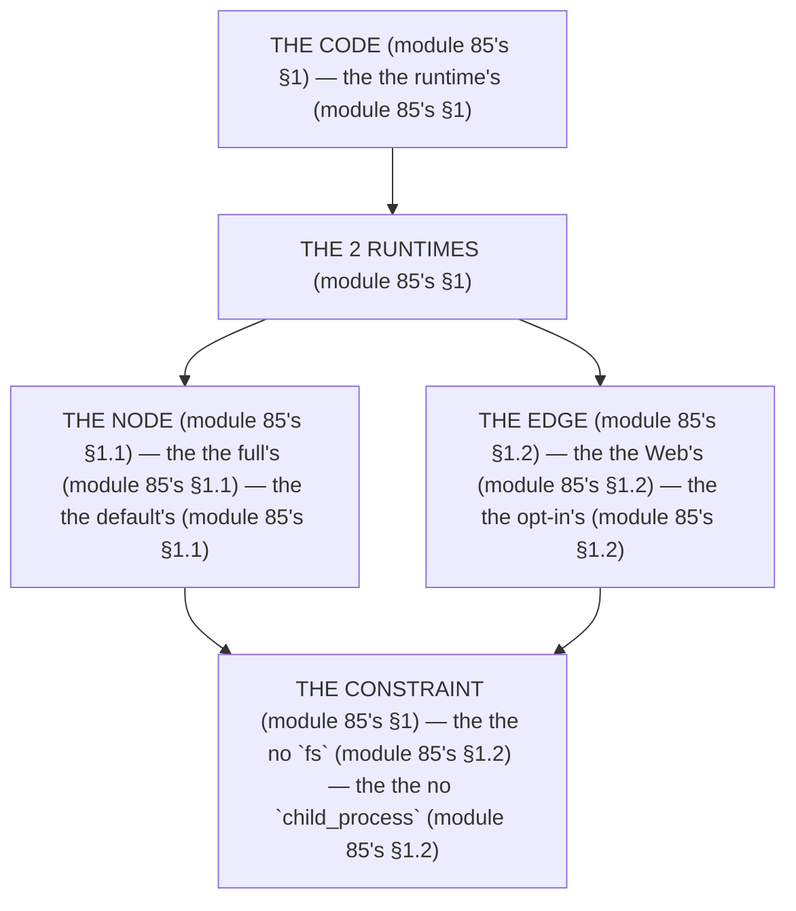

# Module 85 — Node vs Edge Runtimes: The `runtime` Export and the Compatibility Matrix

**Phase 22: Deployment · Module 85 of 101**

> **Where does this run?** The *Node* runtime is **`[SERVER]`** (the full Node API — module 85's §1); the *Edge* runtime is **`[SERVER]`** too, but a *smaller* API (the Web platform — module 85's §1). The module-85's standing rule (module 84's constraint rule, now the runtime level): **the runtime is the *constraint* (module 85's §1) — Node has the *full API* (module 85's §1), Edge has the *Web API* (module 85's §1); the *default* is Node (module 85's §1), and the *Edge* is the *opt-in* (the `export const runtime = 'edge'` — module 85's §1); the *cold start* is the *trade-off* (module 85's §1)** (module 85's §1).

---

## 1. Concept — The 2 runtimes (the map)

**The Node's** (module 85's §1.1): the *the full's* (module 85's §1.1) — the *module-85's line: the Node is the full's* (module 85's §1.1) — the *the default's* (module 85's §1.1).

**The Edge's** (module 85's §1.2): the *the Web's* (module 85's §1.2) — the *module-85's line: the Edge is the Web's* (module 85's §1.2) — the *the opt-in's* (module 85's §1.2).

## 2. Mental Model — The 2 runtimes (drawn)



## 3. Architecture — The compatibility matrix (the table)

`FILE: docs/runtime-matrix.md` (production pattern — the module-85's §3: the table's)

```md
## THE COMPATIBILITY MATRIX (module 85's §3 — the the table's (module 85's §3))

| API (module 85's §3) | Node (module 85's §1.1) | Edge (module 85's §1.2) |
|---|---|---|
| `fs` (module 85's §3.1) | ✅ | ❌ |
| `child_process` (module 85's §3.2) | ✅ | ❌ |
| `crypto` (module 85's §3.3) | ✅ (`node:crypto`) | ❌ (use `crypto.subtle`) |
| `fetch` (module 85's §3.4) | ✅ | ✅ |
| `Request`/`Response` (module 85's §3.5) | ✅ | ✅ |
| `setTimeout` (module 85's §3.6) | ✅ | ⚠️ (no long) |
| `ImageResponse` (module 61's) | ✅ | ✅ (the edge's) |
| The DB's driver (module 5's) | ✅ | ⚠️ (check) |

/* THE RULE (module 85's §3): the the runtime's is the constraint's (module 85's §1) — the the Node's is the full's (module 85's §1.1) — the the Edge's is the Web's (module 85's §1.2) */
```

## 4. Production Code — The runtime's export (module 85's §4)

`FILE: src/app/api/og/route.ts` (production pattern — [SERVER] — the module-85's §4: the edge's)

```ts
// THE EDGE (module 85's §4) — the the Web's (module 85's §1.2) — the the opt-in's (module 85's §1.2):
import { ImageResponse } from 'next/og'   /* the module-61's line: the OG's (module 61's) */

export const runtime = 'edge'   /* the module-85's line: the opt-in's (module 85's §1.2) */

export async function GET(req: Request) {
  const { title } = new URL(req.url).searchParams   /* the module-85's line: the param's (module 85's §4) */
  return new ImageResponse(
    <div style={{ display: 'flex', width: '100%', height: '100%' }}>{title}</div>,   /* the module-85's line: the JSX's (module 61's) */
    { width: 1200, height: 630 }   /* the module-61's line: the 1200x630's (module 61's) */
  )
}
```

**The module-85's line:** the *Web's* (module 85's §1.2) — the *opt-in's* (module 85's §1.2) — the *no `fs`* (module 85's §1.2).

## 5. Production Code — The Node's (module 85's §4.1)

`FILE: src/app/api/report/route.ts` (production pattern — [SERVER] — the module-85's §4.1: the full's)

```ts
// THE NODE (module 85's §4.1) — the the full's (module 85's §1.1) — the the default's (module 85's §1.1):
import { db } from '@/db'   /* the module-5's line: the DB's (module 5's) */

// export const runtime = 'nodejs'   /* the module-85's line: the default's (module 85's §1.1) — the the no export's (module 85's §4.1) */

export async function GET() {
  /* THE NODE'S (module 85's §4.1) — the the full's (module 85's §1.1):
     const rows = await db.select().from(...)   (module 85's §4.1) — the the DB's (module 5's)
     return Response.json(rows)   (module 85's §4.1) */
}
```

**The module-85's line:** the *full's* (module 85's §1.1) — the *default's* (module 85's §1.1) — the *DB's* (module 5's).

## 6. Common Mistakes (the runtime's failures)

| Mistake | The symptom | Fix |
|---|---|---|
| **The Edge's `fs`** (module 85's §1.2's line violated) | the *module-85's line: the Edge is the Web's* (module 85's §1.2) — the *the Edge's `fs`'s is the *no's* (module 85's §3.1) — the *module-85's line: the no Edge's `fs`* (module 85's §3.1) — the *no Edge's `fs`* (module 85's §3.1)* | the *the Node's (module 85's §1.1) — the *module-85's line: the Node is the full's* (module 85's §1.1)* |
| **The Node's OG** (module 85's §1.1's line violated) | the *module-85's line: the Edge is the Web's* (module 85's §1.2) — the *the Node's OG's is the *no's* (module 61's) — the *module-85's line: the no Node's OG* (module 61's) — the *no Node's OG* (module 61's)* | the *the Edge's (module 85's §4) — the *module-85's line: the Edge is the Web's* (module 85's §1.2)* |
| **The no `runtime`** (module 85's §1's line violated) | the *module-85's line: the runtime's is the constraint's* (module 85's §1) — the *the no `runtime`'s is the *no's* (module 85's §1) — the *module-85's line: the no `runtime`* (module 85's §1) — the *no `runtime`* (module 85's §1)* | the *the `runtime`'s export (module 85's §4) — the *module-85's line: the runtime's is the constraint's* (module 85's §1)* |
| **The Edge's DB** (module 85's §1.2's line violated) | the *module-85's line: the Edge is the Web's* (module 85's §1.2) — the *the Edge's DB's is the *no's* (module 5's) — the *module-85's line: the no Edge's DB* (module 5's) — the *no Edge's DB* (module 5's)* | the *the Node's (module 85's §1.1) — the *module-85's line: the Node is the full's* (module 85's §1.1)* |
| **The long's Edge** (module 85's §1.2's line violated) | the *module-85's line: the Edge is the Web's* (module 85's §1.2) — the *the long's Edge's is the *no's* (module 85's §3.6) — the *module-85's line: the no long's Edge* (module 85's §3.6) — the *no long's Edge* (module 85's §3.6)* | the *the Node's (module 85's §1.1) — the *module-85's line: the Node is the full's* (module 85's §1.1)* |
| **The cold's start** (module 85's §1's line violated) | the *module-85's line: the cold start's* (module 85's §1) — the *the cold's start's is the *no's* (module 85's §1) — the *module-85's line: the no cold's start* (module 85's §1) — the *no cold's start* (module 85's §1)* | the *the Edge's (module 85's §1.2) — the *module-85's line: the cold start's* (module 85's §1)* |

## 7. Security Notes

- **The no `fs`** (module 85's §1.2): the *module-85's line: the Edge is the Web's* (module 85's §1.2) — the *module-74's* *deep-dive* (module 74's).
- **The DB's** (module 5's): the *module-85's line: the Node is the full's* (module 85's §1.1) — the *module-5's* *deep-dive* (module 5's).
- **The cold's** (module 85's §1): the *module-85's line: the cold start's* (module 85's §1) — the *module-70's* *deep-dive* (module 70's).

## 8. Performance Notes

- **The Edge's** (module 85's §1.2): the *module-85's line: the cold start's* (module 85's §1) — the *the no container's* (module 85's §1.2).
- **The Node's** (module 85's §1.1): the *module-85's line: the Node is the full's* (module 85's §1.1) — the *the container's* (module 85's §1.1).
- **The OG's** (module 61's): the *module-85's line: the Edge is the Web's* (module 85's §1.2) — the *the 1200x630's* (module 61's).

## 9. Exercise

**Beginner.** *The compatibility matrix's* (module 85's §3): the *the 8's rows* (module 3's) + the *the 2's columns* (module 3's) — *build the table* — the *artifact: the matrix's* (module 3's).

**Intermediate.** *The runtime's export's* (module 85's §4): the *the `runtime = 'edge`'s* (module 4's) + the *the `ImageResponse`'s* (module 4's) — *build it* — the *artifact: the export's* (module 4's).

**Production.** *The no `fs`'s* (module 85's §1.2): the *the audit's* (module 85's §1.2) + the *the no Edge's `fs`* (module 85's §3.1) — *build the audit* — the *artifact: the audit's* (module 85's §1.2).

## 10. Official Documentation

- Next.js: `runtime`: https://nextjs.org/docs/app/api-reference/file-conventions/route#runtime
- Next.js: Edge Runtime: https://nextjs.org/docs/app/getting-started/runtime-configuration
- Next.js: `ImageResponse`: https://nextjs.org/docs/app/api-reference/functions/image-response
- The module-84's targets: the module-84 (the phase-22's file-01)

## 11. What You Should Know Before Continuing

- [ ] I can state the *2 runtimes* (module 1's: the Node/Edge) — the *module-85's line: the runtime is the constraint's* (module 1's)
- [ ] I know the *Node is the full's* (module 1.1's) — the *the default's* (module 1.1's)
- [ ] I know the *Edge is the Web's* (module 1.2's) — the *the opt-in's* (module 1.2's)
- [ ] I know the *no `fs`* (module 3.1's) — the *the no `child_process`* (module 3.2's)
- [ ] I know the *`ImageResponse`* (module 61's) — the *the Edge's* (module 4's)
- [ ] I know the *cold start's* (module 1's) — the *the trade-off's* (module 1's)
- [ ] I've done the *matrix's* (module 9's beginner) + the *export's* (module 9's intermediate) + the *audit's* (module 9's production) — the *artifacts* (module 20's)

**Next:** Module 86 — Docker & CI/CD (the *the pipeline's* — the *module-86's line: the pipeline is the gate's* (module 86's)).
