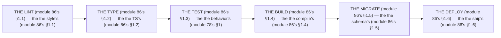

# Module 86 — Docker & CI/CD: Multi-Stage Build, the Pipeline, Preview Deploys

**Phase 22: Deployment · Module 86 of 101**

> **Where does this run?** The Docker build is **CI** (the pipeline, module 86's §1); the deploy is **infra** (the target, module 84's). The module-86's standing rule (module 78's no-"it works" rule, now the pipeline level): **the pipeline is the *gate* (module 86's §1) — *lint → type → test → build → migrate → deploy* (module 86's §1); a *red* step *stops* the deploy (module 86's §1); the *multi-stage* Dockerfile keeps the *build deps* out of the *run image* (module 86's §1); and the *preview deploy* is per-branch (module 84's §3.4) — never per-local-machine (module 78's §4)** (module 86's §1).

---

## 1. Concept — The 6 gates (the map)

**The lint's** (module 86's §1.1): the *the style's* (module 86's §1.1) — the *module-86's line: the lint is the style's* (module 86's §1.1) — the *the fast's* (module 86's §1.1).

**The type's** (module 86's §1.2): the *the TS's* (module 86's §1.2) — the *module-86's line: the type is the TS's* (module 86's §1.2) — the *the no runtime's* (module 86's §1.2).

**The test's** (module 86's §1.3): the *the behavior's* (module 78's §1) — the *module-86's line: the test is the behavior's* (module 78's §1) — the *module-78's* *pyramid* (module 78's).

**The build's** (module 86's §1.4): the *the compile's* (module 86's §1.4) — the *module-86's line: the build is the compile's* (module 86's §1.4) — the *the no error's* (module 86's §1.4).

**The migrate's** (module 86's §1.5): the *the schema's* (module 86's §1.5) — the *module-86's line: the migrate is the schema's* (module 86's §1.5) — the *module-5's* *Drizzle* (module 5's).

**The deploy's** (module 86's §1.6): the *the ship's* (module 86's §1.6) — the *module-86's line: the deploy is the ship's* (module 86's §1.6) — the *module-84's* *target* (module 84's).

## 2. Mental Model — The 6 gates (drawn)



## 3. Architecture — The Dockerfile (module 86's §3)

`FILE: Dockerfile` (production pattern — the module-86's §3: the multi-stage's)

```dockerfile
# THE DOCKERFILE (module 86's §3) — the the multi-stage's (module 86's §1) — the the no build's deps (module 86's §1):
FROM node:24-alpine AS base   # the module-86's line: the node's 24's (module 84's §4.2)
RUN corepack enable   # the module-86's line: the pnpm's (module 84's §4.2)

FROM base AS deps   # the module-86's line: the deps's (module 86's §3)
COPY package.json pnpm-lock.yaml ./
RUN pnpm install --frozen-lockfile

FROM base AS build   # the module-86's line: the build's (module 86's §1.4)
ENV NEXT_TELEMETRY_DISABLED=1
COPY --from=deps /app/node_modules ./node_modules
COPY . .
RUN pnpm build

FROM base AS run   # the module-86's line: the run's (module 86's §1) — the the no build's deps (module 86's §1)
ENV NODE_ENV=production
COPY --from=build /app/public ./public
COPY --from=build /app/.next ./.next
COPY --from=build /app/node_modules ./node_modules
COPY --from=build /app/package.json ./package.json
COPY --from=build /app/next.config.ts ./next.config.ts
EXPOSE 3000
CMD ["pnpm", "start"]
```

**The module-86's line:** the *multi-stage's* (module 86's §1) — the *no build's deps* (module 86's §1) — the *node's 24's* (module 84's §4.2).

## 4. Production Code — The pipeline (module 86's §4)

`FILE: .github/workflows/deploy.yml` (production pattern — the module-86's §4: the 6's gates)

```yaml
# THE PIPELINE (module 86's §4) — the the 6's gates (module 86's §1) — the the no red's (module 86's §1):
name: Deploy
on:
  push:
    branches: [main]
  pull_request:

jobs:
  lint:   # the module-86's line: the lint's (module 86's §1.1)
    runs-on: ubuntu-latest
    steps:
      - uses: actions/checkout@v4
      - uses: pnpm/action-setup@v4
      - run: pnpm lint

  type:   # the module-86's line: the type's (module 86's §1.2)
    needs: lint
    runs-on: ubuntu-latest
    steps:
      - uses: actions/checkout@v4
      - uses: pnpm/action-setup@v4
      - run: pnpm typecheck

  test:   # the module-86's line: the test's (module 86's §1.3) — the the pyramid's (module 78's):
    needs: type
    runs-on: ubuntu-latest
    services:
      postgres:   # the module-86's line: the real's Postgres (module 79's §1.2)
        image: postgres:18
        env: { POSTGRES_PASSWORD: test }
        ports: ['5432:5432']
    steps:
      - uses: actions/checkout@v4
      - uses: pnpm/action-setup@v4
      - run: pnpm test
      - run: pnpm e2e

  build:   # the module-86's line: the build's (module 86's §1.4):
    needs: test
    runs-on: ubuntu-latest
    steps:
      - uses: actions/checkout@v4
      - uses: pnpm/action-setup@v4
      - run: pnpm build

  migrate:   # the module-86's line: the migrate's (module 86's §1.5) — the the schema's (module 86's §1.5):
    needs: build
    if: github.ref == 'refs/heads/main'
    runs-on: ubuntu-latest
    steps:
      - uses: actions/checkout@v4
      - uses: pnpm/action-setup@v4
      - run: pnpm db:migrate   # the module-86's line: the Drizzle's (module 5's)
        env: { DATABASE_URL: ${{ secrets.DATABASE_URL }} }

  deploy:   # the module-86's line: the deploy's (module 86's §1.6) — the the ship's (module 86's §1.6):
    needs: migrate
    if: github.ref == 'refs/heads/main'
    runs-on: ubuntu-latest
    steps:
      - uses: actions/checkout@v4
      - run: ./deploy.sh   # the module-86's line: the target's (module 84's)
```

**The module-86's line:** the *6's gates* (module 86's §1) — the *no red's* (module 86's §1) — the *real's Postgres* (module 79's §1.2).

## 5. Common Mistakes (the pipeline's failures)

| Mistake | The symptom | Fix |
|---|---|---|
| **The no lint** (module 86's §1.1's line violated) | the *module-86's line: the lint is the style's* (module 86's §1.1) — the *the no lint's is the *no's* (module 86's §1.1) — the *module-86's line: the no lint* (module 86's §1.1) — the *no lint* (module 86's §1.1)* | the *the lint's (module 86's §4) — the *module-86's line: the lint is the style's* (module 86's §1.1)* |
| **The no type** (module 86's §1.2's line violated) | the *module-86's line: the type is the TS's* (module 86's §1.2) — the *the no type's is the *no's* (module 86's §1.2) — the *module-86's line: the no type* (module 86's §1.2) — the *no type* (module 86's §1.2)* | the *the type's (module 86's §4) — the *module-86's line: the type is the TS's* (module 86's §1.2)* |
| **The no test** (module 86's §1.3's line violated) | the *module-86's line: the test is the behavior's* (module 78's §1) — the *the no test's is the *no's* (module 78's §1) — the *module-86's line: the no test* (module 78's §1) — the *no test* (module 78's §1)* | the *the test's (module 86's §4) — the *module-86's line: the test is the behavior's* (module 78's §1)* |
| **The no migrate** (module 86's §1.5's line violated) | the *module-86's line: the migrate is the schema's* (module 86's §1.5) — the *the no migrate's is the *no's* (module 86's §1.5) — the *module-86's line: the no migrate* (module 86's §1.5) — the *no migrate* (module 86's §1.5)* | the *the migrate's (module 86's §4) — the *module-86's line: the migrate is the schema's* (module 86's §1.5)* |
| **The single-stage** (module 86's §1's line violated) | the *module-86's line: the multi-stage's* (module 86's §1) — the *the single-stage's is the *no's* (module 86's §3) — the *module-86's line: the no single-stage* (module 86's §3) — the *no single-stage* (module 86's §3)* | the *the multi-stage's (module 86's §3) — the *module-86's line: the multi-stage's* (module 86's §1)* |
| **The no preview** (module 84's §3.4's line violated) | the *module-86's line: the preview's* (module 84's §3.4) — the *the no preview's is the *no's* (module 84's §3.4) — the *module-86's line: the no preview* (module 84's §3.4) — the *no preview* (module 84's §3.4)* | the *the preview's (module 86's §4) — the *module-86's line: the preview's* (module 84's §3.4)* |

## 6. Security Notes

- **The no red's** (module 86's §1): the *module-86's line: the pipeline is the gate's* (module 86's §1) — the *module-77's* *deep-dive* (module 77's).
- **The real's Postgres** (module 79's §1.2): the *module-86's line: the test is the behavior's* (module 78's §1) — the *module-79's* *deep-dive* (module 79's).
- **The no build's deps** (module 86's §1): the *module-86's line: the multi-stage's* (module 86's §1) — the *module-74's* *deep-dive* (module 74's).

## 7. Performance Notes

- **The 5s's** (module 78's §4): the *module-86's line: the lint is the style's* (module 86's §1.1) — the *the 5s's* (module 78's §4).
- **The 30s's** (module 78's §4): the *module-86's line: the test is the behavior's* (module 78's §1) — the *the 30s's* (module 78's §4).
- **The 5min's** (module 78's §4): the *module-86's line: the test is the behavior's* (module 78's §1) — the *the 5min's* (module 78's §4).

## 8. Exercise

**Beginner.** *The Dockerfile's* (module 86's §3): the *the 4's stages* (module 3's) + the *the no build's deps* (module 3's) — *build it* — the *artifact: the Dockerfile's* (module 3's).

**Intermediate.** *The pipeline's* (module 86's §4): the *the 6's gates* (module 4's) + the *the real's Postgres* (module 4's) — *build it* — the *artifact: the pipeline's* (module 4's).

**Production.** *The preview's* (module 84's §3.4): the *the per-branch's* (module 84's §3.4) + the *the no red's* (module 4's) — *build the preview* — the *artifact: the preview's* (module 84's §3.4).

## 9. Architecture Challenge

**Prompt:** The *"the team deploys from a laptop with `git push` and no pipeline — the build is single-stage, the migrate is manual, and the preview is the dev machine"* (the *module-86's* *pipeline* — the *module-84's* *target* — the *module-86's line: the pipeline is the gate's* (module 86's §1) — the *module-78's line: the no "it works on my machine"* (module 78's §4) — the *module-86's standing line: the 6's gates + the multi-stage's + the preview's* (module 86's §1 + module 86's §1 + module 84's §3.4)).

The *problems*: (1) the *the no pipeline* (the *the no gate's* (module 86's §1) — the *module-86's line: the pipeline is the gate's* (module 86's §1) — the *module-86's standing line: the 6's gates* (module 86's §1)).

(2) the *the single-stage* (the *the no multi-stage's* (module 86's §3) — the *module-86's line: the multi-stage's* (module 86's §1) — the *module-86's standing line: the multi-stage's* (module 86's §1)).

**Design**: the *the pipeline's remediation* (the *the 6's gates* (module 4's) + the *the multi-stage's* (module 3's) + the *the preview's* (module 4's) — the *module-86's line: the pipeline is the gate's* (module 86's §1) — the *module-86's standing line: the 6's gates + the multi-stage's + the preview's* (module 86's §1 + module 86's §1 + module 84's §3.4)).

Produce: the *the pipeline's remediation* (the *the 6's gates* (module 4's) + the *the multi-stage's* (module 3's) + the *the preview's* (module 4's) — the *module-86's line: the pipeline is the gate's* (module 86's §1) — the *module-86's standing line: the 6's gates + the multi-stage's + the preview's* (module 86's §1 + module 86's §1 + module 84's §3.4)).

<details>
<summary>Model answer</summary>
**The pipeline's remediation** (module 86's §4 + module 86's §3 + module 84's §3.4):
1. **The 6's gates** (module 86's §1): the *the `deploy.yml`'s replaces the laptop's* — the *module-86's line: the pipeline is the gate's* (module 86's §1).
2. **The multi-stage's** (module 86's §1): the *the 4's stages replace the single-stage's* — the *module-86's line: the multi-stage's* (module 86's §1).
3. **The preview's** (module 84's §3.4): the *the per-branch's replaces the dev machine's* — the *module-86's line: the preview's* (module 84's §3.4).
**The generalization** (the *pipeline's* pattern, the *module's* standing rule): **the *6's gates* (module 86's §1) — the *the multi-stage's* (module 86's §1) — the *the preview's* (module 84's §3.4) — the *module-86's standing line: the 6's gates + the multi-stage's + the preview's* (module 86's §1 + module 86's §1 + module 84's §3.4)*.
</details>

## 10. Official Documentation

- Docker: https://docs.docker.com/
- GitHub Actions: https://docs.github.com/actions
- Drizzle: Migrations: https://orm.drizzle.site/docs/databases/migrations
- The module-84's targets: the module-84 (the phase-22's file-01)
- The module-79's real's: the module-79 (the phase-20's file-02)

## 11. What You Should Know Before Continuing

- [ ] I can state the *6 gates* (module 1's: the lint/type/test/build/migrate/deploy) — the *module-86's line: the pipeline is the gate's* (module 1's)
- [ ] I know the *lint is the style's* (module 1.1's) — the *the fast's* (module 1.1's)
- [ ] I know the *type is the TS's* (module 1.2's) — the *the no runtime's* (module 1.2's)
- [ ] I know the *test is the behavior's* (module 1.3's) — the *the real's Postgres* (module 79's §1.2)
- [ ] I know the *migrate is the schema's* (module 1.5's) — the *the Drizzle's* (module 5's)
- [ ] I know the *multi-stage's* (module 3's) — the *the no build's deps* (module 3's)
- [ ] I know the *preview's* (module 84's §3.4) — the *the per-branch's* (module 4's)
- [ ] I've done the *Dockerfile's* (module 8's beginner) + the *pipeline's* (module 8's intermediate) + the *preview's* (module 8's production) — the *artifacts* (module 20's)

**Next:** Module 87 — Background Jobs (the *the worker's* — the *module-87's line: the job is the no-request's* (module 87's)).
