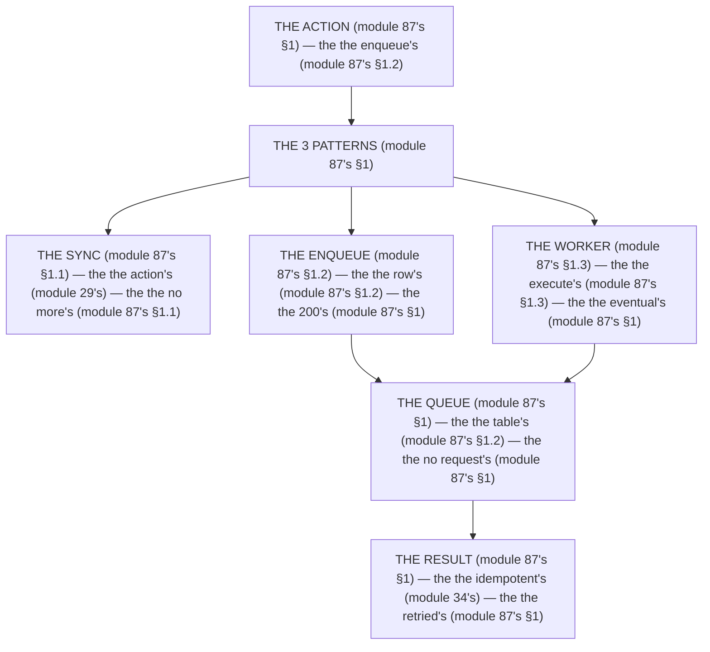

# Module 87 ⚡ — Background Jobs: Why Not In-Request, Queues, and One Real Worker

**Phase 22: Deployment · Module 87 of 101**

> **Where does this run?** The *enqueue* is **`[SERVER]`** (the action's, module 87's §1); the *worker* is **`[SERVER]`** (a separate process, module 87's §1). The module-87's standing rule (module 29's action rule, now the job level): **the action *enqueues*, the worker *executes* (module 87's §1) — the *request* is the *200's* (module 87's §1), the *job* is the *eventual's* (module 87's §1); the job is *idempotent* (module 34's), *retried* with backoff (module 87's §1), and *never* runs inside the request when it can take *more than a few seconds* (module 87's §1)** (module 87's §1).

---

## 1. Concept — The 3 patterns (the map)

**The sync's** (module 87's §1.1): the *the action's* (module 29's) — the *module-87's line: the sync is the action's* (module 87's §1.1) — the *module-29's* *five-step* (module 29's).

**The enqueue's** (module 87's §1.2): the *the job's row* (module 87's §1.2) — the *module-87's line: the enqueue is the row's* (module 87's §1.2) — the *module-5's* *service* (module 5's).

**The worker's** (module 87's §1.3): the *the execute's* (module 87's §1.3) — the *module-87's line: the worker is the execute's* (module 87's §1.3) — the *module-34's* *idempotency* (module 34's).

## 2. Mental Model — The 3 patterns (drawn)



## 3. Architecture — The 3 patterns (the code)

### 3.1 The enqueue's (module 87's §1.2 — the row's)

`FILE: src/db/schema.ts` + `FILE: src/services/jobs.ts` (production pattern — [SERVER] — the module-87's §3.1: the no request's)

```ts
// THE ENQUEUE (module 87's §3.1) — the the row's (module 87's §1.2) — the the no request's (module 87's §1):
// src/db/schema.ts (module 87's §3.1)
export const jobs = pgTable('jobs', {
  id: uuid('id').primaryKey().defaultRandom(),   /* the module-87's line: the uuid's (module 87's §3.1) */
  orgId: uuid('org_id').notNull().references(() => orgs.id, { onDelete: 'cascade' }),   /* the module-49's line: the orgId's (module 49's) */
  type: text('type').notNull(),   /* the module-87's line: the type's (module 87's §3.1) */
  payload: jsonb('payload').notNull().default({}),   /* the module-87's line: the no PII's (module 69's §3.2) */
  status: text('status').notNull().default('pending'),   /* the module-87's line: the pending's (module 87's §3.1) */
  attempts: integer('attempts').notNull().default(0),   /* the module-87's line: the retry's (module 87's §1) */
  idempotencyKey: text('idempotency_key').unique(),   /* the module-34's line: the idempotency's (module 34's) */
  createdAt: timestamp('created_at', { withTimezone: true }).notNull().defaultNow(),   /* the module-37's line: the timestamptz's (module 37's) */
})

// src/services/jobs.ts (module 87's §3.1)
import { db } from '@/db'
import { jobs } from '@/db/schema'

export async function enqueueJob(orgId: string, type: string, payload: Record<string, unknown>, idempotencyKey: string) {
  return db.insert(jobs).values({ orgId, type, payload, idempotencyKey })   /* the module-87's line: the row's (module 87's §1.2) */
}
```

**The module-87's line:** the *row's* (module 87's §1.2) — the *no request's* (module 87's §1) — the *idempotency's* (module 34's).

### 3.2 The action's (module 87's §1.2 — the 200's)

`FILE: src/app/(org)/api/actions/invoice.ts` (production pattern — [SERVER] — the module-87's §3.2: the 200's)

```ts
// 'use server'
// THE ACTION (module 87's §3.2) — the the 200's (module 87's §1) — the the no request's (module 87's §1):
import { enqueueJob } from '@/services/jobs'   /* the module-87's line: the enqueue's (module 87's §1.2) */

export async function generateInvoice(formData: FormData) {
  /* THE SYNC (module 87's §3.2) — the the no more's (module 87's §1.1):
     The invoice's *data* is the action's (module 87's §1.1) — the the 200's (module 87's §1)
     The invoice's *PDF* is the job's (module 87's §1.2) — the the no request's (module 87's §1) */
  await enqueueJob(orgId, 'invoice:generate', { orderId }, idempotencyKey)   /* the module-87's line: the row's (module 87's §1.2) */
  redirect('/invoices/pending')   /* the module-29's line: the redirect's (module 29's) */
}
```

**The module-87's line:** the *200's* (module 87's §1) — the *row's* (module 87's §1.2) — the *redirect's* (module 29's).

### 3.3 The worker's (module 87's §1.3 — the execute's)

`FILE: src/workers/invoice.ts` (production pattern — [SERVER] — the module-87's §3.3: the `FOR UPDATE`'s)

```ts
// THE WORKER (module 87's §3.3) — the the execute's (module 87's §1.3) — the the no request's (module 87's §1):
import { db } from '@/db'
import { jobs } from '@/db/schema'
import { sql, eq } from 'drizzle-orm'

export async function claimNextJob() {
  /* THE CLAIM (module 87's §3.3) — the the `FOR UPDATE`'s (module 37's):
     The `SKIP LOCKED` (module 87's §3.3) — the the no duplicate's (module 87's §1.3) */
  const [job] = await db
    .select()
    .from(jobs)
    .where(eq(jobs.status, 'pending'))
    .orderBy(jobs.createdAt)
    .limit(1)
    .forUpdate({ skipLocked: true })   /* the module-87's line: the skip's locked (module 87's §3.3) */
  if (!job) return null   /* the module-87's line: the no job's (module 87's §3.3) */
  await db.update(jobs).set({ status: 'processing' }).where(eq(jobs.id, job.id))   /* the module-87's line: the processing's (module 87's §3.3) */
  return job   /* the module-87's line: the execute's (module 87's §1.3) */
}

export async function completeJob(id: string) {
  await db.update(jobs).set({ status: 'done' }).where(eq(jobs.id, id))   /* the module-87's line: the done's (module 87's §3.3) }
}

export async function failJob(id: string) {
  const job = await db.query.jobs.findFirst({ where: eq(jobs.id, id) })   /* the module-87's line: the retry's (module 87's §1) */
  if (job && job.attempts < 5) {
    await db.update(jobs).set({ status: 'pending', attempts: job.attempts + 1 }).where(eq(jobs.id, id))   /* the module-87's line: the retry's (module 87's §1) */
  } else {
    await db.update(jobs).set({ status: 'failed' }).where(eq(jobs.id, id))   /* the module-87's line: the dead's (module 87's §1.3) */
  }
}
```

**The module-87's line:** the *execute's* (module 87's §1.3) — the *`FOR UPDATE`'s* (module 37's) — the *retry's* (module 87's §1).

## 4. Production Code — The no request's (module 87's §4)

`FILE: docs/job-policy.md` (production pattern — the module-87's §4: the 3 rules)

```md
## THE JOB'S POLICY (module 87's §4 — the the no request's (module 87's §1) — the the eventual's (module 87's §1))

1. **The no request's** (module 87's §4.1): the the action's (module 29's) — the the no more's (module 87's §1.1)
2. **The idempotent's** (module 87's §4.2): the the `idempotencyKey`'s (module 34's) — the the no duplicate's (module 87's §1.3)
3. **The retried's** (module 87's §4.3): the the 5's attempts (module 87's §3.3) — the the dead's (module 87's §1.3)

/* THE RULE (module 87's §4): the the no request's (module 87's §1) — the the idempotent's (module 34's) — the the retried's (module 87's §1) */
```

**The module-87's line:** the *no request's* (module 87's §1) — the *idempotent's* (module 34's) — the *retried's* (module 87's §1).

## 5. Common Mistakes (the job's failures)

| Mistake | The symptom | Fix |
|---|---|---|
| **The request's job** (module 87's §1's line violated) | the *module-87's line: the no request's* (module 87's §1) — the *the request's job's is the *no's* (module 87's §1) — the *module-87's line: the no request's job* (module 87's §1) — the *no request's job* (module 87's §1)* | the *the enqueue's (module 87's §3.1) — the *module-87's line: the no request's* (module 87's §1)* |
| **The no idempotency** (module 87's §1.3's line violated) | the *module-87's line: the idempotent's* (module 34's) — the *the no idempotency's is the *no's* (module 34's) — the *module-87's line: the no idempotency* (module 34's) — the *no idempotency* (module 34's)* | the *the `idempotencyKey`'s (module 34's) — the *module-87's line: the idempotent's* (module 34's)* |
| **The no retry** (module 87's §1's line violated) | the *module-87's line: the retried's* (module 87's §1) — the *the no retry's is the *no's* (module 87's §1) — the *module-87's line: the no retry* (module 87's §1) — the *no retry* (module 87's §1)* | the *the 5's attempts (module 87's §3.3) — the *module-87's line: the retried's* (module 87's §1)* |
| **The no `SKIP LOCKED`** (module 87's §3.3's line violated) | the *module-87's line: the skip's locked* (module 87's §3.3) — the *the no `SKIP LOCKED`'s is the *no's* (module 87's §3.3) — the *module-87's line: the no `SKIP LOCKED`* (module 87's §3.3) — the *no `SKIP LOCKED`* (module 87's §3.3)* | the *the `FOR UPDATE SKIP LOCKED`'s (module 87's §3.3) — the *module-87's line: the skip's locked* (module 87's §3.3)* |
| **The no dead's** (module 87's §1.3's line violated) | the *module-87's line: the dead's* (module 87's §1.3) — the *the no dead's is the *no's* (module 87's §1.3) — the *module-87's line: the no dead* (module 87's §1.3) — the *no dead* (module 87's §1.3)* | the *the `failed`'s (module 87's §3.3) — the *module-87's line: the dead's* (module 87's §1.3)* |
| **The PII's payload** (module 69's §3.2's line violated) | the *module-87's line: the no PII's* (module 69's §3.2) — the *the PII's payload's is the *no's* (module 69's §3.2) — the *module-87's line: the no PII's payload* (module 69's §3.2) — the *no PII's payload* (module 69's §3.2)* | the *the no PII's (module 69's §3.2) — the *module-87's line: the no PII's* (module 69's §3.2)* |

## 6. Security Notes

- **The no PII** (module 69's §3.2): the *module-87's line: the no PII's* (module 69's §3.2) — the *module-75's* *deep-dive* (module 75's).
- **The idempotency's** (module 34's): the *module-87's line: the idempotent's* (module 34's) — the *module-34's* *deep-dive* (module 34's).
- **The orgId's** (module 49's): the *module-87's line: the orgId's* (module 49's) — the *module-49's* *deep-dive* (module 49's).

## 7. Performance Notes

- **The 200's** (module 87's §1): the *module-87's line: the no request's* (module 87's §1) — the *the no timeout's* (module 87's §1).
- **The `SKIP LOCKED`'s** (module 87's §3.3): the *module-87's line: the skip's locked* (module 87's §3.3) — the *the no duplicate's* (module 87's §1.3).
- **The 5's attempts** (module 87's §3.3): the *module-87's line: the retried's* (module 87's §1) — the *the no infinite's* (module 87's §1.3).

## 8. Exercise

**Beginner.** *The enqueue's* (module 87's §3.1): the *the `jobs`'s table* (module 3.1's) + the *the `enqueueJob`'s* (module 3.1's) — *build it* — the *artifact: the enqueue's* (module 3.1's).

**Intermediate.** *The worker's* (module 87's §3.3): the *the `claimNextJob`'s* (module 3.3's) + the *the `FOR UPDATE SKIP LOCKED`'s* (module 3.3's) — *build it* — the *artifact: the worker's* (module 3.3's).

**Production.** *The job's policy's* (module 87's §4): the *the 3's rules* (module 4's) + the *the `failed`'s alert* (module 3.3's) — *build the policy* — the *artifact: the policy's* (module 4's).

## 9. Architecture Challenge

**Prompt:** The *"the team generates the PDF inside the request — the action takes 30 seconds, the user's browser times out, and the job runs twice"* (the *module-87's* *job* — the *module-29's* *action* — the *module-87's line: the no request's* (module 87's §1) — the *module-34's line: the idempotent's* (module 34's) — the *module-87's standing line: the enqueue's + the worker's + the idempotent's* (module 87's §1.2 + module 87's §1.3 + module 34's)).

The *problems*: (1) the *the request's job* (the *the no enqueue's* (module 87's §1.2) — the *module-87's line: the no request's* (module 87's §1) — the *module-87's standing line: the enqueue's* (module 87's §1.2)).

(2) the *the duplicate's* (the *the no idempotency's* (module 34's) — the *module-87's line: the idempotent's* (module 34's) — the *module-87's standing line: the idempotent's* (module 34's)).

**Design**: the *the job's remediation* (the *the `enqueueJob`'s* (module 3.1's) + the *the `idempotencyKey`'s* (module 3.1's) + the *the `FOR UPDATE SKIP LOCKED`'s* (module 3.3's) — the *module-87's line: the no request's* (module 87's §1) — the *module-87's standing line: the enqueue's + the worker's + the idempotent's* (module 87's §1.2 + module 87's §1.3 + module 34's)).

Produce: the *the job's remediation* (the *the `enqueueJob`'s* (module 3.1's) + the *the `idempotencyKey`'s* (module 3.1's) + the *the `FOR UPDATE SKIP LOCKED`'s* (module 3.3's) — the *module-87's line: the no request's* (module 87's §1) — the *module-87's standing line: the enqueue's + the worker's + the idempotent's* (module 87's §1.2 + module 87's §1.3 + module 34's)).

<details>
<summary>Model answer</summary>
**The job's remediation** (module 87's §3.1 + module 34's + module 87's §3.3):
1. **The `enqueueJob`'s** (module 87's §1.2): the *the PDF's generation becomes the row's* — the *module-87's line: the no request's* (module 87's §1).
2. **The `idempotencyKey`'s** (module 34's): the *the duplicate's becomes the no-op's* — the *module-87's line: the idempotent's* (module 34's).
3. **The `FOR UPDATE SKIP LOCKED`'s** (module 87's §3.3): the *the 2's workers become the 1's* — the *module-87's line: the skip's locked* (module 87's §3.3).
**The generalization** (the *job's* pattern, the *module's* standing rule): **the *enqueue's* (module 87's §1.2) — the *the worker's* (module 87's §1.3) — the *the idempotent's* (module 34's) — the *module-87's standing line: the enqueue's + the worker's + the idempotent's* (module 87's §1.2 + module 87's §1.3 + module 34's)*.
</details>

## 10. Official Documentation

- Postgres: `FOR UPDATE SKIP LOCKED`: https://www.postgresql.org/docs/current/sql-select.html#SQL-FOR-UPDATE-SHARE
- Drizzle: `forUpdate`: https://orm.drizzle.site/docs/queries/select
- The module-29's action: the module-29 (the phase-7's file-01)
- The module-34's idempotency: the module-34 (the phase-8's file-03)

## 11. What You Should Know Before Continuing

- [ ] I can state the *3 patterns* (module 1's: the sync/enqueue/worker) — the *module-87's line: the no request's* (module 1's)
- [ ] I know the *sync is the action's* (module 1.1's) — the *the no more's* (module 87's §1.1)
- [ ] I know the *enqueue is the row's* (module 1.2's) — the *the 200's* (module 87's §1)
- [ ] I know the *worker is the execute's* (module 1.3's) — the *the eventual's* (module 87's §1)
- [ ] I know the *`FOR UPDATE SKIP LOCKED`'s* (module 3.3's) — the *the no duplicate's* (module 87's §1.3)
- [ ] I know the *5's attempts* (module 3.3's) — the *the dead's* (module 87's §1.3)
- [ ] I've done the *enqueue's* (module 8's beginner) + the *worker's* (module 8's intermediate) + the *policy's* (module 8's production) — the *artifacts* (module 20's)

**Next:** Module 88 — Internationalization (the *the locale's* — the *module-88's line: the locale is the route's* (module 88's)).
