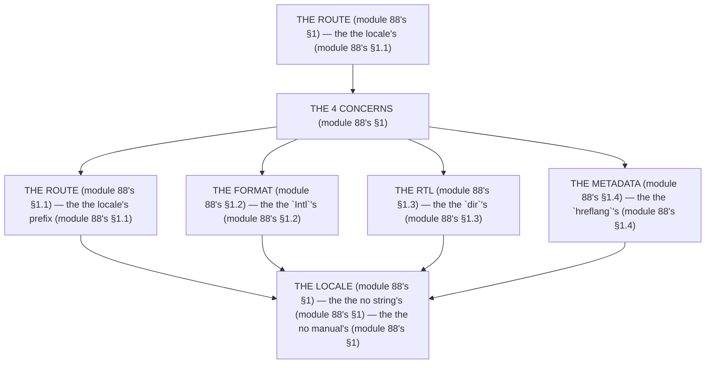

# Module 88 ⚡ — Internationalization: next-intl, Localized Routes, Formatting, RTL, Locale Metadata

**Phase 22: Deployment · Module 88 of 101**

> **Where does this run?** The *config* is **`[SERVER]`** (the `routing.ts`, the `global-request.ts` — module 88's §1); the *translation* is **`[BOTH]`** (the `useTranslations` is `[CLIENT]` behind the provider, module 88's §1; the `getTranslations` is `[SERVER]`, module 88's §1). The module-88's standing rule (module 61's metadata rule, now the locale level): **the locale is the *route* (module 88's §1) — `/en/...`, `/fr/...` (module 88's §1); the *formatting* is the `Intl`'s (module 88's §1), never the string's (module 88's §1); the *RTL* is the `dir`'s + the logical's CSS (module 88's §1); and the *metadata* is the `hreflang`'s (module 88's §1) — the `generateMetadata`'s per-locale (module 61's)** (module 88's §1).

---

## 1. Concept — The 4 concerns (the map)

**The route's** (module 88's §1.1): the *the locale's prefix* (module 88's §1.1) — the *module-88's line: the locale is the route's* (module 88's §1.1) — the *module-2's* *routing* (module 2's).

**The format's** (module 88's §1.2): the *the `Intl`'s* (module 88's §1.2) — the *module-88's line: the format is the `Intl`'s* (module 88's §1.2) — the *module-37's* *cents* (module 37's).

**The RTL's** (module 88's §1.3): the *the `dir`'s* (module 88's §1.3) — the *module-88's line: the RTL is the `dir`'s* (module 88's §1.3) — the *the logical's* (module 88's §1.3).

**The metadata's** (module 88's §1.4): the *the `hreflang`'s* (module 88's §1.4) — the *module-88's line: the metadata is the `hreflang`'s* (module 88's §1.4) — the *module-61's* *metadata* (module 61's).

## 2. Mental Model — The 4 concerns (drawn)



## 3. Architecture — The 4 concerns (the code)

### 3.1 The route's (module 88's §1.1 — the locale's prefix)

`FILE: src/i18n/routing.ts` + `FILE: src/i18n/global-request.ts` (production pattern — [SERVER] — the module-88's §3.1: the no manual's)

```ts
// THE ROUTE (module 88's §3.1) — the the locale's prefix (module 88's §1.1) — the the no manual's (module 88's §1):
// src/i18n/routing.ts (module 88's §3.1)
import { defineRouting } from 'next-intl/routing'   /* the module-88's line: the next-intl's (module 88's §3.1) */

export const routing = defineRouting({
  locales: ['en', 'fr', 'ar'],   /* the module-88's line: the locale's (module 88's §1.1) */
  defaultLocale: 'en',   /* the module-88's line: the default's (module 88's §3.1) */
})

// src/i18n/global-request.ts (module 88's §3.1)
import { getRequestConfig } from 'next-intl/server'   /* the module-88's line: the server's (module 88's §3.1) */
import { routing } from './routing'

export default getRequestConfig(async ({ requestLocale }) => {
  const requested = await requestLocale   /* the module-88's line: the requested's (module 88's §3.1) */
  const locale = routing.locales.includes(requested as never) ? requested : routing.defaultLocale   /* the module-88's line: the fallback's (module 88's §3.1) */
  return { locale, messages: (await import(`../../messages/${locale}.json`)).default }   /* the module-88's line: the messages' (module 88's §3.1) */
})
```

**The module-88's line:** the *locale's prefix* (module 88's §1.1) — the *no manual's* (module 88's §1) — the *fallback's* (module 88's §3.1).

### 3.2 The format's (module 88's §1.2 — the `Intl`'s)

`FILE: src/components/price.tsx` (production pattern — [CLIENT] — the module-88's §3.2: the no string's)

```tsx
// THE FORMAT (module 88's §3.2) — the the `Intl`'s (module 88's §1.2) — the the no string's (module 88's §1):
'use client'
import { useLocale } from 'next-intl'   /* the module-88's line: the locale's (module 88's §3.2) */

export function Price({ cents }: { cents: number }) {
  const locale = useLocale()   /* the module-88's line: the locale's (module 88's §1.2) */
  /* THE `Intl`'s (module 88's §3.2) — the the no string's (module 88's §1):
     The `Intl.NumberFormat`'s (module 88's §3.2) — the the cents's (module 37's) */
  const formatted = new Intl.NumberFormat(locale, { style: 'currency', currency: 'EUR' }).format(cents / 100)   /* the module-88's line: the cents's (module 37's) */
  return <span>{formatted}</span>   /* the module-88's line: the no manual's (module 88's §1) */
}
```

**The module-88's line:** the *`Intl`'s* (module 88's §1.2) — the *no string's* (module 88's §1) — the *cents's* (module 37's).

### 3.3 The RTL's (module 88's §1.3 — the `dir`'s)

`FILE: src/app/[locale]/layout.tsx` (production pattern — [SERVER] — the module-88's §3.3: the logical's)

```tsx
// THE RTL (module 88's §3.3) — the the `dir`'s (module 88's §1.3) — the the logical's (module 88's §1.3):
import { NextIntlClientProvider } from 'next-intl'   /* the module-88's line: the provider's (module 88's §3.3) */
import { getMessages } from 'next-intl/server'   /* the module-88's line: the messages' (module 88's §3.3) */

export default async function LocaleLayout({ children, params }: { children: React.ReactNode; params: { locale: string } }) {
  const messages = await getMessages()   /* the module-88's line: the messages' (module 88's §3.3) */
  const dir = params.locale === 'ar' ? 'rtl' : 'ltr'   /* the module-88's line: the `dir`'s (module 88's §1.3) */
  return (
    <html lang={params.locale} dir={dir}>   /* the module-88's line: the `lang`'s + the `dir`'s (module 88's §1.3) */
      <body>
        <NextIntlClientProvider messages={messages}>   /* the module-88's line: the provider's (module 88's §3.3) */
          {children}   /* the module-88's line: the logical's (module 88's §1.3) */
        </NextIntlClientProvider>
      </body>
    </html>
  )
}
/* THE LOGICAL'S (module 88's §3.3) — the the `ms-`/`me-` (module 88's §1.3) — the the no `ml-`/`mr-` (module 88's §1.3):
   Tailwind's `ms-4` = `margin-inline-start` (module 88's §1.3) — the the no `ml-4` (module 88's §1.3) */
```

**The module-88's line:** the *`dir`'s* (module 88's §1.3) — the *logical's* (module 88's §1.3) — the *no `ml-`/`mr-`* (module 88's §1.3).

### 3.4 The metadata's (module 88's §1.4 — the `hreflang`'s)

`FILE: src/app/[locale]/products/[slug]/page.tsx` (production pattern — [SERVER] — the module-88's §3.4: the `alternate`'s)

```tsx
// THE METADATA (module 88's §3.4) — the the `hreflang`'s (module 88's §1.4) — the the no manual's (module 88's §1):
import type { Metadata } from 'next'
import { getTranslations } from 'next-intl/server'   /* the module-88's line: the server's (module 88's §3.4) */

export async function generateMetadata({ params }: { params: { locale: string; slug: string } }): Promise<Metadata> {
  const t = await getTranslations({ locale: params.locale, namespace: 'metadata' })   /* the module-88's line: the locale's (module 88's §3.4) */
  return {
    title: t('product.title', { name: params.slug }),   /* the module-88's line: the locale's (module 88's §1.4) */
    alternates: {
      languages: {
        en: `/en/products/${params.slug}`,   /* the module-88's line: the `hreflang`'s (module 88's §1.4) */
        fr: `/fr/products/${params.slug}`,   /* the module-88's line: the `hreflang`'s (module 88's §1.4) */
        ar: `/ar/products/${params.slug}`,   /* the module-88's line: the `hreflang`'s (module 88's §1.4) */
      },
    },
  }
}
```

**The module-88's line:** the *`hreflang`'s* (module 88's §1.4) — the *no manual's* (module 88's §1) — the *locale's* (module 61's).

## 4. Production Code — The no manual's (module 88's §4)

`FILE: docs/i18n-policy.md` (production pattern — the module-88's §4: the 3 rules)

```md
## THE I18N'S POLICY (module 88's §4 — the the no manual's (module 88's §1) — the the no string's (module 88's §1))

1. **The no manual's** (module 88's §4.1): the the locale's route (module 88's §1.1) — the the no `if (locale === 'fr')` (module 88's §4.1)
2. **The no string's** (module 88's §4.2): the the `Intl`'s (module 88's §1.2) — the the no `"$" + price` (module 88's §4.2)
3. **The no `ml-`'s** (module 88's §4.3): the the `ms-`'s (module 88's §1.3) — the the no `ml-4` (module 88's §4.3)

/* THE RULE (module 88's §4): the the no manual's (module 88's §1) — the the no string's (module 88's §1) — the the no `ml-`'s (module 88's §1.3) */
```

**The module-88's line:** the *no manual's* (module 88's §1) — the *no string's* (module 88's §1) — the *no `ml-`'s* (module 88's §1.3).

## 5. Common Mistakes (the i18n's failures)

| Mistake | The symptom | Fix |
|---|---|---|
| **The no locale's route** (module 88's §1.1's line violated) | the *module-88's line: the locale is the route's* (module 88's §1.1) — the *the no locale's route's is the *no's* (module 88's §1.1) — the *module-88's line: the no locale's route* (module 88's §1.1) — the *no locale's route* (module 88's §1.1)* | the *the `[locale]`'s (module 88's §3.1) — the *module-88's line: the locale is the route's* (module 88's §1.1)* |
| **The string's format** (module 88's §1.2's line violated) | the *module-88's line: the format is the `Intl`'s* (module 88's §1.2) — the *the string's format's is the *no's* (module 88's §1.2) — the *module-88's line: the no string's format* (module 88's §1.2) — the *no string's format* (module 88's §1.2)* | the *the `Intl`'s (module 88's §3.2) — the *module-88's line: the format is the `Intl`'s* (module 88's §1.2)* |
| **The no `dir`** (module 88's §1.3's line violated) | the *module-88's line: the RTL is the `dir`'s* (module 88's §1.3) — the *the no `dir`'s is the *no's* (module 88's §1.3) — the *module-88's line: the no `dir`* (module 88's §1.3) — the *no `dir`* (module 88's §1.3)* | the *the `dir`'s (module 88's §3.3) — the *module-88's line: the RTL is the `dir`'s* (module 88's §1.3)* |
| **The `ml-`'s** (module 88's §1.3's line violated) | the *module-88's line: the logical's* (module 88's §1.3) — the *the `ml-`'s is the *no's* (module 88's §1.3) — the *module-88's line: the no `ml-`* (module 88's §1.3) — the *no `ml-`* (module 88's §1.3)* | the *the `ms-`'s (module 88's §3.3) — the *module-88's line: the logical's* (module 88's §1.3)* |
| **The no `hreflang`** (module 88's §1.4's line violated) | the *module-88's line: the metadata is the `hreflang`'s* (module 88's §1.4) — the *the no `hreflang`'s is the *no's* (module 88's §1.4) — the *module-88's line: the no `hreflang`* (module 88's §1.4) — the *no `hreflang`* (module 88's §1.4)* | the *the `alternates`'s (module 88's §3.4) — the *module-88's line: the metadata is the `hreflang`'s* (module 88's §1.4)* |
| **The no fallback** (module 88's §3.1's line violated) | the *module-88's line: the fallback's* (module 88's §3.1) — the *the no fallback's is the *no's* (module 88's §3.1) — the *module-88's line: the no fallback* (module 88's §3.1) — the *no fallback* (module 88's §3.1)* | the *the `defaultLocale`'s (module 88's §3.1) — the *module-88's line: the fallback's* (module 88's §3.1)* |

## 6. Security Notes

- **The no manual's** (module 88's §1): the *module-88's line: the locale is the route's* (module 88's §1.1) — the *module-2's* *deep-dive* (module 2's).
- **The `Intl`'s** (module 88's §1.2): the *module-88's line: the format is the `Intl`'s* (module 88's §1.2) — the *module-37's* *deep-dive* (module 37's).
- **The `hreflang`'s** (module 88's §1.4): the *module-88's line: the metadata is the `hreflang`'s* (module 88's §1.4) — the *module-61's* *deep-dive* (module 61's).

## 7. Performance Notes

- **The no manual's** (module 88's §1): the *module-88's line: the locale is the route's* (module 88's §1.1) — the *the no branch's cost* (module 88's §1).
- **The `Intl`'s** (module 88's §1.2): the *module-88's line: the format is the `Intl`'s* (module 88's §1.2) — the *the no string's cost* (module 88's §1.2).
- **The logical's** (module 88's §1.3): the *module-88's line: the RTL is the `dir`'s* (module 88's §1.3) — the *the no `ml-`'s cost* (module 88's §1.3).

## 8. Exercise

**Beginner.** *The route's* (module 88's §3.1): the *the `defineRouting`'s* (module 3.1's) + the *the `[locale]`'s layout* (module 3.3's) — *build it* — the *artifact: the route's* (module 3.1's).

**Intermediate.** *The format's + the RTL's* (module 88's §3.2 + §3.3): the *the `Intl.NumberFormat`'s* (module 3.2's) + the *the `dir`'s* (module 3.3's) — *build it* — the *artifact: the 2's concerns* (module 3.2's + module 3.3's).

**Production.** *The metadata's* (module 88's §3.4): the *the `alternates`'s* (module 3.4's) + the *the `generateMetadata`'s per-locale* (module 3.4's) — *build it* — the *artifact: the metadata's* (module 3.4's).

## 9. Architecture Challenge

**Prompt:** The *"the team hard-codes the strings, formats the price with `\"$\" + price`, uses `ml-4` everywhere, and has no `hreflang`"* (the *module-88's* *i18n* — the *module-61's* *metadata* — the *module-88's line: the locale is the route's* (module 88's §1.1) — the *module-37's line: the cents's* (module 37's) — the *module-88's standing line: the locale's + the `Intl`'s + the `dir`'s + the `hreflang`'s* (module 88's §1.1 + module 88's §1.2 + module 88's §1.3 + module 88's §1.4)).

The *problems*: (1) the *the string's* (the *the no `Intl`'s* (module 88's §1.2) — the *module-88's line: the format is the `Intl`'s* (module 88's §1.2) — the *module-88's standing line: the `Intl`'s* (module 88's §1.2)).

(2) the *the no `hreflang`* (the *the no `alternates`'s* (module 88's §1.4) — the *module-88's line: the metadata is the `hreflang`'s* (module 88's §1.4) — the *module-88's standing line: the `hreflang`'s* (module 88's §1.4)).

**Design**: the *the i18n's remediation* (the *the `useTranslations`'s* (module 3.2's) + the *the `Intl.NumberFormat`'s* (module 3.2's) + the *the `alternates`'s* (module 3.4's) — the *module-88's line: the locale is the route's* (module 88's §1.1) — the *module-88's standing line: the locale's + the `Intl`'s + the `dir`'s + the `hreflang`'s* (module 88's §1.1 + module 88's §1.2 + module 88's §1.3 + module 88's §1.4)).

Produce: the *the i18n's remediation* (the *the `useTranslations`'s* (module 3.2's) + the *the `Intl.NumberFormat`'s* (module 3.2's) + the *the `alternates`'s* (module 3.4's) — the *module-88's line: the locale is the route's* (module 88's §1.1) — the *module-88's standing line: the locale's + the `Intl`'s + the `dir`'s + the `hreflang`'s* (module 88's §1.1 + module 88's §1.2 + module 88's §1.3 + module 88's §1.4)).

<details>
<summary>Model answer</summary>
**The i18n's remediation** (module 88's §3.2 + module 88's §3.4):
1. **The `useTranslations`'s** (module 88's §1.1): the *the hard-coded's becomes the `useTranslations`'s* — the *module-88's line: the locale is the route's* (module 88's §1.1).
2. **The `Intl.NumberFormat`'s** (module 88's §1.2): the *the `\"$\" + price`'s becomes the `Intl`'s* — the *module-88's line: the format is the `Intl`'s* (module 88's §1.2).
3. **The `alternates`'s** (module 88's §1.4): the *the no-`hreflang`'s becomes the `alternates`'s* — the *module-88's line: the metadata is the `hreflang`'s* (module 88's §1.4).
**The generalization** (the *i18n's* pattern, the *module's* standing rule): **the *locale's* (module 88's §1.1) — the *the `Intl`'s* (module 88's §1.2) — the *the `dir`'s* (module 88's §1.3) — the *the `hreflang`'s* (module 88's §1.4) — the *module-88's standing line: the locale's + the `Intl`'s + the `dir`'s + the `hreflang`'s* (module 88's §1.1 + module 88's §1.2 + module 88's §1.3 + module 88's §1.4)*.
</details>

## 10. Official Documentation

- next-intl: https://next-intl.dev/docs
- next-intl: Routing: https://next-intl.dev/docs/environments#routing
- MDN: `Intl.NumberFormat`: https://developer.mozilla.org/en-US/docs/Web/JavaScript/Reference/Global_Objects/Intl/NumberFormat
- MDN: `dir`: https://developer.mozilla.org/en-US/docs/Web/HTML/Element/html#dir
- The module-61's metadata: the module-61 (the phase-14's file-01)

## 11. What You Should Know Before Continuing

- [ ] I can state the *4 concerns* (module 1's: the route/format/RTL/metadata) — the *module-88's line: the locale is the route's* (module 1's)
- [ ] I know the *locale is the route's* (module 1.1's) — the *the no manual's* (module 1's)
- [ ] I know the *format is the `Intl`'s* (module 1.2's) — the *the no string's* (module 1's)
- [ ] I know the *RTL is the `dir`'s* (module 1.3's) — the *the logical's* (module 1.3's)
- [ ] I know the *metadata is the `hreflang`'s* (module 1.4's) — the *the `alternates`'s* (module 1.4's)
- [ ] I've done the *route's* (module 8's beginner) + the *format/RTL's* (module 8's intermediate) + the *metadata's* (module 8's production) — the *artifacts* (module 20's)

**Phase 22 complete.** Deployment — the targets (module 84's), the runtimes (module 85's), the pipeline (module 86's), the jobs (module 87's), the locale's (module 88's).

**Next:** Module 89 — Phase 23 (the *the architecture's* — the *module-89's line: the architecture is the when's* (module 89's)).
