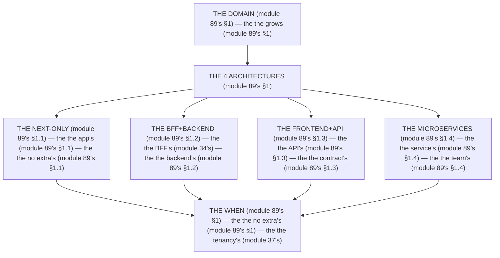

# Module 89 — The Four Backend Architectures: When Each Wins

**Phase 23: Production Architecture · Module 89 of 101**

> **Where does this run?** This is an **architecture** decision (the team's, module 89's §1) — it changes *where* the `[SERVER]` lives (the app's, the BFF's, the API's, the services' — module 89's §1). The module-89's standing rule (module 34's BFF gate + module 37's tenancy, now the architecture level): **the architecture is the *when's* (module 89's §1) — *Next-only* wins while the *domain* is the *app's* (module 89's §1); *BFF+backend* wins when the *domain* outgrows the *app's* (module 89's §1); *frontend+API* wins when the *frontend* is the *consumer's* (module 89's §1); *microservices* wins when the *team* outgrows the *monolith's* (module 89's §1) — and the *tenancy* is the *first* in **all four** (module 37's)** (module 89's §1).

---

## 1. Concept — The 4 architectures (the map)

**The Next-only's** (module 89's §1.1): the *the app's* (module 89's §1.1) — the *module-89's line: the Next-only is the app's* (module 89's §1.1) — the *module-5's* *service* (module 5's).

**The BFF+backend's** (module 89's §1.2): the *the BFF's* (module 34's) — the *module-89's line: the BFF is the gate's* (module 34's) — the *module-34's* *BFF* (module 34's).

**The frontend+API's** (module 89's §1.3): the *the API's* (module 89's §1.3) — the *module-89's line: the API is the contract's* (module 89's §1.3) — the *module-34's* *snake_case* (module 34's).

**The microservices's** (module 89's §1.4): the *the service's* (module 89's §1.4) — the *module-89's line: the service is the team's* (module 89's §1.4) — the *module-37's* *tenancy* (module 37's).

## 2. Mental Model — The 4 architectures (drawn)



## 3. Architecture — The 4 architectures (the table)

`FILE: docs/architectures.md` (production pattern — the module-89's §3: the table's)

```md
## THE 4 ARCHITECTURES (module 89's §3 — the the table's (module 89's §3))

| Architecture (module 89's §3) | When it wins (module 89's §3) | The cost (module 89's §3) | The tenancy's (module 37's) |
|---|---|---|---|
| The Next-only (module 89's §1.1) | The app's (module 89's §1.1) — the the no extra's (module 89's §1.1) | The no separation's (module 89's §1.1) | The service's (module 5's) |
| The BFF+backend (module 89's §1.2) | The domain's (module 89's §1.2) — the the backend's (module 89's §1.2) | The 2's deploys (module 89's §1.2) | The BFF's + the backend's (module 34's) |
| The frontend+API (module 89's §1.3) | The consumer's (module 89's §1.3) — the the API's (module 89's §1.3) | The contract's (module 89's §1.3) | The API's (module 89's §1.3) |
| The microservices (module 89's §1.4) | The team's (module 89's §1.4) — the the service's (module 89's §1.4) | The 10's services (module 89's §1.4) | The service's (module 37's) |

/* THE RULE (module 89's §3): the the when's (module 89's §1) — the the no extra's (module 89's §1) — the the tenancy's (module 37's) */
```

## 4. Production Code — The Next-only's (module 89's §4.1)

`FILE: src/services/products.ts` (production pattern — [SERVER] — the module-89's §4.1: the app's)

```ts
// THE NEXT-ONLY (module 89's §4.1) — the the app's (module 89's §1.1) — the the no extra's (module 89's §1.1):
import { db } from '@/db'   /* the module-5's line: the service's (module 5's) */
import { products } from '@/db/schema'

export async function listProducts(orgId: string) {
  return db.select().from(products).where(eq(products.orgId, orgId))   /* the module-89's line: the tenancy's (module 37's) */
}
/* THE RULE (module 89's §4.1): the the app's (module 89's §1.1) — the the no extra's (module 89's §1.1) — the the tenancy's (module 37's) */
```

**The module-89's line:** the *app's* (module 89's §1.1) — the *no extra's* (module 89's §1.1) — the *tenancy's* (module 37's).

## 5. Common Mistakes (the architecture's failures)

| Mistake | The symptom | Fix |
|---|---|---|
| **The microservices's day 1** (module 89's §1.4's line violated) | the *module-89's line: the service is the team's* (module 89's §1.4) — the *the microservices's day 1's is the *no's* (module 89's §1.4) — the *module-89's line: the no microservices's day 1* (module 89's §1.4) — the *no microservices's day 1* (module 89's §1.4)* | the *the Next-only's (module 89's §1.1) — the *module-89's line: the Next-only is the app's* (module 89's §1.1)* |
| **The no BFF** (module 89's §1.2's line violated) | the *module-89's line: the BFF is the gate's* (module 34's) — the *the no BFF's is the *no's* (module 34's) — the *module-89's line: the no BFF* (module 34's) — the *no BFF* (module 34's)* | the *the BFF+backend's (module 89's §1.2) — the *module-89's line: the BFF is the gate's* (module 34's)* |
| **The no contract** (module 89's §1.3's line violated) | the *module-89's line: the API is the contract's* (module 89's §1.3) — the *the no contract's is the *no's* (module 89's §1.3) — the *module-89's line: the no contract* (module 89's §1.3) — the *no contract* (module 89's §1.3)* | the *the API's (module 89's §1.3) — the *module-89's line: the API is the contract's* (module 89's §1.3)* |
| **The no tenancy** (module 37's line violated) | the *module-89's line: the tenancy's* (module 37's) — the *the no tenancy's is the *no's* (module 37's) — the *module-89's line: the no tenancy* (module 37's) — the *no tenancy* (module 37's)* | the *the tenancy's (module 37's) — the *module-89's line: the tenancy's* (module 37's)* |
| **The no when** (module 89's §1's line violated) | the *module-89's line: the architecture is the when's* (module 89's §1) — the *the no when's is the *no's* (module 89's §1) — the *module-89's line: the no when* (module 89's §1) — the *no when* (module 89's §1)* | the *the when's (module 89's §3) — the *module-89's line: the architecture is the when's* (module 89's §1)* |
| **The extra's** (module 89's §1's line violated) | the *module-89's line: the no extra's* (module 89's §1) — the *the extra's is the *no's* (module 89's §1) — the *module-89's line: the no extra* (module 89's §1) — the *no extra* (module 89's §1)* | the *the Next-only's (module 89's §1.1) — the *module-89's line: the no extra's* (module 89's §1)* |

## 6. Security Notes

- **The tenancy's** (module 37's): the *module-89's line: the tenancy's* (module 37's) — the *module-37's* *deep-dive* (module 37's).
- **The BFF's** (module 34's): the *module-89's line: the BFF is the gate's* (module 34's) — the *module-34's* *deep-dive* (module 34's).
- **The API's** (module 89's §1.3): the *module-89's line: the API is the contract's* (module 89's §1.3) — the *module-75's* *deep-dive* (module 75's).

## 7. Performance Notes

- **The no extra's** (module 89's §1): the *module-89's line: the Next-only is the app's* (module 89's §1.1) — the *the no hop's* (module 89's §1.1).
- **The BFF's** (module 34's): the *module-89's line: the BFF is the gate's* (module 34's) — the *the no client's* (module 34's).
- **The 10's services** (module 89's §1.4): the *module-89's line: the service is the team's* (module 89's §1.4) — the *the 10's hops* (module 89's §1.4).

## 8. Exercise

**Beginner.** *The table's* (module 89's §3): the *the 4's architectures* (module 3's) + the *the when's* (module 3's) — *build the table* — the *artifact: the table's* (module 3's).

**Intermediate.** *The Next-only's* (module 89's §4.1): the *the service's* (module 4.1's) + the *the tenancy's* (module 4.1's) — *build it* — the *artifact: the service's* (module 4.1's).

**Production.** *The when's* (module 89's §1): the *the 4's whens* (module 3's) + the *the no extra's* (module 3's) — *build the when's* — the *artifact: the when's* (module 3's).

## 9. Architecture Challenge

**Prompt:** The *"the team starts with 10 microservices on day 1, no BFF, no contract, and the tenancy is in one service"* (the *module-89's* *architecture* — the *module-37's* *tenancy* — the *module-89's line: the architecture is the when's* (module 89's §1) — the *module-37's line: the tenancy is the first's* (module 37's) — the *module-89's standing line: the when's + the no extra's + the tenancy's* (module 89's §1 + module 89's §1 + module 37's)).

The *problems*: (1) the *the microservices's day 1* (the *the no when's* (module 89's §1) — the *module-89's line: the architecture is the when's* (module 89's §1) — the *module-89's standing line: the when's* (module 89's §1)).

(2) the *the no tenancy* (the *the no first's* (module 37's) — the *module-89's line: the tenancy's* (module 37's) — the *module-89's standing line: the tenancy's* (module 37's)).

**Design**: the *the architecture's remediation* (the *the Next-only's* (module 4.1's) + the *the tenancy's* (module 4.1's) + the *the when's* (module 3's) — the *module-89's line: the architecture is the when's* (module 89's §1) — the *module-89's standing line: the when's + the no extra's + the tenancy's* (module 89's §1 + module 89's §1 + module 37's)).

Produce: the *the architecture's remediation* (the *the Next-only's* (module 4.1's) + the *the tenancy's* (module 4.1's) + the *the when's* (module 3's) — the *module-89's line: the architecture is the when's* (module 89's §1) — the *module-89's standing line: the when's + the no extra's + the tenancy's* (module 89's §1 + module 89's §1 + module 37's)).

<details>
<summary>Model answer</summary>
**The architecture's remediation** (module 89's §4.1 + module 37's + module 89's §3):
1. **The Next-only's** (module 89's §1.1): the *the 10's services become the app's* — the *module-89's line: the Next-only is the app's* (module 89's §1.1).
2. **The tenancy's** (module 37's): the *the one's service becomes the first's* — the *module-89's line: the tenancy's* (module 37's).
3. **The when's** (module 89's §3): the *the day 1's becomes the when's* — the *module-89's line: the architecture is the when's* (module 89's §1).
**The generalization** (the *architecture's* pattern, the *module's* standing rule): **the *when's* (module 89's §1) — the *the no extra's* (module 89's §1) — the *the tenancy's* (module 37's) — the *module-89's standing line: the when's + the no extra's + the tenancy's* (module 89's §1 + module 89's §1 + module 37's)*.
</details>

## 10. Official Documentation

- Next.js: Architecture: https://nextjs.org/docs/app/building-your-application/rendering
- Martin Fowler: BFF: https://martinfowler.com/bliki/Bff.html
- The module-34's BFF: the module-34 (the phase-8's file-02)
- The module-37's tenancy: the module-37 (the phase-9's file-03)

## 11. What You Should Know Before Continuing

- [ ] I can state the *4 architectures* (module 1's: the Next-only/BFF+backend/frontend+API/microservices) — the *module-89's line: the architecture is the when's* (module 1's)
- [ ] I know the *Next-only is the app's* (module 1.1's) — the *the no extra's* (module 1's)
- [ ] I know the *BFF is the gate's* (module 34's) — the *the backend's* (module 1.2's)
- [ ] I know the *API is the contract's* (module 1.3's) — the *the consumer's* (module 1.3's)
- [ ] I know the *service is the team's* (module 1.4's) — the *the no day 1's* (module 1.4's)
- [ ] I know the *tenancy's* (module 37's) — the *the first's* (module 37's)
- [ ] I've done the *table's* (module 8's beginner) + the *Next-only's* (module 8's intermediate) + the *when's* (module 8's production) — the *artifacts* (module 20's)

**Next:** Module 90 — State Management, Decided (the *the ladder's* — the *module-90's line: the state is the ladder's* (module 90's)).
