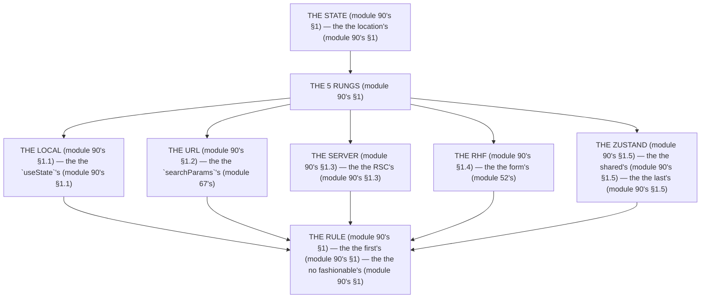

# Module 90 — State Management, Decided: The 5-Step Ladder, Applied to the Capstone

**Phase 23: Production Architecture · Module 90 of 101**

> **Where does this run?** The ladder is a **`[BOTH]`** decision (the state's *location* — module 90's §1); the *answer* is almost always the *first* rung that fits (module 90's §1). The module-90's standing rule (module 67's URL rule + module 52's RHF rule, now the state level): **the state is the *ladder's* (module 90's §1) — *local → URL → server → RHF → Zustand* (module 90's §1); you use the *first* rung that fits (module 90's §1), never the *fashionable* one (module 90's §1); and *Zustand* is the *last* rung (module 90's §1) — it needs a *justification* (module 90's §1), not a *habit* (module 90's §1)** (module 90's §1).

---

## 1. Concept — The 5 rungs (the map)

**The local's** (module 90's §1.1): the *the `useState`'s* (module 90's §1.1) — the *module-90's line: the local is the `useState`'s* (module 90's §1.1) — the *the component's* (module 90's §1.1).

**The URL's** (module 90's §1.2): the *the `searchParams`'s* (module 67's) — the *module-90's line: the URL is the `searchParams`'s* (module 67's) — the *module-67's* *filter* (module 67's).

**The server's** (module 90's §1.3): the *the RSC's* (module 90's §1.3) — the *module-90's line: the server is the RSC's* (module 90's §1.3) — the *module-4's* *fetch* (module 4's).

**The RHF's** (module 90's §1.4): the *the form's* (module 52's) — the *module-90's line: the RHF is the form's* (module 52's) — the *module-52's* *resolver* (module 52's).

**The Zustand's** (module 90's §1.5): the *the shared's* (module 90's §1.5) — the *module-90's line: the Zustand is the shared's* (module 90's §1.5) — the *the last's* (module 90's §1.5).

## 2. Mental Model — The 5 rungs (drawn)



## 3. Architecture — The capstone's (module 90's §3)

`FILE: docs/state-decisions.md` (production pattern — the module-90's §3: the table's)

```md
## THE CAPSTONE'S STATE (module 90's §3 — the the table's (module 90's §3))

| State (module 90's §3) | The rung (module 90's §3) | Why (module 90's §3) |
|---|---|---|
| The modal's open (module 90's §3.1) | The local's (module 90's §1.1) | The component's (module 90's §1.1) |
| The product's filter (module 90's §3.2) | The URL's (module 90's §1.2) | The share's (module 67's) |
| The product's list (module 90's §3.3) | The server's (module 90's §1.3) | The no client's cache (module 4's) |
| The checkout's form (module 90's §3.4) | The RHF's (module 90's §1.4) | The field's (module 52's) |
| The bulk-select's rows (module 90's §3.5) | The Zustand's (module 90's §1.5) | The shared's (module 90's §1.5) |

/* THE RULE (module 90's §3): the the first's (module 90's §1) — the the no fashionable's (module 90's §1) — the the last's (module 90's §1.5) */
```

## 4. Production Code — The Zustand's (module 90's §4)

`FILE: src/stores/bulk-select.ts` (production pattern — [CLIENT] — the module-90's §4: the justification's)

```ts
// THE ZUSTAND (module 90's §4) — the the shared's (module 90's §1.5) — the the last's (module 90's §1.5):
import { create } from 'zustand'   /* the module-90's line: the Zustand's (module 90's §1.5) */

/* THE JUSTIFICATION (module 90's §4) — the the no local's (module 90's §4) — the the no URL's (module 90's §4):
   1. The shared's (module 90's §4.1): the the 3's components (module 90's §4.1) — the the row's, the bar's, the dialog's (module 90's §4.1)
   2. The no URL's (module 90's §4.2): the the no share's (module 90's §4.2) — the the no link's (module 90's §4.2)
   3. The no server's (module 90's §4.3): the the no DB's (module 90's §4.3) — the the ephemeral's (module 90's §4.3) */

interface BulkSelect {
  ids: string[]   /* the module-90's line: the ids's (module 90's §4) */
  toggle: (id: string) => void   /* the module-90's line: the toggle's (module 90's §4) */
  clear: () => void   /* the module-90's line: the clear's (module 90's §4) */
}

export const useBulkSelect = create<BulkSelect>((set) => ({
  ids: [],   /* the module-90's line: the empty's (module 90's §4) */
  toggle: (id) => set((s) => ({ ids: s.ids.includes(id) ? s.ids.filter((x) => x !== id) : [...s.ids, id] })),   /* the module-90's line: the toggle's (module 90's §4) */
  clear: () => set({ ids: [] }),   /* the module-90's line: the clear's (module 90's §4) */
}))
```

**The module-90's line:** the *shared's* (module 90's §1.5) — the *last's* (module 90's §1.5) — the *justification's* (module 90's §4).

## 5. Common Mistakes (the state's failures)

| Mistake | The symptom | Fix |
|---|---|---|
| **The Zustand's day 1** (module 90's §1.5's line violated) | the *module-90's line: the last's* (module 90's §1.5) — the *the Zustand's day 1's is the *no's* (module 90's §1.5) — the *module-90's line: the no Zustand's day 1* (module 90's §1.5) — the *no Zustand's day 1* (module 90's §1.5)* | the *the first's (module 90's §1) — the *module-90's line: the state is the ladder's* (module 90's §1)* |
| **The no justification** (module 90's §1.5's line violated) | the *module-90's line: the justification's* (module 90's §4) — the *the no justification's is the *no's* (module 90's §4) — the *module-90's line: the no justification* (module 90's §4) — the *no justification* (module 90's §4)* | the *the 3's reasons (module 90's §4) — the *module-90's line: the justification's* (module 90's §4)* |
| **The URL's server** (module 90's §1.2's line violated) | the *module-90's line: the URL is the `searchParams`'s* (module 67's) — the *the URL's server's is the *no's* (module 90's §1.2) — the *module-90's line: the no URL's server* (module 90's §1.2) — the *no URL's server* (module 90's §1.2)* | the *the server's (module 90's §1.3) — the *module-90's line: the server is the RSC's* (module 90's §1.3)* |
| **The local's shared** (module 90's §1.1's line violated) | the *module-90's line: the local is the `useState`'s* (module 90's §1.1) — the *the local's shared's is the *no's* (module 90's §1.1) — the *module-90's line: the no local's shared* (module 90's §1.1) — the *no local's shared* (module 90's §1.1)* | the *the Zustand's (module 90's §1.5) — the *module-90's line: the Zustand is the shared's* (module 90's §1.5)* |
| **The RHF's no form** (module 90's §1.4's line violated) | the *module-90's line: the RHF is the form's* (module 52's) — the *the RHF's no form's is the *no's* (module 52's) — the *module-90's line: the no RHF's no form* (module 52's) — the *no RHF's no form* (module 52's)* | the *the local's (module 90's §1.1) — the *module-90's line: the local is the `useState`'s* (module 90's §1.1)* |
| **The fashionable's** (module 90's §1's line violated) | the *module-90's line: the no fashionable's* (module 90's §1) — the *the fashionable's is the *no's* (module 90's §1) — the *module-90's line: the no fashionable* (module 90's §1) — the *no fashionable* (module 90's §1)* | the *the first's (module 90's §1) — the *module-90's line: the state is the ladder's* (module 90's §1)* |

## 6. Security Notes

- **The URL's** (module 67's): the *module-90's line: the URL is the `searchParams`'s* (module 67's) — the *module-67's* *deep-dive* (module 67's).
- **The server's** (module 90's §1.3): the *module-90's line: the server is the RSC's* (module 90's §1.3) — the *module-4's* *deep-dive* (module 4's).
- **The no client's cache** (module 4's): the *module-90's line: the server is the RSC's* (module 90's §1.3) — the *module-22's* *deep-dive* (module 22's).

## 7. Performance Notes

- **The no client's cache** (module 4's): the *module-90's line: the server is the RSC's* (module 90's §1.3) — the *the no fetch's* (module 90's §1.3).
- **The URL's** (module 67's): the *module-90's line: the URL is the `searchParams`'s* (module 67's) — the *the no JS's* (module 67's).
- **The Zustand's** (module 90's §1.5): the *module-90's line: the Zustand is the shared's* (module 90's §1.5) — the *the no re-render's* (module 71's §1.4).

## 8. Exercise

**Beginner.** *The table's* (module 90's §3): the *the 5's states* (module 3's) + the *the 5's rungs* (module 3's) — *build the table* — the *artifact: the table's* (module 3's).

**Intermediate.** *The Zustand's* (module 90's §4): the *the 3's reasons* (module 4's) + the *the `useBulkSelect`'s* (module 4's) — *build it* — the *artifact: the store's* (module 4's).

**Production.** *The ladder's* (module 90's §1): the *the 5's rungs* (module 1's) + the *the no fashionable's* (module 1's) — *audit the capstone* — the *artifact: the audit's* (module 1's).

## 9. Architecture Challenge

**Prompt:** The *"the team puts the product list in Zustand, the checkout form in `useState`, and the filter in a context provider"* (the *module-90's* *state* — the *module-67's* *URL* — the *module-90's line: the state is the ladder's* (module 90's §1) — the *module-67's line: the URL is the `searchParams`'s* (module 67's) — the *module-90's standing line: the ladder's + the first's + the no fashionable's* (module 90's §1 + module 90's §1 + module 90's §1)).

The *problems*: (1) the *the Zustand's list* (the *the no server's* (module 90's §1.3) — the *module-90's line: the server is the RSC's* (module 90's §1.3) — the *module-90's standing line: the server's* (module 90's §1.3)).

(2) the *the filter's context* (the *the no URL's* (module 67's) — the *module-90's line: the URL is the `searchParams`'s* (module 67's) — the *module-90's standing line: the URL's* (module 90's §1.2)).

**Design**: the *the state's remediation* (the *the server's list* (module 3.3's) + the *the URL's filter* (module 3.2's) + the *the RHF's form* (module 3.4's) — the *module-90's line: the state is the ladder's* (module 90's §1) — the *module-90's standing line: the ladder's + the first's + the no fashionable's* (module 90's §1 + module 90's §1 + module 90's §1)).

Produce: the *the state's remediation* (the *the server's list* (module 3.3's) + the *the URL's filter* (module 3.2's) + the *the RHF's form* (module 3.4's) — the *module-90's line: the state is the ladder's* (module 90's §1) — the *module-90's standing line: the ladder's + the first's + the no fashionable's* (module 90's §1 + module 90's §1 + module 90's §1)).

<details>
<summary>Model answer</summary>
**The state's remediation** (module 90's §3.3 + module 90's §3.2 + module 90's §3.4):
1. **The server's list** (module 90's §1.3): the *the Zustand's list becomes the RSC's* — the *module-90's line: the server is the RSC's* (module 90's §1.3).
2. **The URL's filter** (module 90's §1.2): the *the context's filter becomes the `searchParams`'s* — the *module-90's line: the URL is the `searchParams`'s* (module 67's).
3. **The RHF's form** (module 90's §1.4): the *the `useState`'s form becomes the RHF's* — the *module-90's line: the RHF is the form's* (module 52's).
**The generalization** (the *state's* pattern, the *module's* standing rule): **the *ladder's* (module 90's §1) — the *the first's* (module 90's §1) — the *the no fashionable's* (module 90's §1) — the *module-90's standing line: the ladder's + the first's + the no fashionable's* (module 90's §1 + module 90's §1 + module 90's §1)*.
</details>

## 10. Official Documentation

- Zustand: https://zustand.docs.pmnd.rs/
- React: `useState`: https://react.dev/reference/react/useState
- URLSearchParams: https://developer.mozilla.org/en-US/docs/Web/API/URLSearchParams
- The module-67's URL: the module-67 (the phase-17's file-01)
- The module-52's RHF: the module-52 (the phase-12's file-02)

## 11. What You Should Know Before Continuing

- [ ] I can state the *5 rungs* (module 1's: the local/URL/server/RHF/Zustand) — the *module-90's line: the state is the ladder's* (module 1's)
- [ ] I know the *local is the `useState`'s* (module 1.1's) — the *the component's* (module 1.1's)
- [ ] I know the *URL is the `searchParams`'s* (module 1.2's) — the *the share's* (module 67's)
- [ ] I know the *server is the RSC's* (module 1.3's) — the *the no client's cache* (module 4's)
- [ ] I know the *RHF is the form's* (module 1.4's) — the *the field's* (module 52's)
- [ ] I know the *Zustand is the shared's* (module 1.5's) — the *the last's* (module 1.5's)
- [ ] I know the *justification's* (module 4's) — the *the 3's reasons* (module 4's)
- [ ] I've done the *table's* (module 8's beginner) + the *Zustand's* (module 8's intermediate) + the *ladder's* (module 8's production) — the *artifacts* (module 20's)

**Next:** Module 91 — TanStack Query, Decided (the *the query's* — the *module-91's line: the query is the when's* (module 91's)).
