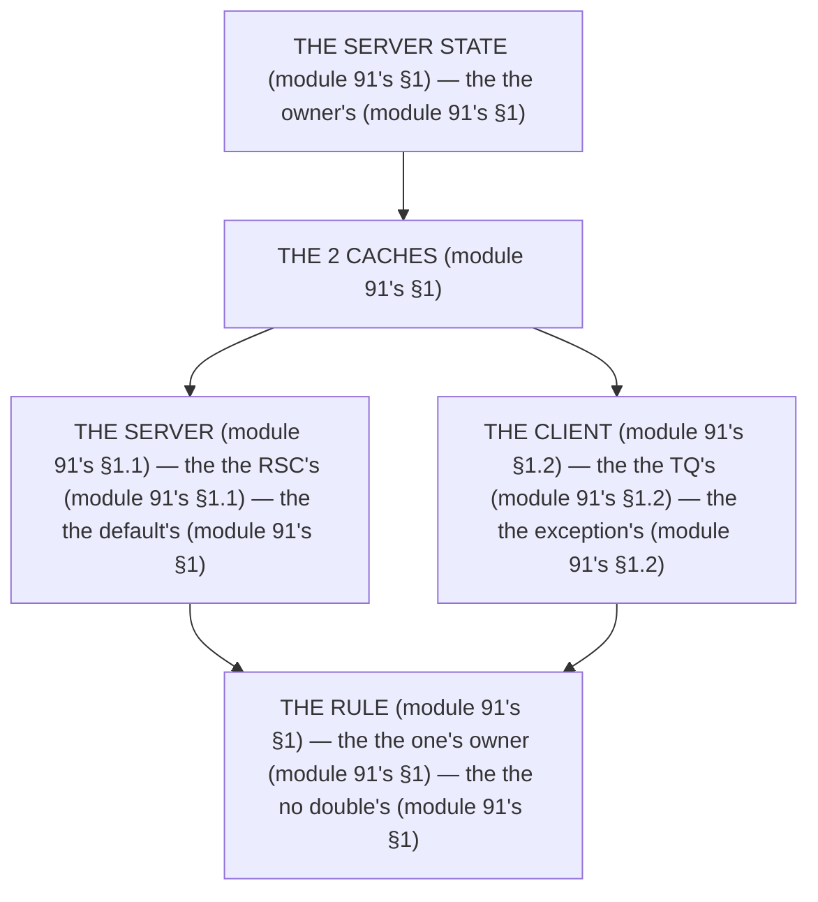

# Module 91 — TanStack Query, Decided: Server Cache vs Client Cache, and One Justified Use

**Phase 23: Production Architecture · Module 91 of 101**

> **Where does this run?** TanStack Query is **`[CLIENT]`** (the client's cache, module 91's §1); the *server* cache is **`[SERVER]`** (the RSC's, the Cache Components' — module 91's §1). The module-91's standing rule (module 4's fetch rule + module 20's tag rule, now the client-cache level): **the server state is the *server's* (module 91's §1) — the RSC's fetch + the `cacheTag`'s invalidation (module 20's) is the *default* (module 91's §1); TanStack Query is the *exception* (module 91's §1) — it wins when the *client* must *own* the polling (module 91's §1), the subscription (module 91's §1), or the *optimistic* mutation (module 91's §1); and a *double cache* (the RSC's + the TQ's) is the *no* (module 91's §1) — pick *one* owner (module 91's §1)** (module 91's §1).

---

## 1. Concept — The 2 caches (the map)

**The server's** (module 91's §1.1): the *the RSC's* (module 91's §1.1) — the *module-91's line: the server is the RSC's* (module 91's §1.1) — the *module-4's* *fetch* (module 4's).

**The client's** (module 91's §1.2): the *the TQ's* (module 91's §1.2) — the *module-91's line: the client is the TQ's* (module 91's §1.2) — the *module-91's* *query* (module 91's §1.2).

## 2. Mental Model — The 2 caches (drawn)



## 3. Architecture — The when's (module 91's §3)

`FILE: docs/tanstack-decision.md` (production pattern — the module-91's §3: the table's)

```md
## THE TQ'S DECISION (module 91's §3 — the the table's (module 91's §3))

| Concern (module 91's §3) | The RSC's (module 91's §1.1) | The TQ's (module 91's §1.2) |
|---|---|---|
| The default's (module 91's §3.1) | ✅ | ❌ |
| The polling's (module 91's §3.2) | The no (module 91's §3.2) | ✅ |
| The subscription's (module 91's §3.3) | The no (module 91's §3.3) | ✅ |
| The optimistic's (module 91's §3.4) | The action's (module 29's) | ✅ (the no action's) |
| The double's cache (module 91's §3.5) | ❌ | ❌ |

/* THE RULE (module 91's §3): the the one's owner (module 91's §1) — the the no double's (module 91's §1) — the the when's (module 91's §3) */
```

## 4. Production Code — The TQ's (module 91's §4)

`FILE: src/components/job-status.tsx` (production pattern — [CLIENT] — the module-91's §4: the polling's)

```tsx
// THE TQ (module 91's §4) — the the polling's (module 91's §1.2) — the the no RSC's (module 91's §4):
'use client'
import { useQuery } from '@tanstack/react-query'   /* the module-91's line: the TQ's (module 91's §1.2) */
import { useEffect } from 'react'

export function JobStatus({ orgId, jobId }: { orgId: string; jobId: string }) {
  /* THE JUSTIFICATION (module 91's §4) — the the no RSC's (module 91's §4):
     1. The polling's (module 91's §4.1): the the job's is the long's (module 87's §1) — the the no RSC's re-render (module 91's §4.1)
     2. The no invalidation's (module 91's §4.2): the the no `revalidateTag`'s (module 20's) — the the no full's re-render (module 91's §4.2)
     3. The ephemeral's (module 91's §4.3): the the job's is the ephemeral's (module 87's §1.3) — the the no DB's (module 91's §4.3) */

  const { data, isPending } = useQuery({
    queryKey: ['job', orgId, jobId],   /* the module-91's line: the key's (module 91's §4) */
    queryFn: async () => {
      const res = await fetch(`/api/v1/jobs/${jobId}`, { cache: 'no-store' })   /* the module-34's line: the BFF's (module 34's) */
      if (!res.ok) throw new Error('job_not_found')   /* the module-91's line: the no PII's (module 69's §3.2) */
      return (await res.json()) as { status: string }   /* the module-91's line: the status's (module 87's §3.3) */
    },
    refetchInterval: (query) => {   /* THE POLLS (module 91's §4) — the the stop's (module 91's §4):
      const status = query.state.data?.status   (module 91's §4)
      return status === 'done' || status === 'failed' ? false : 2000   (module 91's §4) — the the no poll's (module 91's §4)
    },
  })

  if (isPending) return <p aria-busy>Generating…</p>   /* the module-58's line: the loading's (module 58's) */
  if (data.status === 'done') return <p>Invoice ready.</p>   /* the module-91's line: the done's (module 87's §3.3) */
  if (data.status === 'failed') return <p>Invoice failed. Try again.</p>   /* the module-91's line: the failed's (module 87's §3.3) */
  return <p aria-busy>Generating…</p>   /* the module-58's line: the loading's (module 58's) */
}
```

**The module-91's line:** the *polling's* (module 91's §1.2) — the *no RSC's* (module 91's §4) — the *stop's* (module 91's §4).

## 5. Common Mistakes (the query's failures)

| Mistake | The symptom | Fix |
|---|---|---|
| **The TQ's default** (module 91's §1.2's line violated) | the *module-91's line: the server is the RSC's* (module 91's §1.1) — the *the TQ's default's is the *no's* (module 91's §1.2) — the *module-91's line: the no TQ's default* (module 91's §1.2) — the *no TQ's default* (module 91's §1.2)* | the *the RSC's (module 91's §1.1) — the *module-91's line: the server is the RSC's* (module 91's §1.1)* |
| **The double's cache** (module 91's §1's line violated) | the *module-91's line: the one's owner* (module 91's §1) — the *the double's cache's is the *no's* (module 91's §1) — the *module-91's line: the no double's cache* (module 91's §1) — the *no double's cache* (module 91's §1)* | the *the one's owner (module 91's §1) — the *module-91's line: the one's owner* (module 91's §1)* |
| **The no stop** (module 91's §4's line violated) | the *module-91's line: the stop's* (module 91's §4) — the *the no stop's is the *no's* (module 91's §4) — the *module-91's line: the no stop* (module 91's §4) — the *no stop* (module 91's §4)* | the *the `refetchInterval`'s (module 91's §4) — the *module-91's line: the stop's* (module 91's §4)* |
| **The RSC's poll** (module 91's §1.1's line violated) | the *module-91's line: the client is the TQ's* (module 91's §1.2) — the *the RSC's poll's is the *no's* (module 91's §1.1) — the *module-91's line: the no RSC's poll* (module 91's §1.1) — the *no RSC's poll* (module 91's §1.1)* | the *the TQ's (module 91's §1.2) — the *module-91's line: the client is the TQ's* (module 91's §1.2)* |
| **The optimistic's no action** (module 91's §1.2's line violated) | the *module-91's line: the action's* (module 29's) — the *the optimistic's no action's is the *no's* (module 29's) — the *module-91's line: the no optimistic's no action* (module 29's) — the *no optimistic's no action* (module 29's)* | the *the action's (module 29's) — the *module-91's line: the action's* (module 29's)* |
| **The no `queryKey`** (module 91's §4's line violated) | the *module-91's line: the key's* (module 91's §4) — the *the no `queryKey`'s is the *no's* (module 91's §4) — the *module-91's line: the no `queryKey`* (module 91's §4) — the *no `queryKey`* (module 91's §4)* | the *the `queryKey`'s (module 91's §4) — the *module-91's line: the key's* (module 91's §4)* |

## 6. Security Notes

- **The no PII** (module 69's §3.2): the *module-91's line: the no PII's* (module 69's §3.2) — the *module-75's* *deep-dive* (module 75's).
- **The BFF's** (module 34's): the *module-91's line: the BFF's* (module 34's) — the *module-34's* *deep-dive* (module 34's).
- **The action's** (module 29's): the *module-91's line: the action's* (module 29's) — the *module-29's* *deep-dive* (module 29's).

## 7. Performance Notes

- **The no poll's** (module 91's §4): the *module-91's line: the stop's* (module 91's §4) — the *the no 2s's* (module 91's §4).
- **The 2s's** (module 91's §4): the *module-91's line: the polling's* (module 91's §1.2) — the *the 2s's* (module 91's §4).
- **The one's owner** (module 91's §1): the *module-91's line: the one's owner* (module 91's §1) — the *the no 2's fetches* (module 91's §1).

## 8. Exercise

**Beginner.** *The table's* (module 91's §3): the *the 5's rows* (module 3's) + the *the 2's columns* (module 3's) — *build the table* — the *artifact: the table's* (module 3's).

**Intermediate.** *The TQ's* (module 91's §4): the *the `useQuery`'s* (module 4's) + the *the `refetchInterval`'s* (module 4's) — *build it* — the *artifact: the query's* (module 4's).

**Production.** *The one's owner's* (module 91's §1): the *the audit's* (module 91's §1) + the *the no double's* (module 91's §1) — *audit the capstone* — the *artifact: the audit's* (module 91's §1).

## 9. Architecture Challenge

**Prompt:** The *"the team wraps every RSC fetch in `useQuery` and polls the job status with a full page reload"* (the *module-91's* *query* — the *module-87's* *job* — the *module-91's line: the server is the RSC's* (module 91's §1.1) — the *module-87's line: the no request's* (module 87's §1) — the *module-91's standing line: the one's owner + the no double's + the when's* (module 91's §1 + module 91's §1 + module 91's §3)).

The *problems*: (1) the *the TQ's default* (the *the no RSC's* (module 91's §1.1) — the *module-91's line: the server is the RSC's* (module 91's §1.1) — the *module-91's standing line: the server's* (module 91's §1.1)).

(2) the *the no stop* (the *the no poll's* (module 91's §4) — the *module-91's line: the stop's* (module 91's §4) — the *module-91's standing line: the stop's* (module 91's §4)).

**Design**: the *the query's remediation* (the *the RSC's default* (module 3.1's) + the *the TQ's polling* (module 4's) + the *the `refetchInterval`'s* (module 4's) — the *module-91's line: the one's owner* (module 91's §1) — the *module-91's standing line: the one's owner + the no double's + the when's* (module 91's §1 + module 91's §1 + module 91's §3)).

Produce: the *the query's remediation* (the *the RSC's default* (module 3.1's) + the *the TQ's polling* (module 4's) + the *the `refetchInterval`'s* (module 4's) — the *module-91's line: the one's owner* (module 91's §1) — the *module-91's standing line: the one's owner + the no double's + the when's* (module 91's §1 + module 91's §1 + module 91's §3)).

<details>
<summary>Model answer</summary>
**The query's remediation** (module 91's §3.1 + module 91's §4):
1. **The RSC's default** (module 91's §1.1): the *the `useQuery`'s wraps leave the RSC's* — the *module-91's line: the server is the RSC's* (module 91's §1.1).
2. **The TQ's polling** (module 91's §1.2): the *the page reload's becomes the `useQuery`'s* — the *module-91's line: the client is the TQ's* (module 91's §1.2).
3. **The `refetchInterval`'s** (module 91's §4): the *the forever's poll becomes the stop's* — the *module-91's line: the stop's* (module 91's §4).
**The generalization** (the *query's* pattern, the *module's* standing rule): **the *one's owner* (module 91's §1) — the *the no double's* (module 91's §1) — the *the when's* (module 91's §3) — the *module-91's standing line: the one's owner + the no double's + the when's* (module 91's §1 + module 91's §1 + module 91's §3)*.
</details>

## 10. Official Documentation

- TanStack Query: https://tanstack.com/query/latest/docs/framework/react/overview
- TanStack Query: `useQuery`: https://tanstack.com/query/latest/docs/framework/react/reference/useQuery
- Next.js: Caching: https://nextjs.org/docs/app/getting-started/caching
- The module-20's tags: the module-20 (the phase-5's file-01)
- The module-87's job: the module-87 (the phase-22's file-04)

## 11. What You Should Know Before Continuing

- [ ] I can state the *2 caches* (module 1's: the server's/client's) — the *module-91's line: the one's owner* (module 1's)
- [ ] I know the *server is the RSC's* (module 1.1's) — the *the default's* (module 1's)
- [ ] I know the *client is the TQ's* (module 1.2's) — the *the exception's* (module 1's)
- [ ] I know the *polling's* (module 3.2's) — the *the stop's* (module 4's)
- [ ] I know the *subscription's* (module 3.3's) — the *the no RSC's* (module 3.3's)
- [ ] I know the *optimistic's* (module 3.4's) — the *the action's* (module 29's)
- [ ] I know the *no double's* (module 3.5's) — the *the one's owner* (module 1's)
- [ ] I've done the *table's* (module 8's beginner) + the *TQ's* (module 8's intermediate) + the *owner's* (module 8's production) — the *artifacts* (module 20's)

**Next:** Module 92 — The Architecture Review Checklist (the *the review's* — the *module-92's line: the review is the recurring's* (module 92's)).
