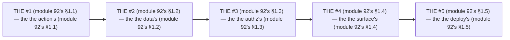

# Module 92 — The Architecture Review Checklist: The Recurring Review, Used at All 5 Points

**Phase 23: Production Architecture · Module 92 of 101**

> **Where does this run?** The review is a **process** (the checklist, module 92's §1); the *findings* land in the *docs* (the artifact, module 92's §1). The module-92's standing rule (module 77's audit rule, now the architecture level): **the review is the *recurring's* (module 92's §1) — not the *one-off's* (module 92's §1); it runs at the *5 points* (module 92's §1), with the *same checklist* (module 92's §1); every finding has a *severity*, an *owner*, and a *fix date* (module 77's §1.2); and the review's *output* is the *artifact* (the `docs/architecture-review-#N.md`) — the *module-92's line: the review is the recurring's* (module 92's §1)** (module 92's §1).

---

## 1. Concept — The 5 points (the map)

**The #1's** (module 92's §1.1): the *the action's* (module 92's §1.1) — the *module-92's line: the #1 is the action's* (module 92's §1.1) — the *module-29's* *inventory* (module 29's).

**The #2's** (module 92's §1.2): the *the data's* (module 92's §1.2) — the *module-92's line: the #2 is the data's* (module 92's §1.2) — the *module-37's* *tenancy* (module 37's).

**The #3's** (module 92's §1.3): the *the authz's* (module 92's §1.3) — the *module-92's line: the #3 is the authz's* (module 92's §1.3) — the *module-48's* *RBAC* (module 48's).

**The #4's** (module 92's §1.4): the *the surface's* (module 92's §1.4) — the *module-92's line: the #4 is the surface's* (module 92's §1.4) — the *module-67's* *URL* (module 67's).

**The #5's** (module 92's §1.5): the *the deploy's* (module 92's §1.5) — the *module-92's line: the #5 is the deploy's* (module 92's §1.5) — the *module-84's* *target* (module 84's).

## 2. Mental Model — The 5 points (drawn)



## 3. Architecture — The checklist (module 92's §3)

`FILE: docs/architecture-review-checklist.md` (production pattern — the module-92's §3: the checklist's)

```md
## THE 8 CHECKS (module 92's §3 — the the checklist's (module 92's §3))

| # | Check (module 92's §3) | Question (module 92's §3) | Ref (module 92's §3) |
|---|---|---|---|
| 1 | The boundary's (module 92's §3.1) | The no component's DB (module 5's) | Module 5 |
| 2 | The tenancy's (module 92's §3.2) | The no cross-tenant's (module 37's) | Module 37 |
| 3 | The cache's (module 92's §3.3) | The no session's in the cache (module 22's) | Module 22 |
| 4 | The state's (module 92's §3.4) | The no Zustand's day 1 (module 90's §1.5) | Module 90 |
| 5 | The security's (module 92's §3.5) | The no `NEXT_PUBLIC_`'s secret (module 76's §1) | Module 76 |
| 6 | The perf's (module 92's §3.6) | The no N+1's (module 72's §1.1) | Module 72 |
| 7 | The API's (module 92's §3.7) | The no raw's BFF (module 34's) | Module 34 |
| 8 | The test's (module 92's §3.8) | The no authz's negative (module 80's §1.4) | Module 80 |

/* THE RULE (module 92's §3): the the checklist's (module 92's §3) — the the 8's checks (module 92's §3) — the the no one-off's (module 92's §1) */
```

## 4. Production Code — The review's (module 92's §4)

`FILE: docs/architecture-review-#4.md` (production pattern — the module-92's §4: the findings')

```md
## THE REVIEW #4 (module 92's §4 — the the surface's (module 92's §1.4))

| # | Check | Finding (module 92's §4) | Severity | Owner | Fix | Status |
|---|---|---|---|---|---|---|
| R-01 | The boundary's | The component's DB (module 5's) | **High** | The UI | The service's (module 5's) | ✅ |
| R-02 | The tenancy's | The no cross-tenant's (module 37's) | **Critical** | The data | The tenancy's (module 37's) | ✅ |
| R-03 | The cache's | The session's in the cache (module 22's) | **Critical** | The cache | The no session's (module 22's) | ✅ |
| R-04 | The state's | The Zustand's day 1 (module 90's §1.5) | **Medium** | The state | The ladder's (module 90's §1) | ✅ |
| R-05 | The security's | The `NEXT_PUBLIC_`'s secret (module 76's §1) | **Critical** | The infra | The no-leak's (module 76's §1) | ✅ |
| R-06 | The perf's | The N+1's (module 72's §1.1) | **High** | The data | The `inArray`'s (module 72's §3.1) | ✅ |
| R-07 | The API's | The raw's BFF (module 34's) | **High** | The API | The snake_case's (module 34's) | ✅ |
| R-08 | The test's | The no authz's negative (module 80's §1.4) | **High** | The test | The 404's (module 80's §3.4) | ✅ |

/* THE RULE (module 92's §4): the the finding's (module 77's §1.2) — the the severity's (module 77's §1.2) — the the fix's (module 77's §1.3) — the the no closed's (module 77's §1.2) */
```

**The module-92's line:** the *finding's* (module 77's §1.2) — the *severity's* (module 77's §1.2) — the *fix's* (module 77's §1.3) — the *no closed's* (module 77's §1.2).

## 5. Common Mistakes (the review's failures)

| Mistake | The symptom | Fix |
|---|---|---|
| **The one-off's** (module 92's §1's line violated) | the *module-92's line: the review is the recurring's* (module 92's §1) — the *the one-off's is the *no's* (module 92's §1) — the *module-92's line: the no one-off* (module 92's §1) — the *no one-off* (module 92's §1)* | the *the 5's points (module 92's §1) — the *module-92's line: the review is the recurring's* (module 92's §1)* |
| **The no severity** (module 77's §1.2's line violated) | the *module-92's line: the finding's* (module 77's §1.2) — the *the no severity's is the *no's* (module 77's §1.2) — the *module-92's line: the no severity* (module 77's §1.2) — the *no severity* (module 77's §1.2)* | the *the severity's (module 77's §1.2) — the *module-92's line: the finding's* (module 77's §1.2)* |
| **The no owner** (module 77's §1.2's line violated) | the *module-92's line: the finding's* (module 77's §1.2) — the *the no owner's is the *no's* (module 77's §1.2) — the *module-92's line: the no owner* (module 77's §1.2) — the *no owner* (module 77's §1.2)* | the *the owner's (module 77's §1.2) — the *module-92's line: the finding's* (module 77's §1.2)* |
| **The no fix date** (module 77's §1.2's line violated) | the *module-92's line: the finding's* (module 77's §1.2) — the *the no fix date's is the *no's* (module 77's §1.2) — the *module-92's line: the no fix date* (module 77's §1.2) — the *no fix date* (module 77's §1.2)* | the *the fix date's (module 77's §1.2) — the *module-92's line: the finding's* (module 77's §1.2)* |
| **The 8's no** (module 92's §3's line violated) | the *module-92's line: the 8's checks* (module 92's §3) — the *the 8's no's is the *no's* (module 92's §3) — the *module-92's line: the no 8's* (module 92's §3) — the *no 8's* (module 92's §3)* | the *the 8's checks (module 92's §3) — the *module-92's line: the 8's checks* (module 92's §3)* |
| **The no artifact** (module 92's §1's line violated) | the *module-92's line: the artifact's* (module 92's §1) — the *the no artifact's is the *no's* (module 92's §1) — the *module-92's line: the no artifact* (module 92's §1) — the *no artifact* (module 92's §1)* | the *the `docs/`'s (module 92's §4) — the *module-92's line: the artifact's* (module 92's §1)* |

## 6. Security Notes

- **The tenancy's** (module 37's): the *module-92's line: the tenancy's* (module 37's) — the *module-37's* *deep-dive* (module 37's).
- **The no-leak's** (module 76's §1): the *module-92's line: the no-leak's* (module 76's §1) — the *module-76's* *deep-dive* (module 76's).
- **The no session's** (module 22's): the *module-92's line: the no session's* (module 22's) — the *module-22's* *deep-dive* (module 22's).

## 7. Performance Notes

- **The no N+1's** (module 72's §1.1): the *module-92's line: the no N+1's* (module 72's §1.1) — the *the `inArray`'s* (module 72's §3.1).
- **The no raw's BFF** (module 34's): the *module-92's line: the no raw's BFF* (module 34's) — the *the snake_case's* (module 34's).
- **The no component's DB** (module 5's): the *module-92's line: the no component's DB* (module 5's) — the *the service's* (module 5's).

## 8. Exercise

**Beginner.** *The checklist's* (module 92's §3): the *the 8's checks* (module 3's) + the *the question's* (module 3's) — *build the table* — the *artifact: the checklist's* (module 3's).

**Intermediate.** *The review's* (module 92's §4): the *the 8's findings* (module 4's) + the *the severity's* (module 4's) — *build the findings'* — the *artifact: the findings'* (module 4's).

**Production.** *The 5's points'* (module 92's §1): the *the 5's reviews* (module 1's) + the *the no one-off's* (module 1's) — *run the 5's* — the *artifact: the 5's reviews* (module 1's).

## 9. Architecture Challenge

**Prompt:** The *"the team does one big review at the end — no severity, no owner, no fix date, and no artifact"* (the *module-92's* *review* — the *module-77's* *audit* — the *module-92's line: the review is the recurring's* (module 92's §1) — the *module-77's line: the finding's* (module 77's §1.2) — the *module-92's standing line: the recurring's + the 8's checks + the artifact's* (module 92's §1 + module 92's §3 + module 92's §1)).

The *problems*: (1) the *the one-off's* (the *the no recurring's* (module 92's §1) — the *module-92's line: the review is the recurring's* (module 92's §1) — the *module-92's standing line: the recurring's* (module 92's §1)).

(2) the *the no severity* (the *the no finding's* (module 77's §1.2) — the *module-92's line: the finding's* (module 77's §1.2) — the *module-92's standing line: the finding's* (module 77's §1.2)).

**Design**: the *the review's remediation* (the *the 5's points* (module 1's) + the *the 8's checks* (module 3's) + the *the findings'* (module 4's) — the *module-92's line: the review is the recurring's* (module 92's §1) — the *module-92's standing line: the recurring's + the 8's checks + the artifact's* (module 92's §1 + module 92's §3 + module 92's §1)).

Produce: the *the review's remediation* (the *the 5's points* (module 1's) + the *the 8's checks* (module 3's) + the *the findings'* (module 4's) — the *module-92's line: the review is the recurring's* (module 92's §1) — the *module-92's standing line: the recurring's + the 8's checks + the artifact's* (module 92's §1 + module 92's §3 + module 92's §1)).

<details>
<summary>Model answer</summary>
**The review's remediation** (module 92's §1 + module 92's §3 + module 92's §4):
1. **The 5's points** (module 92's §1): the *the one's review becomes the 5's* — the *module-92's line: the review is the recurring's* (module 92's §1).
2. **The 8's checks** (module 92's §3): the *the big's review becomes the 8's* — the *module-92's line: the 8's checks* (module 92's §3).
3. **The findings'** (module 92's §4): the *the no-severity's becomes the severity's* — the *module-92's line: the finding's* (module 77's §1.2).
**The generalization** (the *review's* pattern, the *module's* standing rule): **the *recurring's* (module 92's §1) — the *the 8's checks* (module 92's §3) — the *the artifact's* (module 92's §1) — the *module-92's standing line: the recurring's + the 8's checks + the artifact's* (module 92's §1 + module 92's §3 + module 92's §1)*.
</details>

## 10. Official Documentation

- OWASP: Architecture: https://owasp.org/www-project-application-security-verification-standard/
- Next.js: Architecture: https://nextjs.org/docs/app/building-your-application/rendering
- The module-77's audit: the module-77 (the phase-19's file-04)
- The module-80's test: the module-80 (the phase-20's file-03)

## 11. What You Should Know Before Continuing

- [ ] I can state the *5 points* (module 1's: the #1/#2/#3/#4/#5) — the *module-92's line: the review is the recurring's* (module 1's)
- [ ] I know the *8's checks* (module 3's) — the *the boundary's + the tenancy's + the cache's + the state's + the security's + the perf's + the API's + the test's* (module 3's)
- [ ] I know the *finding's* (module 77's §1.2) — the *the severity's + the owner's + the fix date's* (module 77's §1.2)
- [ ] I know the *artifact's* (module 1's) — the *the `docs/architecture-review-#N.md`'s* (module 4's)
- [ ] I've done the *checklist's* (module 8's beginner) + the *review's* (module 8's intermediate) + the *5's points'* (module 8's production) — the *artifacts* (module 20's)

**Phase 23 complete.** Production Architecture — the 4 architectures (module 89's), the state's (module 90's), the query's (module 91's), the review's (module 92's).

**Next:** Module 93 — Phase 24 (the *the capstone's* — the *module-93's line: the PRD is the requirements's* (module 93's)).
