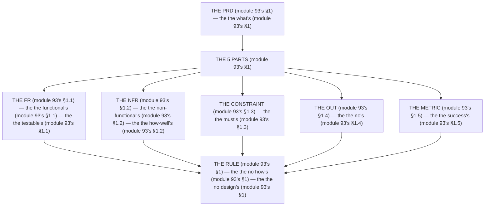

# Module 93 — The Capstone PRD: Requirements Only (No Design)

**Phase 24: Capstone · Module 93 of 101**

> **Where does this run?** The PRD is a **document** (the team's, module 93's §1) — it prescribes the *what*, never the *how* (module 93's §1). The module-93's standing rule (the course's capstone contract, module 93's §1): **the PRD is the *requirements' (module 93's §1) — the *FR's* (functional, module 93's §1) + the *NFR's* (non-functional, module 93's §1); it contains *zero* architecture (module 93's §1) — no folder, no schema, no runtime, no cache strategy (module 93's §1); the *design* is the *next* module's job (module 94's §1), and the *build* is the *staged* module's (module 95's §1)** (module 93's §1).

---

## 1. Concept — The 5 parts (the map)

**The FR's** (module 93's §1.1): the *the functional's* (module 93's §1.1) — the *module-93's line: the FR is the what's* (module 93's §1.1) — the *the testable's* (module 93's §1.1).

**The NFR's** (module 93's §1.2): the *the non-functional's* (module 93's §1.2) — the *module-93's line: the NFR is the how-well's* (module 93's §1.2) — the *module-73's* *targets* (module 73's).

**The constraint's** (module 93's §1.3): the *the must's* (module 93's §1.3) — the *module-93's line: the constraint is the must's* (module 93's §1.3) — the *module-01's* *stack* (module 1's).

**The out's** (module 93's §1.4): the *the no's* (module 93's §1.4) — the *module-93's line: the out is the no's* (module 93's §1.4) — the *the scope's* (module 93's §1.4).

**The metric's** (module 93's §1.5): the *the success's* (module 93's §1.5) — the *module-93's line: the metric is the success's* (module 93's §1.5) — the *module-69's* *measure* (module 69's).

## 2. Mental Model — The 5 parts (drawn)



## 3. Architecture — The PRD (module 93's §3)

`FILE: docs/capstone-prd.md` (production pattern — the module-93's §3: the PRD's)

```md
# CAPSTONE PRD — Multi-Tenant SaaS Commerce & Operations Platform (module 93's §3)

## 3.1 Vision (module 93's §3)
One platform where a small business (an *org*) manages its catalog, orders, and team — multi-tenant, server-rendered, production-grade (module 93's §3).

## 3.2 Personas (module 93's §3)
| Persona (module 93's §3) | The role (module 93's §3) | The need (module 93's §3) |
|---|---|---|
| The owner (module 93's §3.1) | The admin's (module 93's §3.1) | The team's + the settings's (module 93's §3.1) |
| The ops' (module 93's §3.2) | The manager's (module 93's §3.2) | The orders's + the products's (module 93's §3.2) |
| The viewer's (module 93's §3.3) | The read-only's (module 93's §3.3) | The dashboard's (module 93's §3.3) |
| The customer's (module 93's §3.4) | The public's (module 93's §3.4) | The catalog's + the checkout's (module 93's §3.4) |

## 3.3 Functional Requirements (module 93's §3)
| # | FR (module 93's §3) | Testable (module 93's §1.1) |
|---|---|---|
| FR-1 (module 93's §3.3.1) | The user's can register/login/logout with email+password (module 93's §3.3.1) | The 2FA's optional (module 93's §3.3.1) |
| FR-2 (module 93's §3.3.2) | The owner's can create an org + invite members (module 93's §3.3.2) | The roles's (module 93's §3.3.2) |
| FR-3 (module 93's §3.3.3) | The member's can CRUD products (module 93's §3.3.3) | The images's (module 93's §3.3.3) |
| FR-4 (module 93's §3.3.4) | The customer's can browse the catalog (module 93's §3.3.4) | The search's + the filter's (module 93's §3.3.4) |
| FR-5 (module 93's §3.3.5) | The customer's can check out (module 93's §3.3.5) | The payment's via a PSP (module 93's §3.3.5) |
| FR-6 (module 93's §3.3.6) | The ops's can manage orders (module 93's §3.3.6) | The status's + the refund's (module 93's §3.3.6) |
| FR-7 (module 93's §3.3.7) | The owner's can view the dashboard (module 93's §3.3.7) | The stats's + the chart's (module 93's §3.3.7) |
| FR-8 (module 93's §3.3.8) | The member's can upload product images (module 93's §3.3.8) | The size's + the type's (module 93's §3.3.8) |
| FR-9 (module 93's §3.3.9) | The invoice's is generated asynchronously (module 93's §3.3.9) | The status's is visible (module 93's §3.3.9) |
| FR-10 (module 93's §3.3.10) | The catalog's is public + SEO (module 93's §3.3.10) | The metadata's + the OG's (module 93's §3.3.10) |
| FR-11 (module 93's §3.3.11) | The UI's is i18n (module 93's §3.3.11) | The en/fr/ar (module 93's §3.3.11) |
| FR-12 (module 93's §3.3.12) | The admin's can view the audit log (module 93's §3.3.12) | The who's + the what's (module 93's §3.3.12) |

## 3.4 Non-Functional Requirements (module 93's §3)
| # | NFR (module 93's §3) | Target (module 93's §1.2) |
|---|---|---|
| NFR-1 (module 93's §3.4.1) | The LCP's (module 73's §1.1) | The 2.5s (module 73's §1.1) |
| NFR-2 (module 93's §3.4.2) | The INP's (module 73's §1.2) | The 200ms (module 73's §1.2) |
| NFR-3 (module 93's §3.4.3) | The CLS's (module 73's §1.3) | The 0.1 (module 73's §1.3) |
| NFR-4 (module 93's §3.4.4) | The TTFB's (module 70's §1.1) | The 800ms (module 70's §1.1) |
| NFR-5 (module 93's §3.4.5) | The availability's (module 93's §3.4.5) | The 99.5% (module 93's §3.4.5) |
| NFR-6 (module 93's §3.4.6) | The recovery's (module 93's §3.4.6) | The RPO 24h (module 93's §3.4.6) |
| NFR-7 (module 93's §3.4.7) | The no cross-tenant's (module 37's) | The 0 (module 37's) |
| NFR-8 (module 93's §3.4.8) | The no PII's in the log (module 69's §3.2) | The 0 (module 69's §3.2) |

## 3.5 Constraints (module 93's §3)
| # | Constraint (module 93's §3) | The must's (module 93's §1.3) |
|---|---|---|
| C-1 (module 93's §3.5.1) | The Next's (module 1's) | The 16.x (module 1's) |
| C-2 (module 93's §3.5.2) | The React's (module 1's) | The 19.x (module 1's) |
| C-3 (module 93's §3.5.3) | The DB's (module 1's) | The Postgres 18 (module 1's) |
| C-4 (module 93's §3.5.4) | The TS's (module 1's) | The everywhere's (module 1's) |
| C-5 (module 93's §3.5.5) | The deployment's (module 84's) | The Vercel's + the Docker's (module 84's) |

## 3.6 Out of Scope (module 93's §3)
| # | Out (module 93's §3) | The no's (module 93's §1.4) |
|---|---|---|
| O-1 (module 93's §3.6.1) | The marketplace's (module 93's §3.6.1) | The no multi-seller's (module 93's §3.6.1) |
| O-2 (module 93's §3.6.2) | The subscription's (module 93's §3.6.2) | The no billing's (module 93's §3.6.2) |
| O-3 (module 93's §3.6.3) | The mobile's app (module 93's §3.6.3) | The no native's (module 93's §3.6.3) |
| O-4 (module 93's §3.6.4) | The AI's (module 93's §3.6.4) | The no ML's (module 93's §3.6.4) |
| O-5 (module 93's §3.6.5) | The webhooks's out (module 93's §3.6.5) | The no integration's (module 93's §3.6.5) |

## 3.7 Success Metrics (module 93's §3)
| # | Metric (module 93's §3) | The success's (module 93's §1.5) |
|---|---|---|
| M-1 (module 93's §3.7.1) | The 15's stages (module 95's) | The all's green (module 95's) |
| M-2 (module 93's §3.7.2) | The 5's reviews (module 92's) | The all's closed (module 92's) |
| M-3 (module 93's §3.7.3) | The NFR's (module 93's §3.4) | The all's met (module 93's §3.4) |
| M-4 (module 93's §3.7.4) | The audit's (module 77's) | The 0's critical (module 77's) |

/* THE RULE (module 93's §3): the the what's (module 93's §1) — the the no how's (module 93's §1) — the the no design's (module 93's §1) */
```

**The module-93's line:** the *what's* (module 93's §1) — the *no how's* (module 93's §1) — the *no design's* (module 93's §1).

## 4. Production Code — The no design's (module 93's §4)

`FILE: docs/capstone-prd-rules.md` (production pattern — the module-93's §4: the 3 rules)

```md
## THE PRD'S RULES (module 93's §4 — the the no design's (module 93's §1))

1. **The no folder** (module 93's §4.1): the the no tree's (module 93's §4.1) — the the no `src/` (module 93's §4.1)
2. **The no schema** (module 93's §4.2): the the no table's (module 93's §4.2) — the the no `orgs` (module 93's §4.2)
3. **The no runtime** (module 93's §4.3): the the no Node's (module 93's §4.3) — the the no Edge's (module 93's §4.3)

/* THE RULE (module 93's §4): the the no design's (module 93's §1) — the the no folder's (module 93's §4.1) — the the no schema's (module 93's §4.2) */
```

**The module-93's line:** the *no design's* (module 93's §1) — the *no folder's* (module 93's §4.1) — the *no schema's* (module 93's §4.2).

## 5. Common Mistakes (the PRD's failures)

| Mistake | The symptom | Fix |
|---|---|---|
| **The design's** (module 93's §1's line violated) | the *module-93's line: the no design's* (module 93's §1) — the *the design's is the *no's* (module 93's §1) — the *module-93's line: the no design* (module 93's §1) — the *no design* (module 93's §1)* | the *the FR's (module 93's §3.3) — the *module-93's line: the FR is the what's* (module 93's §1.1)* |
| **The no testable** (module 93's §1.1's line violated) | the *module-93's line: the testable's* (module 93's §1.1) — the *the no testable's is the *no's* (module 93's §1.1) — the *module-93's line: the no testable* (module 93's §1.1) — the *no testable* (module 93's §1.1)* | the *the testable's (module 93's §3.3) — the *module-93's line: the testable's* (module 93's §1.1)* |
| **The no target** (module 93's §1.2's line violated) | the *module-93's line: the how-well's* (module 93's §1.2) — the *the no target's is the *no's* (module 93's §1.2) — the *module-93's line: the no target* (module 93's §1.2) — the *no target* (module 93's §1.2)* | the *the target's (module 93's §3.4) — the *module-93's line: the how-well's* (module 93's §1.2)* |
| **The no out** (module 93's §1.4's line violated) | the *module-93's line: the out is the no's* (module 93's §1.4) — the *the no out's is the *no's* (module 93's §1.4) — the *module-93's line: the no out* (module 93's §1.4) — the *no out* (module 93's §1.4)* | the *the out's (module 93's §3.6) — the *module-93's line: the out is the no's* (module 93's §1.4)* |
| **The no metric** (module 93's §1.5's line violated) | the *module-93's line: the metric is the success's* (module 93's §1.5) — the *the no metric's is the *no's* (module 93's §1.5) — the *module-93's line: the no metric* (module 93's §1.5) — the *no metric* (module 93's §1.5)* | the *the metric's (module 93's §3.7) — the *module-93's line: the metric is the success's* (module 93's §1.5)* |
| **The no constraint** (module 93's §1.3's line violated) | the *module-93's line: the constraint is the must's* (module 93's §1.3) — the *the no constraint's is the *no's* (module 93's §1.3) — the *module-93's line: the no constraint* (module 93's §1.3) — the *no constraint* (module 93's §1.3)* | the *the constraint's (module 93's §3.5) — the *module-93's line: the constraint is the must's* (module 93's §1.3)* |

## 6. Security Notes

- **The no cross-tenant's** (module 37's): the *module-93's line: the no cross-tenant's* (module 37's) — the *module-37's* *deep-dive* (module 37's).
- **The no PII's** (module 69's §3.2): the *module-93's line: the no PII's* (module 69's §3.2) — the *module-69's* *deep-dive* (module 69's).
- **The 2FA's** (module 93's §3.3.1): the *module-93's line: the 2FA's* (module 93's §3.3.1) — the *module-44's* *deep-dive* (module 44's).

## 7. Performance Notes

- **The 2.5s's** (module 73's §1.1): the *module-93's line: the LCP's* (module 73's §1.1) — the *the 2.5s* (module 73's §1.1).
- **The 800ms's** (module 70's §1.1): the *module-93's line: the TTFB's* (module 70's §1.1) — the *the 800ms* (module 70's §1.1).
- **The 99.5%'s** (module 93's §3.4.5): the *module-93's line: the availability's* (module 93's §3.4.5) — the *the 99.5%* (module 93's §3.4.5).

## 8. Exercise

**Beginner.** *The FR's* (module 93's §3.3): the *the 12's FRs* (module 3's) + the *the testable's* (module 3's) — *build the table* — the *artifact: the FR's* (module 3's).

**Intermediate.** *The NFR's* (module 93's §3.4): the *the 8's NFRs* (module 3's) + the *the target's* (module 3's) — *build the table* — the *artifact: the NFR's* (module 3's).

**Production.** *The no design's* (module 93's §4): the *the 3's rules* (module 4's) + the *the audit's* (module 4's) — *audit the PRD* — the *artifact: the audit's* (module 4's).

## 9. Architecture Challenge

**Prompt:** The *"the team's 'PRD' includes the folder structure, the schema, and the runtime choice — and it's 40 pages"* (the *module-93's* *PRD* — the *module-94's* *design* — the *module-93's line: the no design's* (module 93's §1) — the *module-94's line: the design is the how's* (module 94's) — the *module-93's standing line: the what's + the no how's + the no design's* (module 93's §1 + module 93's §1 + module 93's §1)).

The *problems*: (1) the *the design's in the PRD* (the *the no what's* (module 93's §1) — the *module-93's line: the no design's* (module 93's §1) — the *module-93's standing line: the no design's* (module 93's §1)).

(2) the *the 40's pages* (the *the no testable's* (module 93's §1.1) — the *module-93's line: the testable's* (module 93's §1.1) — the *module-93's standing line: the testable's* (module 93's §1.1)).

**Design**: the *the PRD's remediation* (the *the 12's FRs* (module 3.3's) + the *the 8's NFRs* (module 3.4's) + the *the 3's rules* (module 4's) — the *module-93's line: the no design's* (module 93's §1) — the *module-93's standing line: the what's + the no how's + the no design's* (module 93's §1 + module 93's §1 + module 93's §1)).

Produce: the *the PRD's remediation* (the *the 12's FRs* (module 3.3's) + the *the 8's NFRs* (module 3.4's) + the *the 3's rules* (module 4's) — the *module-93's line: the no design's* (module 93's §1) — the *module-93's standing line: the what's + the no how's + the no design's* (module 93's §1 + module 93's §1 + module 93's §1)).

<details>
<summary>Model answer</summary>
**The PRD's remediation** (module 93's §3.3 + module 93's §3.4 + module 93's §4):
1. **The 12's FRs** (module 93's §3.3): the *the design's leaves the PRD's* — the *module-93's line: the FR is the what's* (module 93's §1.1).
2. **The 8's NFRs** (module 93's §3.4): the *the how-well's becomes the target's* — the *module-93's line: the NFR is the how-well's* (module 93's §1.2).
3. **The 3's rules** (module 93's §4): the *the 40's pages become the 3's rules'* — the *module-93's line: the no design's* (module 93's §1).
**The generalization** (the *PRD's* pattern, the *module's* standing rule): **the *what's* (module 93's §1) — the *the no how's* (module 93's §1) — the *the no design's* (module 93's §1) — the *module-93's standing line: the what's + the no how's + the no design's* (module 93's §1 + module 93's §1 + module 93's §1)*.
</details>

## 10. Official Documentation

- Next.js: Getting Started: https://nextjs.org/docs/app/getting-started
- The course's stack: the module-01 (the phase-0's file-01)
- The module-94's design: the module-94 (the phase-24's file-02)
- The module-95's build: the module-95 (the phase-24's file-03)

## 11. What You Should Know Before Continuing

- [ ] I can state the *5 parts* (module 1's: the FR/NFR/constraint/out/metric) — the *module-93's line: the no design's* (module 1's)
- [ ] I know the *FR is the what's* (module 1.1's) — the *the testable's* (module 1.1's)
- [ ] I know the *NFR is the how-well's* (module 1.2's) — the *the target's* (module 1.2's)
- [ ] I know the *constraint is the must's* (module 1.3's) — the *the must's* (module 1.3's)
- [ ] I know the *out is the no's* (module 1.4's) — the *the no's* (module 1.4's)
- [ ] I know the *metric is the success's* (module 1.5's) — the *the success's* (module 1.5's)
- [ ] I know the *no design's* (module 4's) — the *the no folder's + the no schema's + the no runtime's* (module 4's)
- [ ] I've done the *FR's* (module 8's beginner) + the *NFR's* (module 8's intermediate) + the *no design's* (module 8's production) — the *artifacts* (module 20's)

**Next:** Module 94 — The Design Workshop (the *the how's* — the *module-94's line: the design is the how's* (module 94's)).
