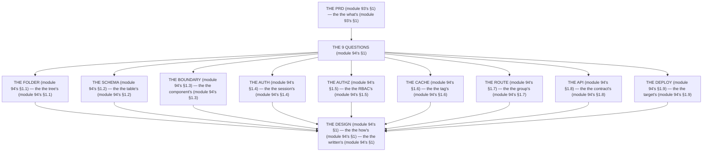

# Module 94 — The Design Workshop: 9 Questions, Answered in Writing, Reviewed

**Phase 24: Capstone · Module 94 of 101**

> **Where does this run?** The workshop is a **you** exercise (module 94's §1) — you *design*, you *write*, you *get reviewed* (module 94's §1). The module-94's standing rule (module 93's PRD rule, now the design level): **the design is the *how's* (module 94's §1) — the PRD's *what's* (module 93's §1) becomes the *design's* how's (module 94's §1); you answer the *9 questions* in *writing* (module 94's §1) — not in code (module 94's §1), not in a slide (module 94's §1); the *code* is the *staged build's* job (module 95's §1), and the *review* is the *architect's* job (module 96's §1)** (module 94's §1).

---

## 1. Concept — The 9 questions (the map)

**The folder's** (module 94's §1.1): the *the tree's* (module 94's §1.1) — the *module-94's line: the folder is the tree's* (module 94's §1.1) — the *module-5's* *service* (module 5's).

**The schema's** (module 94's §1.2): the *the table's* (module 94's §1.2) — the *module-94's line: the schema is the table's* (module 94's §1.2) — the *module-37's* *tenancy* (module 37's).

**The boundary's** (module 94's §1.3): the *the component's* (module 94's §1.3) — the *module-94's line: the boundary is the component's* (module 94's §1.3) — the *module-68's* *SC/CC* (module 68's).

**The auth's** (module 94's §1.4): the *the session's* (module 94's §1.4) — the *module-94's line: the auth is the session's* (module 94's §1.4) — the *module-43's* *cookie* (module 43's).

**The authz's** (module 94's §1.5): the *the RBAC's* (module 94's §1.5) — the *module-94's line: the authz is the RBAC's* (module 94's §1.5) — the *module-48's* *permission* (module 48's).

**The cache's** (module 94's §1.6): the *the tag's* (module 94's §1.6) — the *module-94's line: the cache is the tag's* (module 94's §1.6) — the *module-20's* *invalidation* (module 20's).

**The route's** (module 94's §1.7): the *the group's* (module 94's §1.7) — the *module-94's line: the route is the group's* (module 94's §1.7) — the *module-2's* *layout* (module 2's).

**The API's** (module 94's §1.8): the *the contract's* (module 94's §1.8) — the *module-94's line: the API is the contract's* (module 94's §1.8) — the *module-34's* *BFF* (module 34's).

**The deploy's** (module 94's §1.9): the *the target's* (module 94's §1.9) — the *module-94's line: the deploy is the target's* (module 94's §1.9) — the *module-84's* *constraint* (module 84's).

## 2. Mental Model — The 9 questions (drawn)



## 3. Architecture — The 9 questions (the workshop)

`FILE: docs/design-workshop.md` (production pattern — the module-94's §3: the questions')

```md
## THE 9 QUESTIONS (module 94's §3 — the the questions' (module 94's §3))

| # | Question (module 94's §3) | The artifact (module 94's §3) | The good's (module 94's §3) |
|---|---|---|---|
| 1 | The folder's (module 94's §1.1) | The tree's (module 94's §3.1) | The service's (module 5's) |
| 2 | The schema's (module 94's §1.2) | The table's (module 94's §3.2) | The tenancy's (module 37's) |
| 3 | The boundary's (module 94's §1.3) | The component's map (module 94's §3.3) | The SC's (module 68's) |
| 4 | The auth's (module 94's §1.4) | The session's flow (module 94's §3.4) | The cookie's (module 43's) |
| 5 | The authz's (module 94's §1.5) | The RBAC's matrix (module 94's §3.5) | The 2-gate's (module 48's) |
| 6 | The cache's (module 94's §1.6) | The tag's map (module 94's §3.6) | The invalidation's (module 20's) |
| 7 | The route's (module 94's §1.7) | The group's tree (module 94's §3.7) | The layout's (module 2's) |
| 8 | The API's (module 94's §1.8) | The contract's doc (module 94's §3.8) | The snake_case's (module 34's) |
| 9 | The deploy's (module 94's §1.9) | The target's doc (module 94's §3.9) | The constraint's (module 84's) |

/* THE RULE (module 94's §3): the the question's (module 94's §3) — the the artifact's (module 94's §3) — the the good's (module 94's §3) */
```

## 4. Production Code — The no code's (module 94's §4)

`FILE: docs/design-rules.md` (production pattern — the module-94's §4: the 3 rules)

```md
## THE DESIGN'S RULES (module 94's §4 — the the no code's (module 94's §1))

1. **The no code** (module 94's §4.1): the the no `src/` (module 94's §4.1) — the the no tree's (module 94's §4.1)
2. **The no slide** (module 94's §4.2): the the no `ppt` (module 94's §4.2) — the the no talk's (module 94's §4.2)
3. **The written's** (module 94's §4.3): the the doc's (module 94's §4.3) — the the `md` (module 94's §4.3)

/* THE RULE (module 94's §4): the the no code's (module 94's §1) — the the no slide's (module 94's §1) — the the written's (module 94's §1) */
```

**The module-94's line:** the *no code's* (module 94's §1) — the *no slide's* (module 94's §1) — the *written's* (module 94's §1).

## 5. Common Mistakes (the design's failures)

| Mistake | The symptom | Fix |
|---|---|---|
| **The code's** (module 94's §1's line violated) | the *module-94's line: the no code's* (module 94's §1) — the *the code's is the *no's* (module 94's §4.1) — the *module-94's line: the no code* (module 94's §4.1) — the *no code* (module 94's §4.1)* | the *the written's (module 94's §1) — the *module-94's line: the no code's* (module 94's §1)* |
| **The no 9's** (module 94's §1's line violated) | the *module-94's line: the 9 questions* (module 94's §1) — the *the no 9's is the *no's* (module 94's §3) — the *module-94's line: the no 9* (module 94's §3) — the *no 9* (module 94's §3)* | the *the 9 questions (module 94's §3) — the *module-94's line: the 9 questions* (module 94's §1)* |
| **The no artifact** (module 94's §3's line violated) | the *module-94's line: the artifact's* (module 94's §3) — the *the no artifact's is the *no's* (module 94's §3) — the *module-94's line: the no artifact* (module 94's §3) — the *no artifact* (module 94's §3)* | the *the artifact's (module 94's §3) — the *module-94's line: the artifact's* (module 94's §3)* |
| **The no good** (module 94's §3's line violated) | the *module-94's line: the good's* (module 94's §3) — the *the no good's is the *no's* (module 94's §3) — the *module-94's line: the no good* (module 94's §3) — the *no good* (module 94's §3)* | the *the good's (module 94's §3) — the *module-94's line: the good's* (module 94's §3)* |
| **The slide's** (module 94's §4.2's line violated) | the *module-94's line: the no slide's* (module 94's §4.2) — the *the slide's is the *no's* (module 94's §4.2) — the *module-94's line: the no slide* (module 94's §4.2) — the *no slide* (module 94's §4.2)* | the *the written's (module 94's §4.3) — the *module-94's line: the no slide's* (module 94's §4.2)* |
| **The no review** (module 94's §1's line violated) | the *module-94's line: the review's* (module 96's) — the *the no review's is the *no's* (module 96's) — the *module-94's line: the no review* (module 96's) — the *no review* (module 96's)* | the *the architect's (module 96's) — the *module-94's line: the review's* (module 96's)* |

## 6. Security Notes

- **The tenancy's** (module 37's): the *module-94's line: the schema is the table's* (module 94's §1.2) — the *module-37's* *deep-dive* (module 37's).
- **The cookie's** (module 43's): the *module-94's line: the auth is the session's* (module 94's §1.4) — the *module-43's* *deep-dive* (module 43's).
- **The 2-gate's** (module 48's): the *module-94's line: the authz is the RBAC's* (module 94's §1.5) — the *module-48's* *deep-dive* (module 48's).

## 7. Performance Notes

- **The tag's** (module 20's): the *module-94's line: the cache is the tag's* (module 94's §1.6) — the *module-20's* *deep-dive* (module 20's).
- **The SC's** (module 68's): the *module-94's line: the boundary is the component's* (module 94's §1.3) — the *module-68's* *deep-dive* (module 68's).
- **The contract's** (module 34's): the *module-94's line: the API is the contract's* (module 94's §1.8) — the *module-34's* *deep-dive* (module 34's).

## 8. Exercise

**Beginner.** *The folder's + the route's* (module 94's §1.1 + §1.7): the *the tree's* (module 3.1's) + the *the group's* (module 3.7's) — *write it* — the *artifact: the 2's artifacts* (module 3.1's + module 3.7's).

**Intermediate.** *The schema's + the authz's* (module 94's §1.2 + §1.5): the *the table's* (module 3.2's) + the *the matrix's* (module 3.5's) — *write it* — the *artifact: the 2's artifacts* (module 3.2's + module 3.5's).

**Production.** *The 9's* (module 94's §3): the *the 9 questions* (module 3's) + the *the 9 artifacts* (module 3's) — *write all 9* — the *artifact: the 9's* (module 3's).

## 9. Architecture Challenge

**Prompt:** The *"the team skips the workshop and goes straight to code — no written design, no review, and the 9 questions are never answered"* (the *module-94's* *design* — the *module-96's* *review* — the *module-94's line: the design is the how's* (module 94's §1) — the *module-96's line: the review is the architect's* (module 96's) — the *module-94's standing line: the 9 questions + the written's + the review's* (module 94's §1 + module 94's §1 + module 96's)).

The *problems*: (1) the *the no 9's* (the *the no written's* (module 94's §1) — the *module-94's line: the written's* (module 94's §1) — the *module-94's standing line: the written's* (module 94's §1)).

(2) the *the no review* (the *the no architect's* (module 96's) — the *module-94's line: the review's* (module 96's) — the *module-94's standing line: the review's* (module 96's)).

**Design**: the *the design's remediation* (the *the 9 questions* (module 3's) + the *the 9 artifacts* (module 3's) + the *the architect's review* (module 96's) — the *module-94's line: the design is the how's* (module 94's §1) — the *module-94's standing line: the 9 questions + the written's + the review's* (module 94's §1 + module 94's §1 + module 96's)).

Produce: the *the design's remediation* (the *the 9 questions* (module 3's) + the *the 9 artifacts* (module 3's) + the *the architect's review* (module 96's) — the *module-94's line: the design is the how's* (module 94's §1) — the *module-94's standing line: the 9 questions + the written's + the review's* (module 94's §1 + module 94's §1 + module 96's)).

<details>
<summary>Model answer</summary>
**The design's remediation** (module 94's §3 + module 94's §4 + module 96's):
1. **The 9 questions** (module 94's §3): the *the code's becomes the 9 questions'* — the *module-94's line: the 9 questions* (module 94's §1).
2. **The 9 artifacts** (module 94's §3): the *the no-artifact's becomes the artifact's* — the *module-94's line: the artifact's* (module 94's §3).
3. **The architect's review** (module 96's): the *the no-review's becomes the architect's* — the *module-94's line: the review's* (module 96's).
**The generalization** (the *design's* pattern, the *module's* standing rule): **the *9 questions* (module 94's §1) — the *the written's* (module 94's §1) — the *the review's* (module 96's) — the *module-94's standing line: the 9 questions + the written's + the review's* (module 94's §1 + module 94's §1 + module 96's)*.
</details>

## 10. Official Documentation

- Next.js: Project Structure: https://nextjs.org/docs/app/getting-started/project-structure
- The module-93's PRD: the module-93 (the phase-24's file-01)
- The module-95's build: the module-95 (the phase-24's file-03)
- The module-96's review: the module-96 (the phase-24's file-04)

## 11. What You Should Know Before Continuing

- [ ] I can state the *9 questions* (module 1's: the folder/schema/boundary/auth/authz/cache/route/API/deploy) — the *module-94's line: the design is the how's* (module 1's)
- [ ] I know the *folder is the tree's* (module 1.1's) — the *the service's* (module 5's)
- [ ] I know the *schema is the table's* (module 1.2's) — the *the tenancy's* (module 37's)
- [ ] I know the *boundary is the component's* (module 1.3's) — the *the SC's* (module 68's)
- [ ] I know the *auth is the session's* (module 1.4's) — the *the cookie's* (module 43's)
- [ ] I know the *authz is the RBAC's* (module 1.5's) — the *the 2-gate's* (module 48's)
- [ ] I know the *cache is the tag's* (module 1.6's) — the *the invalidation's* (module 20's)
- [ ] I know the *route is the group's* (module 1.7's) — the *the layout's* (module 2's)
- [ ] I know the *API is the contract's* (module 1.8's) — the *the snake_case's* (module 34's)
- [ ] I know the *deploy is the target's* (module 1.9's) — the *the constraint's* (module 84's)
- [ ] I've done the *folder/route* (module 8's beginner) + the *schema/authz* (module 8's intermediate) + the *9's* (module 8's production) — the *artifacts* (module 20's)

**Next:** Module 95 — The Staged Build (the *the 15's stages* — the *module-95's line: the build is the staged's* (module 95's)).
