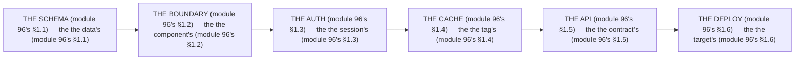

# Module 96 — The Senior Architect Review: The Review Pass over Your Design

**Phase 24: Capstone · Module 96 of 101**

> **Where does this run?** The review is a **senior's** pass (module 96's §1) over your *written* design (module 94's) and *staged* build (module 95's). The module-96's standing rule (module 92's recurring review, now the final level): **the review is the *architect's* (module 96's §1) — it asks the *6 questions* (module 96's §1) in the *6 passes* (module 96's §1); a *pass* is *approved* (module 96's §1), *rejected with findings* (module 96's §1), or *sent back* (module 96's §1); and the review's *output* is the *verdict doc* (module 96's §1) — the *module-96's line: the review is the architect's* (module 96's §1)** (module 96's §1).

---

## 1. Concept — The 6 passes (the map)

**The schema's** (module 96's §1.1): the *the data's* (module 96's §1.1) — the *module-96's line: the schema is the data's* (module 96's §1.1) — the *module-37's* *tenancy* (module 37's).

**The boundary's** (module 96's §1.2): the *the component's* (module 96's §1.2) — the *module-96's line: the boundary is the component's* (module 96's §1.2) — the *module-68's* *SC/CC* (module 68's).

**The auth's** (module 96's §1.3): the *the session's* (module 96's §1.3) — the *module-96's line: the auth is the session's* (module 96's §1.3) — the *module-43's* *cookie* (module 43's).

**The cache's** (module 96's §1.4): the *the tag's* (module 96's §1.4) — the *module-96's line: the cache is the tag's* (module 96's §1.4) — the *module-20's* *invalidation* (module 20's).

**The API's** (module 96's §1.5): the *the contract's* (module 96's §1.5) — the *module-96's line: the API is the contract's* (module 96's §1.5) — the *module-34's* *BFF* (module 34's).

**The deploy's** (module 96's §1.6): the *the target's* (module 96's §1.6) — the *module-96's line: the deploy is the target's* (module 96's §1.6) — the *module-84's* *constraint* (module 84's).

## 2. Mental Model — The 6 passes (drawn)



## 3. Architecture — The 6 passes (the questions)

`FILE: docs/architect-review.md` (production pattern — the module-96's §3: the questions')

```md
## THE 6 PASSES (module 96's §3 — the the questions' (module 96's §3))

| # | Pass (module 96's §3) | The question (module 96's §3) | The good's (module 96's §3) | The bad's (module 96's §3) |
|---|---|---|---|---|
| 1 | The schema's (module 96's §1.1) | The tenancy's? (module 37's) | The first's (module 37's) | The no first's (module 37's) |
| 2 | The boundary's (module 96's §1.2) | The SC's? (module 68's) | The no `'use client`'s guess (module 71's) | The all's `'use client` (module 71's) |
| 3 | The auth's (module 96's §1.3) | The cookie's? (module 43's) | The HttpOnly's (module 43's) | The localStorage's (module 43's §5) |
| 4 | The cache's (module 96's §1.4) | The tag's? (module 20's) | The typed's tag (module 20's) | The no tag's (module 20's) |
| 5 | The API's (module 96's §1.5) | The contract's? (module 34's) | The snake_case's (module 34's) | The camelCase's (module 34's) |
| 6 | The deploy's (module 96's §1.6) | The constraint's? (module 84's) | The no `public/`'s (module 66's) | The `public/`'s (module 66's) |

/* THE RULE (module 96's §3): the the pass's (module 96's §3) — the the question's (module 96's §3) — the the verdict's (module 96's §1) */
```

## 4. Production Code — The verdict (module 96's §4)

`FILE: docs/architect-verdict.md` (production pattern — the module-96's §4: the verdict's)

```md
## THE VERDICT (module 96's §4 — the the verdict's (module 96's §4))

| # | Pass | Verdict (module 96's §4) | Finding (module 96's §4) | The fix (module 96's §4) |
|---|---|---|---|---|
| 1 | The schema's (module 96's §1.1) | ✅ Approved (module 96's §4) | The no (module 96's §4) | The no (module 96's §4) |
| 2 | The boundary's (module 96's §1.2) | ⚠️ Findings (module 96's §4) | The `'use client`'s guess (module 71's) | The 3's questions (module 68's) |
| 3 | The auth's (module 96's §1.3) | ✅ Approved (module 96's §4) | The no (module 96's §4) | The no (module 96's §4) |
| 4 | The cache's (module 96's §1.4) | ⚠️ Findings (module 96's §4) | The no tag's (module 20's) | The typed's tag (module 20's) |
| 5 | The API's (module 96's §1.5) | ✅ Approved (module 96's §4) | The no (module 96's §4) | The no (module 96's §4) |
| 6 | The deploy's (module 96's §1.6) | ❌ Sent back (module 96's §4) | The `public/`'s (module 66's) | The S3's (module 66's) |

/* THE RULE (module 96's §4): the the verdict's (module 96's §4) — the the finding's (module 77's §1.2) — the the fix's (module 77's §1.3) */
```

**The module-96's line:** the *verdict's* (module 96's §4) — the *finding's* (module 77's §1.2) — the *fix's* (module 77's §1.3).

## 5. Common Mistakes (the review's failures)

| Mistake | The symptom | Fix |
|---|---|---|
| **The no pass** (module 96's §1's line violated) | the *module-96's line: the 6 passes* (module 96's §1) — the *the no pass's is the *no's* (module 96's §3) — the *module-96's line: the no pass* (module 96's §3) — the *no pass* (module 96's §3)* | the *the 6 passes (module 96's §3) — the *module-96's line: the 6 passes* (module 96's §1)* |
| **The no verdict** (module 96's §4's line violated) | the *module-96's line: the verdict's* (module 96's §4) — the *the no verdict's is the *no's* (module 96's §4) — the *module-96's line: the no verdict* (module 96's §4) — the *no verdict* (module 96's §4)* | the *the verdict's (module 96's §4) — the *module-96's line: the verdict's* (module 96's §4)* |
| **The no finding** (module 77's §1.2's line violated) | the *module-96's line: the finding's* (module 77's §1.2) — the *the no finding's is the *no's* (module 77's §1.2) — the *module-96's line: the no finding* (module 77's §1.2) — the *no finding* (module 77's §1.2)* | the *the finding's (module 77's §1.2) — the *module-96's line: the finding's* (module 77's §1.2)* |
| **The no fix** (module 77's §1.3's line violated) | the *module-96's line: the fix's* (module 77's §1.3) — the *the no fix's is the *no's* (module 77's §1.3) — the *module-96's line: the no fix* (module 77's §1.3) — the *no fix* (module 77's §1.3)* | the *the fix's (module 77's §1.3) — the *module-96's line: the fix's* (module 77's §1.3)* |
| **The all's 'use client'** (module 96's §1.2's line violated) | the *module-96's line: the SC's* (module 68's) — the *the all's `'use client`'s is the *no's* (module 71's) — the *module-96's line: the no all's `'use client`* (module 71's) — the *no all's `'use client`* (module 71's)* | the *the 3's questions (module 68's) — the *module-96's line: the SC's* (module 68's)* |
| **The `public/`'s** (module 96's §1.6's line violated) | the *module-96's line: the no `public/`'s* (module 66's) — the *the `public/`'s is the *no's* (module 66's) — the *module-96's line: the no `public/`* (module 66's) — the *no `public/`* (module 66's)* | the *the S3's (module 66's) — the *module-96's line: the no `public/`'s* (module 66's)* |

## 6. Security Notes

- **The tenancy's** (module 37's): the *module-96's line: the schema is the data's* (module 96's §1.1) — the *module-37's* *deep-dive* (module 37's).
- **The cookie's** (module 43's): the *module-96's line: the auth is the session's* (module 96's §1.3) — the *module-43's* *deep-dive* (module 43's).
- **The no `public/`'s** (module 66's): the *module-96's line: the deploy is the target's* (module 96's §1.6) — the *module-66's* *deep-dive* (module 66's).

## 7. Performance Notes

- **The SC's** (module 68's): the *module-96's line: the boundary is the component's* (module 96's §1.2) — the *module-68's* *deep-dive* (module 68's).
- **The tag's** (module 20's): the *module-96's line: the cache is the tag's* (module 96's §1.4) — the *module-20's* *deep-dive* (module 20's).
- **The contract's** (module 34's): the *module-96's line: the API is the contract's* (module 96's §1.5) — the *module-34's* *deep-dive* (module 34's).

## 8. Exercise

**Beginner.** *The passes 1–3's* (module 96's §1.1–§1.3): the *the 3 questions* (module 3's) + the *the 3 verdicts* (module 4's) — *run them* — the *artifact: the 3 passes* (module 3's).

**Intermediate.** *The passes 4–6's* (module 96's §1.4–§1.6): the *the 3 questions* (module 3's) + the *the 3 verdicts* (module 4's) — *run them* — the *artifact: the 3 passes* (module 3's).

**Production.** *The 6's passes'* (module 96's §3): the *the 6 questions* (module 3's) + the *the 6 verdicts* (module 4's) — *run all 6* — the *artifact: the 6 passes* (module 3's).

## 9. Architecture Challenge

**Prompt:** The *"the architect reviews the capstone in 10 minutes, approves everything, and writes no findings"* (the *module-96's* *review* — the *module-92's* *recurring* — the *module-96's line: the review is the architect's* (module 96's §1) — the *module-77's line: the finding's* (module 77's §1.2) — the *module-96's standing line: the 6 passes + the verdict's + the finding's* (module 96's §1 + module 96's §4 + module 77's §1.2)).

The *problems*: (1) the *the no 6's* (the *the no pass's* (module 96's §3) — the *module-96's line: the 6 passes* (module 96's §1) — the *module-96's standing line: the 6 passes* (module 96's §1)).

(2) the *the no finding* (the *the no verdict's* (module 96's §4) — the *module-96's line: the finding's* (module 77's §1.2) — the *module-96's standing line: the finding's* (module 77's §1.2)).

**Design**: the *the review's remediation* (the *the 6 questions* (module 3's) + the *the 6 verdicts* (module 4's) + the *the findings'* (module 4's) — the *module-96's line: the review is the architect's* (module 96's §1) — the *module-96's standing line: the 6 passes + the verdict's + the finding's* (module 96's §1 + module 96's §4 + module 77's §1.2)).

Produce: the *the review's remediation* (the *the 6 questions* (module 3's) + the *the 6 verdicts* (module 4's) + the *the findings'* (module 4's) — the *module-96's line: the review is the architect's* (module 96's §1) — the *module-96's standing line: the 6 passes + the verdict's + the finding's* (module 96's §1 + module 96's §4 + module 77's §1.2)).

<details>
<summary>Model answer</summary>
**The review's remediation** (module 96's §3 + module 96's §4):
1. **The 6 questions** (module 96's §1): the *the 10's minutes become the 6 passes'* — the *module-96's line: the 6 passes* (module 96's §1).
2. **The 6 verdicts** (module 96's §4): the *the all's approved becomes the verdict's* — the *module-96's line: the verdict's* (module 96's §4).
3. **The findings'** (module 77's §1.2): the *the no-finding's becomes the finding's* — the *module-96's line: the finding's* (module 77's §1.2).
**The generalization** (the *review's* pattern, the *module's* standing rule): **the *6 passes* (module 96's §1) — the *the verdict's* (module 96's §4) — the *the finding's* (module 77's §1.2) — the *module-96's standing line: the 6 passes + the verdict's + the finding's* (module 96's §1 + module 96's §4 + module 77's §1.2)*.
</details>

## 10. Official Documentation

- Next.js: Architecture: https://nextjs.org/docs/app/building-your-application/rendering
- The module-94's design: the module-94 (the phase-24's file-02)
- The module-95's build: the module-95 (the phase-24's file-03)
- The module-92's recurring: the module-92 (the phase-23's file-04)

## 11. What You Should Know Before Continuing

- [ ] I can state the *6 passes* (module 1's: the schema/boundary/auth/cache/API/deploy) — the *module-96's line: the review is the architect's* (module 1's)
- [ ] I know the *schema is the data's* (module 1.1's) — the *the tenancy's* (module 37's)
- [ ] I know the *boundary is the component's* (module 1.2's) — the *the SC's* (module 68's)
- [ ] I know the *auth is the session's* (module 1.3's) — the *the cookie's* (module 43's)
- [ ] I know the *cache is the tag's* (module 1.4's) — the *the invalidation's* (module 20's)
- [ ] I know the *API is the contract's* (module 1.5's) — the *the snake_case's* (module 34's)
- [ ] I know the *deploy is the target's* (module 1.6's) — the *the constraint's* (module 84's)
- [ ] I know the *verdict's* (module 4's) — the *the ✅/⚠️/❌'s* (module 4's)
- [ ] I've done the *1–3's* (module 8's beginner) + the *4–6's* (module 8's intermediate) + the *6's* (module 8's production) — the *artifacts* (module 20's)

**Phase 24 complete.** Capstone — the PRD (module 93's), the design (module 94's), the build (module 95's), the review (module 96's).

**Next:** Module 97 — Phase 25 (the *the mastery's* — the *module-97's line: the debugging is the 15's* (module 97's)).
