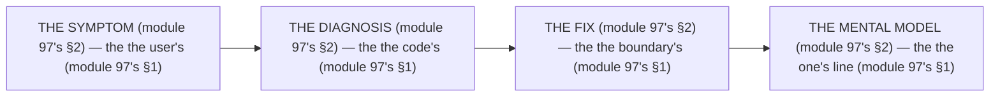

# Module 97 — Debugging Lab: 15 Broken Apps (Diagnose → Fix → Explain)

**Phase 25: Mastery · Module 97 of 101**

> **Where does this run?** The debugging is a **process** (the lab's, module 97's §1) — *symptom → diagnosis → fix → mental model* (module 97's §1). The module-97's standing rule (module 69's measure rule, now the debugging level): **the symptom is the *user's* (module 97's §1), the diagnosis is the *code's* (module 97's §1), the fix is the *boundary's* (module 97's §1), and the *mental model* is the *one line* (module 97's §1) — a bug *fixed without the line* is a bug *that returns* (module 97's §1)** (module 97's §1).

---

## 1. Concept — The 15 bugs (the map)

`FILE: docs/debugging-lab.md` (production pattern — the module-97's §1: the table's)

| # | Bug (module 97's §1) | The symptom (module 97's §1) | The module's (module 97's §1) |
|---|---|---|---|
| 1 | The hydration's (module 97's §1.1) | The `Date`'s mismatch (module 71's) | Module 71 |
| 2 | The N+1's (module 97's §1.2) | The 51's queries (module 72's) | Module 72 |
| 3 | The session's leak (module 97's §1.3) | The other's user (module 47's) | Module 47 |
| 4 | The no redirect's (module 97's §1.4) | The double's submit (module 29's) | Module 29 |
| 5 | The `or()`'s tenancy (module 97's §1.5) | The cross-tenant's 403 (module 49's) | Module 49 |
| 6 | The `NEXT_PUBLIC_`'s secret (module 97's §1.6) | The bundle's leak (module 76's) | Module 76 |
| 7 | The raw's `` (module 97's §1.7) | The CLS's 0.15 (module 64's) | Module 64 |
| 8 | The no content-type's (module 97's §1.8) | The CSRF's (module 75's) | Module 75 |
| 9 | The `useState`'s SC (module 97's §1.9) | The compile's error (module 3's) | Module 3 |
| 10 | The middleware's session (module 97's §1.10) | The stale's user (module 43's) | Module 43 |
| 11 | The unbounded's revalidate (module 97's §1.11) | The DB's melt (module 20's) | Module 20 |
| 12 | The no `key`'s (module 97's §1.12) | The focus's loss (module 58's) | Module 58 |
| 13 | The raw's SQL (module 97's §1.13) | The SQLi's (module 5's) | Module 5 |
| 14 | The `public/`'s upload (module 97's §1.14) | The lost's files (module 66's) | Module 66 |
| 15 | The no `SKIP LOCKED` (module 97's §1.15) | The 2's workers (module 87's) | Module 87 |

## 2. Mental Model — The 4 steps (drawn)

## 3. Architecture — The 15 bugs (the lab)

### Bug 1 — The hydration's (module 71's)

**Symptom (module 97's §3.1):** The user's sees `Mon, 28 Sep 2026 14:00:00 GMT` on the server, `Mon, 28 Sep 2026 15:00:00 GMT` on the client (module 71's).

**Diagnosis (module 97's §3.1):** The `Date`'s in the render (module 71's) — the *module-71's line: the no `Date` in the render* (module 71's).

**Fix (module 97's §3.1):** The `suppressHydrationWarning`'s (module 71's) or the `useEffect`'s (module 71's) (module 71's).

**Mental model (module 97's §3.1):** The *the server's HTML and the client's JS must match the first paint* (module 71's).

### Bug 2 — The N+1's (module 72's)

**Symptom (module 97's §3.2):** The product's list takes 320ms (module 72's).

**Diagnosis (module 97's §3.2):** The 51's queries (module 72's) — the *module-72's line: the N+1 is the no's* (module 72's §1.1).

**Fix (module 97's §3.2):** The `inArray`'s batch (module 72's §3.1) (module 72's).

**Mental model (module 97's §3.2):** The *the 1's + the N's becomes the 1's + the 1's* (module 72's §1.1).

### Bug 3 — The session's leak (module 47's)

**Symptom (module 97's §3.3):** The user's A sees the user's B's dashboard (module 47's).

**Diagnosis (module 97's §3.3):** The session's in the cached's shell (module 47's) — the *module-47's line: the session's never cached* (module 47's).

**Fix (module 97's §3.3):** The `'use cache: private`'s (module 47's) (module 47's).

**Mental model (module 97's §3.3):** The *the session's + the orgId's are the no-cache's* (module 47's).

### Bug 4 — The no redirect's (module 29's)

**Symptom (module 97's §3.4):** The user's double's submits the form (module 29's).

**Diagnosis (module 97's §3.4):** The action's returns a JSON (module 29's) — the *module-29's line: the action's MUST `redirect()`* (module 29's).

**Fix (module 97's §3.4):** The `redirect()`'s (module 29's) (module 29's).

**Mental model (module 97's §3.4):** The *the 303's floor (module 29's)*.

### Bug 5 — The `or()`'s tenancy (module 49's)

**Symptom (module 97's §3.5):** The org's A's member sees the org's B's product (module 49's).

**Diagnosis (module 97's §3.5):** The `or()`'s in the tenancy's filter (module 49's) — the *module-49's line: the tenancy's is the first's* (module 49's).

**Fix (module 97's §3.5):** The `eq`'s (module 49's) (module 49's).

**Mental model (module 97's §3.5):** The *the tenancy's clause is the first's, never in the `or()`'s* (module 49's).

### Bug 6 — The `NEXT_PUBLIC_`'s secret (module 76's)

**Symptom (module 97's §3.6):** The `BETTER_AUTH_SECRET`'s in the client's bundle (module 76's).

**Diagnosis (module 97's §3.6):** The `NEXT_PUBLIC_`'s prefix (module 76's) — the *module-76's line: the `NEXT_PUBLIC_` is the public's* (module 76's §1).

**Fix (module 97's §3.6):** The no prefix (module 76's) (module 76's).

**Mental model (module 97's §3.6):** The *the `NEXT_PUBLIC_`'s secret is the public's by construction* (module 76's §1).

### Bug 7 — The raw's `` (module 64's)

**Symptom (module 97's §3.7):** The CLS's is 0.15 (module 64's).

**Diagnosis (module 97's §3.7):** The no `width`/`height`'s (module 64's) — the *module-64's line: the `width`/`height` is the aspect's* (module 64's §3.1).

**Fix (module 97's §3.7):** The `next/image`'s (module 64's) (module 64's).

**Mental model (module 97's §3.7):** The *the no raw's ``* (module 64's).

### Bug 8 — The no content-type's (module 75's)

**Symptom (module 97's §3.8):** The CSRF's succeeds (module 75's).

**Diagnosis (module 97's §3.8):** The no `Content-Type`'s check (module 75's) — the *module-75's line: the `Content-Type`'s check* (module 75's §1.2).

**Fix (module 97's §3.8):** The `Content-Type`'s check (module 75's §3.2) (module 75's).

**Mental model (module 97's §3.8):** The *the server's stops, never the client's `if`* (module 75's §1).

### Bug 9 — The `useState`'s SC (module 3's)

**Symptom (module 97's §3.9):** The compile's error (module 3's).

**Diagnosis (module 97's §3.9):** The `useState`'s in the SC (module 3's) — the *module-3's line: the SC is the no state's* (module 3's).

**Fix (module 97's §3.9):** The `'use client`'s (module 3's) (module 3's).

**Mental model (module 97's §3.9):** The *the state's is the client's* (module 3's).

### Bug 10 — The middleware's session (module 43's)

**Symptom (module 97's §3.10):** The stale's user (module 43's).

**Diagnosis (module 97's §3.10):** The middleware's caches the session (module 43's) — the *module-43's line: the `nextCookies()` is the LAST's* (module 43's).

**Fix (module 97's §3.10):** The no cache (module 43's) (module 43's).

**Mental model (module 97's §3.10):** The *the session's read is the no-cache's* (module 43's).

### Bug 11 — The unbounded's revalidate (module 20's)

**Symptom (module 97's §3.11):** The DB's melts (module 20's).

**Diagnosis (module 97's §3.11):** The `revalidate: 1`'s on the public's page (module 20's) — the *module-20's line: the `revalidate` is the tag's* (module 20's).

**Fix (module 97's §3.11):** The `revalidateTag`'s (module 20's) (module 20's).

**Mental model (module 97's §3.11):** The *the invalidation's is the event's, not the timer's* (module 20's).

### Bug 12 — The no `key`'s (module 58's)

**Symptom (module 97's §3.12):** The focus's loss (module 58's).

**Diagnosis (module 97's §3.12):** The no `key`'s on the list (module 58's) — the *module-58's line: the `key` is the identity's* (module 58's).

**Fix (module 97's §3.12):** The `key`'s (module 58's) (module 58's).

**Mental model (module 97's §3.12):** The *the `key` is the identity's* (module 58's).

### Bug 13 — The raw's SQL (module 5's)

**Symptom (module 97's §3.13):** The SQLi's succeeds (module 5's).

**Diagnosis (module 97's §3.13):** The `sql`'s interpolation (module 5's) — the *module-5's line: the param's* (module 5's).

**Fix (module 97's §3.13):** The `sql`'s param (module 5's) (module 5's).

**Mental model (module 97's §3.13):** The *the param's, never the string's* (module 5's).

### Bug 14 — The `public/`'s upload (module 66's)

**Symptom (module 97's §3.14):** The lost's files after the redeploy (module 66's).

**Diagnosis (module 97's §3.14):** The `public/`'s upload (module 66's) — the *module-66's line: the no `public/`* (module 66's).

**Fix (module 97's §3.14):** The S3's (module 66's) (module 66's).

**Mental model (module 97's §3.14):** The *the fs is the ephemeral's* (module 66's).

### Bug 15 — The no `SKIP LOCKED` (module 87's)

**Symptom (module 97's §3.15):** The 2's workers process the same's job (module 87's).

**Diagnosis (module 97's §3.15):** The no `FOR UPDATE SKIP LOCKED` (module 87's) — the *module-87's line: the skip's locked* (module 87's §3.3).

**Fix (module 97's §3.15):** The `FOR UPDATE SKIP LOCKED` (module 87's §3.3) (module 87's).

**Mental model (module 97's §3.15):** The *the claim is the atomic's* (module 87's §3.3).

## 4. Common Mistakes (the debugging's failures)

| Mistake | The symptom | Fix |
|---|---|---|
| **The no mental model** (module 97's §1's line violated) | the *module-97's line: the one's line* (module 97's §1) — the *the no mental model's is the *no's* (module 97's §1) — the *module-97's line: the no mental model* (module 97's §1) — the *no mental model* (module 97's §1)* | the *the one's line (module 97's §3) — the *module-97's line: the one's line* (module 97's §1)* |
| **The no diagnosis** (module 97's §1's line violated) | the *module-97's line: the code's* (module 97's §1) — the *the no diagnosis's is the *no's* (module 97's §1) — the *module-97's line: the no diagnosis* (module 97's §1) — the *no diagnosis* (module 97's §1)* | the *the diagnosis's (module 97's §3) — the *module-97's line: the code's* (module 97's §1)* |
| **The no fix** (module 97's §1's line violated) | the *module-97's line: the boundary's* (module 97's §1) — the *the no fix's is the *no's* (module 97's §1) — the *module-97's line: the no fix* (module 97's §1) — the *no fix* (module 97's §1)* | the *the fix's (module 97's §3) — the *module-97's line: the boundary's* (module 97's §1)* |
| **The no symptom** (module 97's §1's line violated) | the *module-97's line: the user's* (module 97's §1) — the *the no symptom's is the *no's* (module 97's §1) — the *module-97's line: the no symptom* (module 97's §1) — the *no symptom* (module 97's §1)* | the *the symptom's (module 97's §3) — the *module-97's line: the user's* (module 97's §1)* |
| **The 15's no** (module 97's §1's line violated) | the *module-97's line: the 15 bugs* (module 97's §1) — the *the 15's no's is the *no's* (module 97's §1) — the *module-97's line: the no 15* (module 97's §1) — the *no 15* (module 97's §1)* | the *the 15 bugs (module 97's §3) — the *module-97's line: the 15 bugs* (module 97's §1)* |
| **The returns** (module 97's §1's line violated) | the *module-97's line: the one's line* (module 97's §1) — the *the returns's is the *no's* (module 97's §1) — the *module-97's line: the no returns* (module 97's §1) — the *no returns* (module 97's §1)* | the *the mental model's (module 97's §1) — the *module-97's line: the one's line* (module 97's §1)* |

## 5. Exercise

**Beginner.** *The bugs 1–5's* (module 97's §3.1–§3.5): the *the 5's diagnoses* (module 3's) + the *the 5's fixes* (module 3's) — *do them* — the *artifact: the 5's* (module 3's).

**Intermediate.** *The bugs 6–10's* (module 97's §3.6–§3.10): the *the 5's diagnoses* (module 3's) + the *the 5's fixes* (module 3's) — *do them* — the *artifact: the 5's* (module 3's).

**Production.** *The bugs 11–15's* (module 97's §3.11–§3.15): the *the 5's diagnoses* (module 3's) + the *the 5's mental models* (module 3's) — *do them* — the *artifact: the 5's* (module 3's).

## 6. Architecture Challenge

**Prompt:** The *"the team fixes 15 bugs in a week, and 10 of them return the next week"* (the *module-97's* *debugging* — the *module-69's* *measure* — the *module-97's line: the one's line* (module 97's §1) — the *module-69's line: the number is the change's* (module 69's §1) — the *module-97's standing line: the symptom's + the diagnosis's + the fix's + the mental model's* (module 97's §1 + module 97's §1 + module 97's §1 + module 97's §1)).

The *problems*: (1) the *the no mental model* (the *the no one's line* (module 97's §1) — the *module-97's line: the one's line* (module 97's §1) — the *module-97's standing line: the mental model's* (module 97's §1)).

(2) the *the returns* (the *the no fix's* (module 97's §1) — the *module-97's line: the boundary's* (module 97's §1) — the *module-97's standing line: the fix's* (module 97's §1)).

**Design**: the *the debugging's remediation* (the *the 15's mental models* (module 3's) + the *the 15's fixes* (module 3's) + the *the test's per bug* (module 79's) — the *module-97's line: the one's line* (module 97's §1) — the *module-97's standing line: the symptom's + the diagnosis's + the fix's + the mental model's* (module 97's §1 + module 97's §1 + module 97's §1 + module 97's §1)).

Produce: the *the debugging's remediation* (the *the 15's mental models* (module 3's) + the *the 15's fixes* (module 3's) + the *the test's per bug* (module 79's) — the *module-97's line: the one's line* (module 97's §1) — the *module-97's standing line: the symptom's + the diagnosis's + the fix's + the mental model's* (module 97's §1 + module 97's §1 + module 97's §1 + module 97's §1)).

Model answer

**The debugging's remediation** (module 97's §3 + module 79's):
1. **The 15's mental models** (module 97's §1): the *the 10's returns become the 0's* — the *module-97's line: the one's line* (module 97's §1).
2. **The 15's fixes** (module 97's §3): the *the week's becomes the 15's fixes'* — the *module-97's line: the boundary's* (module 97's §1).
3. **The test's per bug** (module 79's): the *the no-test's becomes the test's* — the *module-79's line: the behavior's* (module 78's §1).
**The generalization** (the *debugging's* pattern, the *module's* standing rule): **the *symptom's* (module 97's §1) — the *the diagnosis's* (module 97's §1) — the *the fix's* (module 97's §1) — the *the mental model's* (module 97's §1) — the *module-97's standing line: the symptom's + the diagnosis's + the fix's + the mental model's* (module 97's §1 + module 97's §1 + module 97's §1 + module 97's §1)*.

## 7. Official Documentation

- Next.js: Debugging: https://nextjs.org/docs/app/getting-started/debugging
- React: Error Boundaries: https://react.dev/reference/react/Component#catching-render-errors-using-an-error-boundary
- The module-69's measure: the module-69 (the phase-18's file-01)
- The module-79's test: the module-79 (the phase-20's file-02)

## 8. What You Should Know Before Continuing

- [ ] I can state the *15 bugs* (module 1's: the 1's–15's) — the *module-97's line: the one's line* (module 1's)
- [ ] I know the *4 steps* (module 2's: the symptom/diagnosis/fix/mental model) — the *the one's line* (module 1's)
- [ ] I know the *hydration's* (module 3.1's) — the *the no `Date` in the render* (module 71's)
- [ ] I know the *N+1's* (module 3.2's) — the *the `inArray`'s* (module 72's)
- [ ] I know the *session's leak* (module 3.3's) — the *the no-cache's* (module 47's)
- [ ] I know the *`NEXT_PUBLIC_`'s secret* (module 3.6's) — the *the public's* (module 76's)
- [ ] I know the *`or()`'s tenancy* (module 3.5's) — the *the first's* (module 49's)
- [ ] I know the *no `SKIP LOCKED`* (module 3.15's) — the *the atomic's* (module 87's)
- [ ] I've done the *1–5's* (module 5's beginner) + the *6–10's* (module 5's intermediate) + the *11–15's* (module 5's production) — the *artifacts* (module 20's)

**Next:** Module 98 — Anti-patterns Compendium (the *the no's* — the *module-98's line: the anti-pattern is the no's* (module 98's)).
