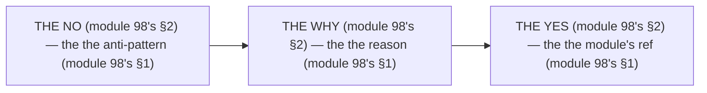

# Module 98 — Anti-patterns Compendium: The Full Catalog

**Phase 25: Mastery · Module 98 of 101**

> **Where does this run?** The compendium is a **reference** (the team's, module 98's §1) — it lists the *no's* (module 98's §1), each with the *why* (module 98's §1) and the *yes* (module 98's §1). The module-98's standing rule (module 97's mental-model rule, now the catalog level): **the anti-pattern is the *no's* (module 98's §1) — every entry has a *why* (module 98's §1) and a *yes* (the module's ref, module 98's §1); a *no* without a *yes* is a *rule* (module 98's §1), and a *yes* without a *no* is a *habit* (module 98's §1)** (module 98's §1).

---

## 1. Concept — The 10 categories (the map)

| # | Category (module 98's §1) | The no's (module 98's §1) |
|---|---|---|
| 1 | The boundary's (module 98's §1.1) | The all's `'use client` (module 71's) |
| 2 | The caching's (module 98's §1.2) | The unbounded's revalidate (module 20's) |
| 3 | The data's (module 98's §1.3) | The N+1's (module 72's) |
| 4 | The form's (module 98's §1.4) | The no redirect's (module 29's) |
| 5 | The auth's (module 98's §1.5) | The localStorage's token (module 43's §5) |
| 6 | The DB's (module 98's §1.6) | The `or()`'s tenancy (module 49's) |
| 7 | The security's (module 98's §1.7) | The `NEXT_PUBLIC_`'s secret (module 76's) |
| 8 | The perf's (module 98's §1.8) | The raw's `` (module 64's) |
| 9 | The test's (module 98's §1.9) | The E2E's everything (module 78's §4) |
| 10 | The architecture's (module 98's §1.10) | The microservices's day 1 (module 89's §1.4) |

## 2. Mental Model — The 3 columns (drawn)



## 3. Architecture — The catalog (the table)

`FILE: docs/anti-patterns.md` (production pattern — the module-98's §3: the catalog's)

```md
## THE 10 CATEGORIES (module 98's §3 — the the catalog's (module 98's §3))

| # | The no's (module 98's §3) | The why's (module 98's §3) | The yes's (module 98's §3) |
|---|---|---|---|
| 1 | The all's `'use client` (module 71's) | The RSC's is the no (module 71's §1.2) | The SC's default (module 68's) |
| 2 | The unbounded's revalidate (module 20's) | The DB's melt (module 20's) | The `revalidateTag`'s (module 20's) |
| 3 | The N+1's (module 72's) | The 51's queries (module 72's §1.1) | The `inArray`'s (module 72's §3.1) |
| 4 | The no redirect's (module 29's) | The double's submit (module 29's) | The `redirect()`'s (module 29's) |
| 5 | The localStorage's token (module 43's §5) | The XSS's (module 75's §1.1) | The cookie's HttpOnly (module 43's) |
| 6 | The `or()`'s tenancy (module 49's) | The cross-tenant's 403 (module 49's) | The `eq`'s first (module 49's) |
| 7 | The `NEXT_PUBLIC_`'s secret (module 76's) | The bundle's leak (module 76's §1) | The no prefix (module 76's) |
| 8 | The raw's `` (module 64's) | The CLS's (module 73's §1.3) | The `next/image`'s (module 64's) |
| 9 | The E2E's everything (module 78's §4) | The flaky's (module 78's §1) | The pyramid's (module 78's §4) |
| 10 | The microservices's day 1 (module 89's §1.4) | The 10's services (module 89's §1.4) | The Next-only's (module 89's §1.1) |

/* THE RULE (module 98's §3): the the no's (module 98's §3) — the the why's (module 98's §3) — the the yes's (module 98's §3) */
```

## 4. Production Code — The outdated's (module 98's §4)

`FILE: docs/outdated-patterns.md` (production pattern — the module-98's §4: the old's)

```md
## THE OUTDATED'S (module 98's §4 — the the old's (module 98's §4))

| # | The old's (module 98's §4) | The new's (module 98's §4) | The module's (module 98's §4) |
|---|---|---|---|
| 1 | The `getServerSideProps`'s (module 98's §4.1) | The RSC's fetch (module 4's) | Module 4 |
| 2 | The `useRouter`'s query (module 98's §4.2) | The `useSearchParams`'s (module 67's) | Module 67 |
| 3 | The `next/dynamic`'s `ssr` no (module 98's §4.3) | The `dynamic`'s `ssr` (module 71's) | Module 71 |
| 4 | The `middleware.ts`'s (module 98's §4.4) | The `proxy.ts`'s (module 16's) | Module 16 |
| 5 | The `Image`'s `priority` (module 98's §4.5) | The `preload`'s (module 64's) | Module 64 |
| 6 | The `onLoadingComplete`'s (module 98's §4.6) | The `onLoad`'s (module 64's) | Module 64 |

/* THE RULE (module 98's §4): the the old's (module 98's §4) — the the new's (module 98's §4) — the the module's (module 98's §4) */
```

**The module-98's line:** the *old's* (module 98's §4) — the *new's* (module 98's §4) — the *module's* (module 98's §4).

## 5. Common Mistakes (the compendium's failures)

| Mistake | The symptom | Fix |
|---|---|---|
| **The no why** (module 98's §1's line violated) | the *module-98's line: the why's* (module 98's §1) — the *the no why's is the *no's* (module 98's §1) — the *module-98's line: the no why* (module 98's §1) — the *no why* (module 98's §1)* | the *the why's (module 98's §3) — the *module-98's line: the why's* (module 98's §1)* |
| **The no yes** (module 98's §1's line violated) | the *module-98's line: the yes's* (module 98's §1) — the *the no yes's is the *no's* (module 98's §1) — the *module-98's line: the no yes* (module 98's §1) — the *no yes* (module 98's §1)* | the *the yes's (module 98's §3) — the *module-98's line: the yes's* (module 98's §1)* |
| **The no outdated** (module 98's §4's line violated) | the *module-98's line: the old's* (module 98's §4) — the *the no outdated's is the *no's* (module 98's §4) — the *module-98's line: the no outdated* (module 98's §4) — the *no outdated* (module 98's §4)* | the *the outdated's (module 98's §4) — the *module-98's line: the old's* (module 98's §4)* |
| **The no 10's** (module 98's §1's line violated) | the *module-98's line: the 10 categories* (module 98's §1) — the *the no 10's is the *no's* (module 98's §1) — the *module-98's line: the no 10* (module 98's §1) — the *no 10* (module 98's §1)* | the *the 10 categories (module 98's §1) — the *module-98's line: the 10 categories* (module 98's §1)* |
| **The habit's** (module 98's §1's line violated) | the *module-98's line: the habit's* (module 98's §1) — the *the habit's is the *no's* (module 98's §1) — the *module-98's line: the no habit* (module 98's §1) — the *no habit* (module 98's §1)* | the *the no's (module 98's §1) — the *module-98's line: the anti-pattern is the no's* (module 98's §1)* |
| **The rule's** (module 98's §1's line violated) | the *module-98's line: the rule's* (module 98's §1) — the *the rule's is the *no's* (module 98's §1) — the *module-98's line: the no rule* (module 98's §1) — the *no rule* (module 98's §1)* | the *the yes's (module 98's §1) — the *module-98's line: the yes's* (module 98's §1)* |

## 6. Security Notes

- **The localStorage's** (module 43's §5): the *module-98's line: the no localStorage's* (module 43's §5) — the *module-43's* *deep-dive* (module 43's).
- **The `or()`'s** (module 49's): the *module-98's line: the no `or()`'s* (module 49's) — the *module-49's* *deep-dive* (module 49's).
- **The `NEXT_PUBLIC_`'s** (module 76's): the *module-98's line: the no `NEXT_PUBLIC_`'s secret* (module 76's) — the *module-76's* *deep-dive* (module 76's).

## 7. Performance Notes

- **The N+1's** (module 72's): the *module-98's line: the no N+1's* (module 72's §1.1) — the *module-72's* *deep-dive* (module 72's).
- **The raw's ``** (module 64's): the *module-98's line: the no raw's ``* (module 64's) — the *module-64's* *deep-dive* (module 64's).
- **The unbounded's** (module 20's): the *module-98's line: the no unbounded's* (module 20's) — the *module-20's* *deep-dive* (module 20's).

## 8. Exercise

**Beginner.** *The categories 1–4's* (module 98's §1.1–§1.4): the *the 4's no's* (module 3's) + the *the 4's yes's* (module 3's) — *build the table* — the *artifact: the 4's* (module 3's).

**Intermediate.** *The categories 5–7's* (module 98's §1.5–§1.7): the *the 3's no's* (module 3's) + the *the 3's yes's* (module 3's) — *build the table* — the *artifact: the 3's* (module 3's).

**Production.** *The categories 8–10's + the outdated's* (module 98's §1.8–§1.10 + §4): the *the 3's no's* (module 3's) + the *the 6's old's* (module 4's) — *build the table* — the *artifact: the 9's* (module 3's + module 4's).

## 9. Architecture Challenge

**Prompt:** The *"the team's codebase has all 10 anti-patterns, no outdated's migration, and no compendium"* (the *module-98's* *catalog* — the *module-100's* *changelog* — the *module-98's line: the anti-pattern is the no's* (module 98's §1) — the *module-100's line: the changelog is the old's* (module 100's) — the *module-98's standing line: the no's + the why's + the yes's + the old's* (module 98's §1 + module 98's §1 + module 98's §1 + module 98's §4)).

The *problems*: (1) the *the 10's no's* (the *the no compendium's* (module 98's §3) — the *module-98's line: the no's* (module 98's §1) — the *module-98's standing line: the no's* (module 98's §1)).

(2) the *the no outdated* (the *the no old's* (module 98's §4) — the *module-98's line: the old's* (module 98's §4) — the *module-98's standing line: the old's* (module 98's §4)).

**Design**: the *the compendium's remediation* (the *the 10's categories* (module 3's) + the *the 6's outdated* (module 4's) + the *the why's + the yes's* (module 3's) — the *module-98's line: the anti-pattern is the no's* (module 98's §1) — the *module-98's standing line: the no's + the why's + the yes's + the old's* (module 98's §1 + module 98's §1 + module 98's §1 + module 98's §4)).

Produce: the *the compendium's remediation* (the *the 10's categories* (module 3's) + the *the 6's outdated* (module 4's) + the *the why's + the yes's* (module 3's) — the *module-98's line: the anti-pattern is the no's* (module 98's §1) — the *module-98's standing line: the no's + the why's + the yes's + the old's* (module 98's §1 + module 98's §1 + module 98's §1 + module 98's §4)).

<details>
<summary>Model answer</summary>
**The compendium's remediation** (module 98's §3 + module 98's §4):
1. **The 10's categories** (module 98's §1): the *the all's become the 10's* — the *module-98's line: the no's* (module 98's §1).
2. **The 6's outdated** (module 98's §4): the *the no-migration's become the 6's* — the *module-98's line: the old's* (module 98's §4).
3. **The why's + the yes's** (module 98's §3): the *the no-why's become the why's + the yes's* — the *module-98's line: the why's* (module 98's §1).
**The generalization** (the *compendium's* pattern, the *module's* standing rule): **the *no's* (module 98's §1) — the *the why's* (module 98's §1) — the *the yes's* (module 98's §1) — the *the old's* (module 98's §4) — the *module-98's standing line: the no's + the why's + the yes's + the old's* (module 98's §1 + module 98's §1 + module 98's §1 + module 98's §4)*.
</details>

## 10. Official Documentation

- Next.js: Breaking Changes: https://nextjs.org/docs/app/guides/upgrading
- The module-100's changelog: the module-100 (the phase-25's file-04)
- The module-101's map: the module-101 (the phase-25's file-05)

## 11. What You Should Know Before Continuing

- [ ] I can state the *10 categories* (module 1's: the boundary/caching/data/form/auth/DB/security/perf/test/architecture) — the *module-98's line: the anti-pattern is the no's* (module 1's)
- [ ] I know the *3 columns* (module 2's: the no/why/yes) — the *the no's + the why's + the yes's* (module 2's)
- [ ] I know the *all's `'use client`* (module 3.1's) — the *the SC's default* (module 68's)
- [ ] I know the *unbounded's revalidate* (module 3.2's) — the *the `revalidateTag`'s* (module 20's)
- [ ] I know the *N+1's* (module 3.3's) — the *the `inArray`'s* (module 72's)
- [ ] I know the *no redirect's* (module 3.4's) — the *the `redirect()`'s* (module 29's)
- [ ] I know the *localStorage's* (module 3.5's) — the *the cookie's* (module 43's)
- [ ] I know the *`or()`'s* (module 3.6's) — the *the `eq`'s* (module 49's)
- [ ] I know the *`NEXT_PUBLIC_`'s* (module 3.7's) — the *the no prefix* (module 76's)
- [ ] I know the *raw's ``* (module 3.8's) — the *the `next/image`'s* (module 64's)
- [ ] I know the *E2E's everything* (module 3.9's) — the *the pyramid's* (module 78's §4)
- [ ] I know the *microservices's day 1* (module 3.10's) — the *the Next-only's* (module 89's §1.1)
- [ ] I know the *6's outdated* (module 4's) — the *the old's + the new's* (module 4's)
- [ ] I've done the *1–4's* (module 8's beginner) + the *5–7's* (module 8's intermediate) + the *8–10's + the outdated's* (module 8's production) — the *artifacts* (module 20's)

**Next:** Module 99 — Tradeoffs Compendium (the *the when's* — the *module-99's line: the tradeoff is the when's* (module 99's)).
