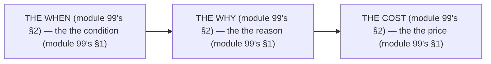

# Module 99 — Tradeoffs Compendium: Every WHEN / WHY / COST in One Reference

**Phase 25: Mastery · Module 99 of 101**

> **Where does this run?** The compendium is a **reference** (the team's, module 99's §1) — it lists the *when's* (module 99's §1), each with the *why* (module 99's §1) and the *cost* (module 99's §1). The module-99's standing rule (module 89's when rule, now the tradeoff level): **the tradeoff is the *when's* (module 99's §1) — every entry has a *when* (module 99's §1), a *why* (module 99's §1), and a *cost* (module 99's §1); a *when* without a *cost* is a *sales pitch* (module 99's §1), and a *cost* without a *when* is a *fear* (module 99's §1)** (module 99's §1).

---

## 1. Concept — The 3 columns (the map)

| # | Column (module 99's §1) | The no's (module 99's §1) |
|---|---|---|
| 1 | The when's (module 99's §1.1) | The no when's (module 99's §1.1) |
| 2 | The why's (module 99's §1.2) | The no why's (module 99's §1.2) |
| 3 | The cost's (module 99's §1.3) | The no cost's (module 99's §1.3) |

## 2. Mental Model — The 3 columns (drawn)



## 3. Architecture — The 20 tradeoffs (the table)

`FILE: docs/tradeoffs.md` (production pattern — the module-99's §3: the table's)

```md
## THE 20 TRADEOFFS (module 99's §3 — the the table's (module 99's §3))

| # | The when's (module 99's §3) | The why's (module 99's §3) | The cost's (module 99's §3) |
|---|---|---|---|
| 1 | The SC's vs the CC's (module 68's) | The RSC's (module 68's) | The no state's (module 68's) |
| 2 | The Cache Components's on (module 20's) | The cache hit's 0ms (module 70's §1.3) | The tag's management (module 20's) |
| 3 | The ISR's vs the on-demand's (module 20's) | The event's (module 20's) | The timer's (module 20's) |
| 4 | The action's vs the route's (module 29's) | The form's (module 29's) | The 303's (module 29's) |
| 5 | The direct's vs the PgBouncer's (module 70's) | The 20's pool (module 70's §3.4) | The hop's (module 70's) |
| 6 | The Drizzle's vs the Prisma's (module 5's) | The SQL's (module 5's) | The client's (module 5's) |
| 7 | The `next/image`'s vs the raw's (module 64's) | The CLS's (module 73's §1.3) | The config's (module 64's) |
| 8 | The Vercel's vs the Docker's (module 84's) | The constraint's (module 84's §1) | The deploy's (module 84's §1.6) |
| 9 | The Node's vs the Edge's (module 85's) | The API's (module 85's §1) | The cold's (module 85's §1) |
| 10 | The sync's vs the job's (module 87's) | The 200's (module 87's §1) | The eventual's (module 87's §1) |
| 11 | The TQ's yes (module 91's) | The polling's (module 91's §1.2) | The double's cache (module 91's §1) |
| 12 | The Zustand's yes (module 90's) | The shared's (module 90's §1.5) | The 5th's rung (module 90's §1.5) |
| 13 | The cookie's vs the localStorage's (module 43's) | The HttpOnly's (module 43's) | The CSRF's (module 43's §5) |
| 14 | The static's vs the dynamic's (module 24's) | The build's (module 24's) | The request's (module 24's) |
| 15 | The Next-only's vs the BFF's (module 89's) | The domain's (module 89's §1) | The 2's deploys (module 89's §1.2) |
| 16 | The i18n's yes (module 88's) | The user's (module 88's §1) | The string's (module 88's §1) |
| 17 | The E2E's count (module 78's) | The journey's (module 78's §1.3) | The flaky's (module 78's §1) |
| 18 | The S3's vs the `public/`'s (module 66's) | The ephemeral's (module 66's) | The hop's (module 66's) |
| 19 | The MSW's yes (module 81's) | The external's (module 81's §1.1) | The fake's (module 81's §1.1) |
| 20 | The Tailwind's v4 (module 55's) | The CSS's first (module 55's) | The config's (module 55's) |

/* THE RULE (module 99's §3): the the when's (module 99's §3) — the the why's (module 99's §3) — the the cost's (module 99's §3) */
```

## 4. Production Code — The no sales pitch's (module 99's §4)

`FILE: docs/tradeoff-rules.md` (production pattern — the module-99's §4: the 3 rules)

```md
## THE TRADEOFF'S RULES (module 99's §4 — the the no sales pitch's (module 99's §1))

1. **The no when's** (module 99's §4.1): the the no condition's (module 99's §4.1) — the the no "it's faster" (module 99's §4.1)
2. **The no why's** (module 99's §4.2): the the no reason's (module 99's §4.2) — the the no "it's modern" (module 99's §4.2)
3. **The no cost's** (module 99's §4.3): the the no price's (module 99's §4.3) — the the no "it's free" (module 99's §4.3)

/* THE RULE (module 99's §4): the the no sales pitch's (module 99's §1) — the the no fear's (module 99's §1) — the the 3's rules (module 99's §4) */
```

**The module-99's line:** the *no sales pitch's* (module 99's §1) — the *no fear's* (module 99's §1) — the *3's rules* (module 99's §4).

## 5. Common Mistakes (the tradeoff's failures)

| Mistake | The symptom | Fix |
|---|---|---|
| **The no when** (module 99's §1.1's line violated) | the *module-99's line: the when's* (module 99's §1.1) — the *the no when's is the *no's* (module 99's §1.1) — the *module-99's line: the no when* (module 99's §1.1) — the *no when* (module 99's §1.1)* | the *the when's (module 99's §3) — the *module-99's line: the when's* (module 99's §1.1)* |
| **The no why** (module 99's §1.2's line violated) | the *module-99's line: the why's* (module 99's §1.2) — the *the no why's is the *no's* (module 99's §1.2) — the *module-99's line: the no why* (module 99's §1.2) — the *no why* (module 99's §1.2)* | the *the why's (module 99's §3) — the *module-99's line: the why's* (module 99's §1.2)* |
| **The no cost** (module 99's §1.3's line violated) | the *module-99's line: the cost's* (module 99's §1.3) — the *the no cost's is the *no's* (module 99's §1.3) — the *module-99's line: the no cost* (module 99's §1.3) — the *no cost* (module 99's §1.3)* | the *the cost's (module 99's §3) — the *module-99's line: the cost's* (module 99's §1.3)* |
| **The no 20's** (module 99's §3's line violated) | the *module-99's line: the 20 tradeoffs* (module 99's §3) — the *the no 20's is the *no's* (module 99's §3) — the *module-99's line: the no 20* (module 99's §3) — the *no 20* (module 99's §3)* | the *the 20 tradeoffs (module 99's §3) — the *module-99's line: the 20 tradeoffs* (module 99's §3)* |
| **The sales pitch's** (module 99's §1's line violated) | the *module-99's line: the no sales pitch's* (module 99's §1) — the *the sales pitch's is the *no's* (module 99's §4.1) — the *module-99's line: the no sales pitch* (module 99's §4.1) — the *no sales pitch* (module 99's §4.1)* | the *the when's (module 99's §1.1) — the *module-99's line: the no sales pitch's* (module 99's §1)* |
| **The fear's** (module 99's §1's line violated) | the *module-99's line: the no fear's* (module 99's §1) — the *the fear's is the *no's* (module 99's §4.3) — the *module-99's line: the no fear* (module 99's §4.3) — the *no fear* (module 99's §4.3)* | the *the cost's (module 99's §1.3) — the *module-99's line: the no fear's* (module 99's §1)* |

## 6. Security Notes

- **The CSRF's** (module 43's §5): the *module-99's line: the cookie's* (module 43's) — the *module-43's* *deep-dive* (module 43's).
- **The 2's deploys** (module 89's §1.2): the *module-99's line: the BFF's* (module 89's §1.2) — the *module-89's* *deep-dive* (module 89's).
- **The ephemeral's** (module 66's): the *module-99's line: the S3's* (module 66's) — the *module-66's* *deep-dive* (module 66's).

## 7. Performance Notes

- **The 0ms's** (module 70's §1.3): the *module-99's line: the Cache Components's* (module 20's) — the *module-70's* *deep-dive* (module 70's).
- **The 20's pool** (module 70's §3.4): the *module-99's line: the PgBouncer's* (module 70's) — the *module-70's* *deep-dive* (module 70's).
- **The flaky's** (module 78's §1): the *module-99's line: the E2E's count* (module 78's) — the *module-78's* *deep-dive* (module 78's).

## 8. Exercise

**Beginner.** *The tradeoffs 1–7's* (module 99's §3.1–§3.7): the *the 7's when's* (module 3's) + the *the 7's cost's* (module 3's) — *build the table* — the *artifact: the 7's* (module 3's).

**Intermediate.** *The tradeoffs 8–14's* (module 99's §3.8–§3.14): the *the 7's when's* (module 3's) + the *the 7's cost's* (module 3's) — *build the table* — the *artifact: the 7's* (module 3's).

**Production.** *The tradeoffs 15–20's* (module 99's §3.15–§3.20): the *the 6's when's* (module 3's) + the *the 6's cost's* (module 3's) — *build the table* — the *artifact: the 6's* (module 3's).

## 9. Architecture Challenge

**Prompt:** The *"the team adopts 5 new tools this quarter, with no when, no why, and no cost"* (the *module-99's* *tradeoff* — the *module-89's* *when* — the *module-99's line: the tradeoff is the when's* (module 99's §1) — the *module-89's line: the architecture is the when's* (module 89's §1) — the *module-99's standing line: the when's + the why's + the cost's* (module 99's §1 + module 99's §1 + module 99's §1)).

The *problems*: (1) the *the no when* (the *the no condition's* (module 99's §1.1) — the *module-99's line: the when's* (module 99's §1.1) — the *module-99's standing line: the when's* (module 99's §1.1)).

(2) the *the no cost* (the *the no price's* (module 99's §1.3) — the *module-99's line: the cost's* (module 99's §1.3) — the *module-99's standing line: the cost's* (module 99's §1.3)).

**Design**: the *the tradeoff's remediation* (the *the 5's when's* (module 3's) + the *the 5's why's* (module 3's) + the *the 5's cost's* (module 3's) — the *module-99's line: the tradeoff is the when's* (module 99's §1) — the *module-99's standing line: the when's + the why's + the cost's* (module 99's §1 + module 99's §1 + module 99's §1)).

Produce: the *the tradeoff's remediation* (the *the 5's when's* (module 3's) + the *the 5's why's* (module 3's) + the *the 5's cost's* (module 3's) — the *module-99's line: the tradeoff is the when's* (module 99's §1) — the *module-99's standing line: the when's + the why's + the cost's* (module 99's §1 + module 99's §1 + module 99's §1)).

<details>
<summary>Model answer</summary>
**The tradeoff's remediation** (module 99's §3):
1. **The 5's when's** (module 99's §1.1): the *the 5's tools become the 5's when's* — the *module-99's line: the when's* (module 99's §1.1).
2. **The 5's why's** (module 99's §1.2): the *the no-why's become the 5's why's* — the *module-99's line: the why's* (module 99's §1.2).
3. **The 5's cost's** (module 99's §1.3): the *the no-cost's become the 5's cost's* — the *module-99's line: the cost's* (module 99's §1.3).
**The generalization** (the *tradeoff's* pattern, the *module's* standing rule): **the *when's* (module 99's §1.1) — the *the why's* (module 99's §1.2) — the *the cost's* (module 99's §1.3) — the *module-99's standing line: the when's + the why's + the cost's* (module 99's §1 + module 99's §1 + module 99's §1)*.
</details>

## 10. Official Documentation

- Next.js: Architecture: https://nextjs.org/docs/app/building-your-application/rendering
- The module-89's when: the module-89 (the phase-23's file-01)
- The module-100's changelog: the module-100 (the phase-25's file-04)

## 11. What You Should Know Before Continuing

- [ ] I can state the *20 tradeoffs* (module 3's: the 1's–20's) — the *module-99's line: the tradeoff is the when's* (module 3's)
- [ ] I know the *3 columns* (module 1's: the when/why/cost) — the *the no sales pitch's* (module 4's)
- [ ] I know the *SC's vs the CC's* (module 3.1's) — the *the RSC's* (module 68's)
- [ ] I know the *Cache Components's* (module 3.2's) — the *the 0ms's* (module 70's §1.3)
- [ ] I know the *action's vs the route's* (module 3.4's) — the *the 303's* (module 29's)
- [ ] I know the *Vercel's vs the Docker's* (module 3.8's) — the *the constraint's* (module 84's §1)
- [ ] I know the *TQ's* (module 3.11's) — the *the double's cache* (module 91's §1)
- [ ] I know the *cookie's vs the localStorage's* (module 3.13's) — the *the HttpOnly's* (module 43's)
- [ ] I know the *S3's vs the `public/`'s* (module 3.18's) — the *the ephemeral's* (module 66's)
- [ ] I've done the *1–7's* (module 8's beginner) + the *8–14's* (module 8's intermediate) + the *15–20's* (module 8's production) — the *artifacts* (module 20's)

**Next:** Module 100 — The Changelog (the *the old's vs the new's* — the *module-100's line: the changelog is the old's* (module 100's)).
