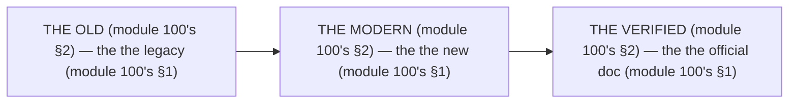

# Module 100 — "What Changed in Modern Next.js": The Old-vs-Modern Changelog

**Phase 25: Mastery · Module 100 of 101**

> **Where does this run?** The changelog is a **reference** (the team's, module 100's §1) — it lists the *old's* (module 100's §1), each with the *modern's* (module 100's §1) and the *verified* (module 100's §1). The module-100's standing rule (module 01's docs rule, now the changelog level): **the changelog is the *old's* (module 100's §1) — every entry has an *old* (module 100's §1), a *modern* (module 100's §1), and a *verified* (the official doc's, module 100's §1); the *legacy* is the *historical knowledge* (module 100's §1), never the *default* (module 100's §1); and a *change* without a *verification* is a *rumor* (module 100's §1)** (module 100's §1).

---

## 1. Concept — The 3 columns (the map)

| # | Column (module 100's §1) | The no's (module 100's §1) |
|---|---|---|
| 1 | The old's (module 100's §1.1) | The no old's (module 100's §1.1) |
| 2 | The modern's (module 100's §1.2) | The no modern's (module 100's §1.2) |
| 3 | The verified's (module 100's §1.3) | The no verified's (module 100's §1.3) |

## 2. Mental Model — The 3 columns (drawn)



## 3. Architecture — The 20 changes (the table)

`FILE: docs/changelog.md` (production pattern — the module-100's §3: the table's)

```md
## THE 20 CHANGES (module 100's §3 — the the table's (module 100's §3))

| # | The old's (module 100's §3) | The modern's (module 100's §3) | The verified's (module 100's §3) |
|---|---|---|---|
| 1 | The Pages Router's (module 100's §3.1) | The App Router's (module 100's §3.1) | The module-02's (module 2's) |
| 2 | The `getServerSideProps`'s (module 100's §3.2) | The RSC's fetch (module 4's) | The module-04's (module 4's) |
| 3 | The `getStaticProps`'s (module 100's §3.3) | The RSC's static (module 24's) | The module-24's (module 24's) |
| 4 | The `useRouter().query`'s (module 100's §3.4) | The `useSearchParams`'s (module 67's) | The module-67's (module 67's) |
| 5 | The `cache: 'force-cache`'s (module 100's §3.5) | The RSC's default (module 20's) | The module-20's (module 20's) |
| 6 | The `cookies()`'s sync (module 100's §3.6) | The `cookies()`'s async (module 43's) | The module-43's (module 43's) |
| 7 | The `headers()`'s sync (module 100's §3.7) | The `headers()`'s async (module 82's) | The module-82's (module 82's) |
| 8 | The `middleware.ts`'s (module 100's §3.8) | The `proxy.ts`'s (module 16's) | The module-16's (module 16's) |
| 9 | The `Image`'s `priority` (module 100's §3.9) | The `preload`'s (module 64's) | The module-64's (module 64's) |
| 10 | The `onLoadingComplete`'s (module 100's §3.10) | The `onLoad`'s (module 64's) | The module-64's (module 64's) |
| 11 | The `useState`'s form (module 100's §3.11) | The `useActionState`'s (module 51's) | The module-51's (module 51's) |
| 12 | The `tailwind.config.ts`'s content (module 100's §3.12) | The `@source inline`'s (module 55's) | The module-55's (module 55's) |
| 13 | The `metadata`'s viewport (module 100's §3.13) | The `viewport`'s export (module 61's) | The module-61's (module 61's) |
| 14 | The `useMemo`'s manual (module 100's §3.14) | The React Compiler's (module 71's) | The module-71's (module 71's) |
| 15 | The `fetch`'s no-store (module 100's §3.15) | The `cacheLife`'s (module 22's) | The module-22's (module 22's) |
| 16 | The `revalidatePath`'s only (module 100's §3.16) | The `revalidateTag`'s (module 20's) | The module-20's (module 20's) |
| 17 | The `next/font`'s Google link (module 100's §3.17) | The `next/font`'s self (module 65's) | The module-65's (module 65's) |
| 18 | The `dynamic`'s ssr no (module 100's §3.18) | The `dynamic`'s ssr (module 71's) | The module-71's (module 71's) |
| 19 | The `instrumentation`'s no (module 100's §3.19) | The `instrumentation.ts`'s (module 69's) | The module-69's (module 69's) |
| 20 | The `useOptimistic`'s no (module 100's §3.20) | The `useOptimistic`'s (module 51's) | The module-51's (module 51's) |

/* THE RULE (module 100's §3): the the old's (module 100's §3) — the the modern's (module 100's §3) — the the verified's (module 100's §3) */
```

## 4. Production Code — The no rumor's (module 100's §4)

`FILE: docs/changelog-rules.md` (production pattern — the module-100's §4: the 3 rules)

```md
## THE CHANGELOG'S RULES (module 100's §4 — the the no rumor's (module 100's §1))

1. **The no old** (module 100's §4.1): the the no legacy's (module 100's §4.1) — the the no "it used to" (module 100's §4.1)
2. **The no modern** (module 100's §4.2): the the no new's (module 100's §4.2) — the the no "it now" (module 100's §4.2)
3. **The no verified** (module 100's §4.3): the the no doc's (module 100's §4.3) — the the no "I heard" (module 100's §4.3)

/* THE RULE (module 100's §4): the the no rumor's (module 100's §1) — the the no legacy's default (module 100's §1) — the the 3's rules (module 100's §4) */
```

**The module-100's line:** the *no rumor's* (module 100's §1) — the *no legacy's default* (module 100's §1) — the *3's rules* (module 100's §4).

## 5. Common Mistakes (the changelog's failures)

| Mistake | The symptom | Fix |
|---|---|---|
| **The no old** (module 100's §1.1's line violated) | the *module-100's line: the old's* (module 100's §1.1) — the *the no old's is the *no's* (module 100's §1.1) — the *module-100's line: the no old* (module 100's §1.1) — the *no old* (module 100's §1.1)* | the *the old's (module 100's §3) — the *module-100's line: the old's* (module 100's §1.1)* |
| **The no modern** (module 100's §1.2's line violated) | the *module-100's line: the modern's* (module 100's §1.2) — the *the no modern's is the *no's* (module 100's §1.2) — the *module-100's line: the no modern* (module 100's §1.2) — the *no modern* (module 100's §1.2)* | the *the modern's (module 100's §3) — the *module-100's line: the modern's* (module 100's §1.2)* |
| **The no verified** (module 100's §1.3's line violated) | the *module-100's line: the verified's* (module 100's §1.3) — the *the no verified's is the *no's* (module 100's §1.3) — the *module-100's line: the no verified* (module 100's §1.3) — the *no verified* (module 100's §1.3)* | the *the verified's (module 100's §3) — the *module-100's line: the verified's* (module 100's §1.3)* |
| **The no 20's** (module 100's §3's line violated) | the *module-100's line: the 20 changes* (module 100's §3) — the *the no 20's is the *no's* (module 100's §3) — the *module-100's line: the no 20* (module 100's §3) — the *no 20* (module 100's §3)* | the *the 20 changes (module 100's §3) — the *module-100's line: the 20 changes* (module 100's §3)* |
| **The rumor's** (module 100's §1's line violated) | the *module-100's line: the no rumor's* (module 100's §1) — the *the rumor's is the *no's* (module 100's §4.3) — the *module-100's line: the no rumor* (module 100's §4.3) — the *no rumor* (module 100's §4.3)* | the *the verified's (module 100's §1.3) — the *module-100's line: the no rumor's* (module 100's §1)* |
| **The legacy's default** (module 100's §1's line violated) | the *module-100's line: the no legacy's default* (module 100's §1) — the *the legacy's default's is the *no's* (module 100's §1) — the *module-100's line: the no legacy's default* (module 100's §1) — the *no legacy's default* (module 100's §1)* | the *the modern's (module 100's §1.2) — the *module-100's line: the no legacy's default* (module 100's §1)* |

## 6. Security Notes

- **The verified's** (module 100's §1.3): the *module-100's line: the verified's* (module 100's §1.3) — the *module-01's* *deep-dive* (module 1's).
- **The no rumor's** (module 100's §1): the *module-100's line: the no rumor's* (module 100's §1) — the *module-01's* *deep-dive* (module 1's).
- **The legacy's** (module 100's §1.1): the *module-100's line: the old's* (module 100's §1.1) — the *module-02's* *deep-dive* (module 2's).

## 7. Performance Notes

- **The RSC's** (module 100's §3.2): the *module-100's line: the modern's* (module 100's §1.2) — the *module-04's* *deep-dive* (module 4's).
- **The `preload`'s** (module 100's §3.9): the *module-100's line: the modern's* (module 100's §1.2) — the *module-64's* *deep-dive* (module 64's).
- **The Compiler's** (module 100's §3.14): the *module-100's line: the modern's* (module 100's §1.2) — the *module-71's* *deep-dive* (module 71's).

## 8. Exercise

**Beginner.** *The changes 1–7's* (module 100's §3.1–§3.7): the *the 7's old's* (module 3's) + the *the 7's modern's* (module 3's) — *build the table* — the *artifact: the 7's* (module 3's).

**Intermediate.** *The changes 8–14's* (module 100's §3.8–§3.14): the *the 7's old's* (module 3's) + the *the 7's modern's* (module 3's) — *build the table* — the *artifact: the 7's* (module 3's).

**Production.** *The changes 15–20's* (module 100's §3.15–§3.20): the *the 6's old's* (module 3's) + the *the 6's verified's* (module 3's) — *build the table* — the *artifact: the 6's* (module 3's).

## 9. Architecture Challenge

**Prompt:** The *"the team's codebase has 20 outdated patterns, no changelog, and 5 of them are 'I heard it changed'"* (the *module-100's* *changelog* — the *module-01's* *docs* — the *module-100's line: the changelog is the old's* (module 100's §1) — the *module-01's line: the docs is the verified's* (module 1's) — the *module-100's standing line: the old's + the modern's + the verified's* (module 100's §1 + module 100's §1 + module 100's §1)).

The *problems*: (1) the *the no 20's* (the *the no changelog's* (module 100's §3) — the *module-100's line: the 20 changes* (module 100's §3) — the *module-100's standing line: the 20 changes* (module 100's §3)).

(2) the *the 5's rumor* (the *the no verified's* (module 100's §1.3) — the *module-100's line: the verified's* (module 100's §1.3) — the *module-100's standing line: the verified's* (module 100's §1.3)).

**Design**: the *the changelog's remediation* (the *the 20's changes* (module 3's) + the *the 5's verified* (module 3's) + the *the 3's rules* (module 4's) — the *module-100's line: the changelog is the old's* (module 100's §1) — the *module-100's standing line: the old's + the modern's + the verified's* (module 100's §1 + module 100's §1 + module 100's §1)).

Produce: the *the changelog's remediation* (the *the 20's changes* (module 3's) + the *the 5's verified* (module 3's) + the *the 3's rules* (module 4's) — the *module-100's line: the changelog is the old's* (module 100's §1) — the *module-100's standing line: the old's + the modern's + the verified's* (module 100's §1 + module 100's §1 + module 100's §1)).

<details>
<summary>Model answer</summary>
**The changelog's remediation** (module 100's §3 + module 100's §4):
1. **The 20's changes** (module 100's §3): the *the 20's outdated become the 20's changes'* — the *module-100's line: the 20 changes* (module 100's §3).
2. **The 5's verified** (module 100's §1.3): the *the 5's rumor become the 5's verified* — the *module-100's line: the verified's* (module 100's §1.3).
3. **The 3's rules** (module 100's §4): the *the no-rule's become the 3's rules'* — the *module-100's line: the no rumor's* (module 100's §1).
**The generalization** (the *changelog's* pattern, the *module's* standing rule): **the *old's* (module 100's §1.1) — the *the modern's* (module 100's §1.2) — the *the verified's* (module 100's §1.3) — the *module-100's standing line: the old's + the modern's + the verified's* (module 100's §1 + module 100's §1 + module 100's §1)*.
</details>

## 10. Official Documentation

- Next.js: Upgrading: https://nextjs.org/docs/app/guides/upgrading
- Next.js: Breaking Changes (Next 15): https://nextjs.org/blog/next-15
- Next.js: Breaking Changes (Next 16): https://nextjs.org/blog/next-16
- The module-01's stack: the module-01 (the phase-0's file-01)

## 11. What You Should Know Before Continuing

- [ ] I can state the *20 changes* (module 3's: the 1's–20's) — the *module-100's line: the changelog is the old's* (module 3's)
- [ ] I know the *3 columns* (module 1's: the old/modern/verified) — the *the no rumor's* (module 4's)
- [ ] I know the *Pages Router's* (module 3.1's) — the *the App Router's* (module 2's)
- [ ] I know the *`getServerSideProps`'s* (module 3.2's) — the *the RSC's fetch* (module 4's)
- [ ] I know the *`cookies()`'s sync* (module 3.6's) — the *the `cookies()`'s async* (module 43's)
- [ ] I know the *`middleware.ts`'s* (module 3.8's) — the *the `proxy.ts`'s* (module 16's)
- [ ] I know the *`priority`'s* (module 3.9's) — the *the `preload`'s* (module 64's)
- [ ] I know the *`useMemo`'s* (module 3.14's) — the *the Compiler's* (module 71's)
- [ ] I've done the *1–7's* (module 8's beginner) + the *8–14's* (module 8's intermediate) + the *15–20's* (module 8's production) — the *artifacts* (module 20's)

**Next:** Module 101 — The Official Documentation Map (the *the map's* — the *module-101's line: the map is the doc's* (module 101's)).
