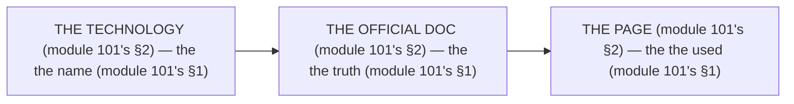

# Module 101 — The Official Documentation Map: Every Technology → Official Docs → The Pages This Course Used

**Phase 25: Mastery · Module 101 of 101**

> **Where does this run?** The map is a **reference** (the team's, module 101's §1) — it lists the *technology's* (module 101's §1), each with the *official doc's* (module 101's §1) and the *page's* (module 101's §1). The module-101's standing rule (module 01's docs rule, now the map level): **the map is the *doc's* (module 101's §1) — every technology has an *official doc* (module 101's §1) and a *page* (module 101's §1) this course *used* (module 101's §1); the *official* is the *truth* (module 101's §1), never the *blog* (module 101's §1), never the *video* (module 101's §1); and a *technology* without an *official doc* is a *guess* (module 101's §1)** (module 101's §1).

---

## 1. Concept — The 3 columns (the map)

| # | Column (module 101's §1) | The no's (module 101's §1) |
|---|---|---|
| 1 | The technology's (module 101's §1.1) | The no technology's (module 101's §1.1) |
| 2 | The official doc's (module 101's §1.2) | The no official doc's (module 101's §1.2) |
| 3 | The page's (module 101's §1.3) | The no page's (module 101's §1.3) |

## 2. Mental Model — The 3 columns (drawn)



## 3. Architecture — The 24 technologies (the table)

`FILE: docs/documentation-map.md` (production pattern — the module-101's §3: the table's)

```md
## THE 24 TECHNOLOGIES (module 101's §3 — the the table's (module 101's §3))

| # | The technology's (module 101's §3) | The official doc's (module 101's §3) | The page's (module 101's §3) |
|---|---|---|---|
| 1 | The Next.js's (module 101's §3.1) | https://nextjs.org/docs | The App Router's (module 2's) |
| 2 | The React's (module 101's §3.2) | https://react.dev | The hooks' (module 3's) |
| 3 | The React Compiler's (module 101's §3.3) | https://react.dev/learn/react-compiler | The memo's (module 71's) |
| 4 | The RHF's (module 101's §3.4) | https://react-hook-form.com | The resolver's (module 52's) |
| 5 | The Zod's (module 101's §3.5) | https://zod.dev | The schema's (module 53's) |
| 6 | The Drizzle's (module 101's §3.6) | https://orm.drizzle.site | The query's (module 5's) |
| 7 | The Prisma's (module 101's §3.7) | https://www.prisma.io/docs | The client's (module 5's) |
| 8 | The Better Auth's (module 101's §3.8) | https://www.better-auth.com/docs | The session's (module 44's) |
| 9 | The Tailwind's (module 101's §3.9) | https://tailwindcss.com/docs | The `@theme`'s (module 55's) |
| 10 | The shadcn/ui's (module 101's §3.10) | https://ui.shadcn.com/docs | The CLI's (module 56's) |
| 11 | The Radix's (module 101's §3.11) | https://www.radix-ui.com/docs | The primitive's (module 56's) |
| 12 | The Motion's (module 101's §3.12) | https://motion.dev/docs | The transition's (module 59's) |
| 13 | The next-intl's (module 101's §3.13) | https://next-intl.dev/docs | The routing's (module 88's) |
| 14 | The Vitest's (module 101's §3.14) | https://vitest.dev | The config's (module 79's) |
| 15 | The RTL's (module 101's §3.15) | https://testing-library.com/docs | The render's (module 79's) |
| 16 | The Playwright's (module 101's §3.16) | https://playwright.dev/docs | The auth's (module 80's) |
| 17 | The MSW's (module 101's §3.17) | https://mswjs.io/docs | The handler's (module 81's) |
| 18 | The Postgres's (module 101's §3.18) | https://www.postgresql.org/docs/current/ | The `EXPLAIN`'s (module 72's) |
| 19 | The PgBouncer's (module 101's §3.19) | https://www.pgbouncer.org | The pool's (module 70's) |
| 20 | The S3's (module 101's §3.20) | https://docs.aws.amazon.com/AmazonS3/ | The ACL's (module 66's) |
| 21 | The Vercel's (module 101's §3.21) | https://vercel.com/docs | The function's (module 84's) |
| 22 | The Docker's (module 101's §3.22) | https://docs.docker.com | The build's (module 86's) |
| 23 | The Actions's (module 101's §3.23) | https://docs.github.com/actions | The pipeline's (module 86's) |
| 24 | The web-vitals's (module 101's §3.24) | https://github.com/GoogleChrome/web-vitals | The beacon's (module 69's) |

/* THE RULE (module 101's §3): the the technology's (module 101's §3) — the the official doc's (module 101's §3) — the the page's (module 101's §3) */
```

## 4. Production Code — The no blog's (module 101's §4)

`FILE: docs/doc-rules.md` (production pattern — the module-101's §4: the 3 rules)

```md
## THE DOC'S RULES (module 101's §4 — the the no blog's (module 101's §1))

1. **The no blog** (module 101's §4.1): the the no article's (module 101's §4.1) — the the no "I read" (module 101's §4.1)
2. **The no video** (module 101's §4.2): the the no tutorial's (module 101's §4.2) — the the no "I watched" (module 101's §4.2)
3. **The official's** (module 101's §4.3): the the doc's (module 101's §4.3) — the the "I verified" (module 101's §4.3)

/* THE RULE (module 101's §4): the the no blog's (module 101's §1) — the the no video's (module 101's §1) — the the official's (module 101's §1) */
```

**The module-101's line:** the *no blog's* (module 101's §1) — the *no video's* (module 101's §1) — the *official's* (module 101's §1).

## 5. Common Mistakes (the map's failures)

| Mistake | The symptom | Fix |
|---|---|---|
| **The no technology** (module 101's §1.1's line violated) | the *module-101's line: the technology's* (module 101's §1.1) — the *the no technology's is the *no's* (module 101's §1.1) — the *module-101's line: the no technology* (module 101's §1.1) — the *no technology* (module 101's §1.1)* | the *the technology's (module 101's §3) — the *module-101's line: the technology's* (module 101's §1.1)* |
| **The no official doc** (module 101's §1.2's line violated) | the *module-101's line: the official doc's* (module 101's §1.2) — the *the no official doc's is the *no's* (module 101's §1.2) — the *module-101's line: the no official doc* (module 101's §1.2) — the *no official doc* (module 101's §1.2)* | the *the official doc's (module 101's §3) — the *module-101's line: the official doc's* (module 101's §1.2)* |
| **The no page** (module 101's §1.3's line violated) | the *module-101's line: the page's* (module 101's §1.3) — the *the no page's is the *no's* (module 101's §1.3) — the *module-101's line: the no page* (module 101's §1.3) — the *no page* (module 101's §1.3)* | the *the page's (module 101's §3) — the *module-101's line: the page's* (module 101's §1.3)* |
| **The no 24's** (module 101's §3's line violated) | the *module-101's line: the 24 technologies* (module 101's §3) — the *the no 24's is the *no's* (module 101's §3) — the *module-101's line: the no 24* (module 101's §3) — the *no 24* (module 101's §3)* | the *the 24 technologies (module 101's §3) — the *module-101's line: the 24 technologies* (module 101's §3)* |
| **The blog's** (module 101's §1's line violated) | the *module-101's line: the no blog's* (module 101's §1) — the *the blog's is the *no's* (module 101's §4.1) — the *module-101's line: the no blog* (module 101's §4.1) — the *no blog* (module 101's §4.1)* | the *the official's (module 101's §1.2) — the *module-101's line: the no blog's* (module 101's §1)* |
| **The video's** (module 101's §1's line violated) | the *module-101's line: the no video's* (module 101's §1) — the *the video's is the *no's* (module 101's §4.2) — the *module-101's line: the no video* (module 101's §4.2) — the *no video* (module 101's §4.2)* | the *the official's (module 101's §1.2) — the *module-101's line: the no video's* (module 101's §1)* |

## 6. Security Notes

- **The official's** (module 101's §1.2): the *module-101's line: the official's* (module 101's §1.2) — the *module-01's* *deep-dive* (module 1's).
- **The no blog's** (module 101's §1): the *module-101's line: the no blog's* (module 101's §1) — the *module-01's* *deep-dive* (module 1's).
- **The no video's** (module 101's §1): the *module-101's line: the no video's* (module 101's §1) — the *module-01's* *deep-dive* (module 1's).

## 7. Performance Notes

- **The map's** (module 101's §3): the *module-101's line: the 24 technologies* (module 101's §3) — the *the no lookup's cost* (module 101's §3).
- **The page's** (module 101's §1.3): the *module-101's line: the page's* (module 101's §1.3) — the *the no scroll's cost* (module 101's §1.3).
- **The official's** (module 101's §1.2): the *module-101's line: the official's* (module 101's §1.2) — the *the no blog's cost* (module 101's §1.2).

## 8. Exercise

**Beginner.** *The technologies 1–8's* (module 101's §3.1–§3.8): the *the 8's official's* (module 3's) + the *the 8's page's* (module 3's) — *build the table* — the *artifact: the 8's* (module 3's).

**Intermediate.** *The technologies 9–16's* (module 101's §3.9–§3.16): the *the 8's official's* (module 3's) + the *the 8's page's* (module 3's) — *build the table* — the *artifact: the 8's* (module 3's).

**Production.** *The technologies 17–24's* (module 101's §3.17–§3.24): the *the 8's official's* (module 3's) + the *the 8's page's* (module 3's) — *build the table* — the *artifact: the 8's* (module 3's).

## 9. Architecture Challenge

**Prompt:** The *"the team's 'docs map' is a list of 24 blogs, 12 videos, and 0 official docs"* (the *module-101's* *map* — the *module-01's* *docs* — the *module-101's line: the map is the doc's* (module 101's §1) — the *module-01's line: the official's* (module 1's) — the *module-101's standing line: the technology's + the official doc's + the page's* (module 101's §1 + module 101's §1 + module 101's §1)).

The *problems*: (1) the *the 24's blog* (the *the no official's* (module 101's §1.2) — the *module-101's line: the official doc's* (module 101's §1.2) — the *module-101's standing line: the official doc's* (module 101's §1.2)).

(2) the *the no page* (the *the no used's* (module 101's §1.3) — the *module-101's line: the page's* (module 101's §1.3) — the *module-101's standing line: the page's* (module 101's §1.3)).

**Design**: the *the map's remediation* (the *the 24's official* (module 3's) + the *the 24's page* (module 3's) + the *the 3's rules* (module 4's) — the *module-101's line: the map is the doc's* (module 101's §1) — the *module-101's standing line: the technology's + the official doc's + the page's* (module 101's §1 + module 101's §1 + module 101's §1)).

Produce: the *the map's remediation* (the *the 24's official* (module 3's) + the *the 24's page* (module 3's) + the *the 3's rules* (module 4's) — the *module-101's line: the map is the doc's* (module 101's §1) — the *module-101's standing line: the technology's + the official doc's + the page's* (module 101's §1 + module 101's §1 + module 101's §1)).

<details>
<summary>Model answer</summary>
**The map's remediation** (module 101's §3 + module 101's §4):
1. **The 24's official** (module 101's §1.2): the *the 24's blog become the 24's official* — the *module-101's line: the official doc's* (module 101's §1.2).
2. **The 24's page** (module 101's §1.3): the *the 0's page become the 24's page* — the *module-101's line: the page's* (module 101's §1.3).
3. **The 3's rules** (module 101's §4): the *the no-rule's become the 3's rules* — the *module-101's line: the official's* (module 101's §1).
**The generalization** (the *map's* pattern, the *module's* standing rule): **the *technology's* (module 101's §1.1) — the *the official doc's* (module 101's §1.2) — the *the page's* (module 101's §1.3) — the *module-101's standing line: the technology's + the official doc's + the page's* (module 101's §1 + module 101's §1 + module 101's §1)*.
</details>

## 10. Official Documentation

- Next.js: https://nextjs.org/docs
- React: https://react.dev
- MDN: https://developer.mozilla.org/en-US/docs/
- The module-01's stack: the module-01 (the phase-0's file-01)
- The module-100's changelog: the module-100 (the phase-25's file-04)

## 11. What You Should Know Before Continuing

- [ ] I can state the *24 technologies* (module 3's: the 1's–24's) — the *module-101's line: the map is the doc's* (module 3's)
- [ ] I know the *3 columns* (module 1's: the technology/official doc/page) — the *the no blog's* (module 4's)
- [ ] I know the *Next.js's* (module 3.1's) — the *the App Router's* (module 2's)
- [ ] I know the *Drizzle's* (module 3.6's) — the *the query's* (module 5's)
- [ ] I know the *Better Auth's* (module 3.8's) — the *the session's* (module 44's)
- [ ] I know the *Tailwind's* (module 3.9's) — the *the `@theme`'s* (module 55's)
- [ ] I know the *Playwright's* (module 3.16's) — the *the auth's* (module 80's)
- [ ] I know the *Postgres's* (module 3.18's) — the *the `EXPLAIN`'s* (module 72's)
- [ ] I've done the *1–8's* (module 8's beginner) + the *9–16's* (module 8's intermediate) + the *17–24's* (module 8's production) — the *artifacts* (module 20's)

**Module 101 of 101 complete.** The course is finished: 25 phases, 101 modules, one running project, and the *module-101's standing line: the technology's + the official doc's + the page's* (module 101's §1).

**The course's last line:** the *the official's is the truth's* (module 101's §1) — go read the docs (module 101's §3).
