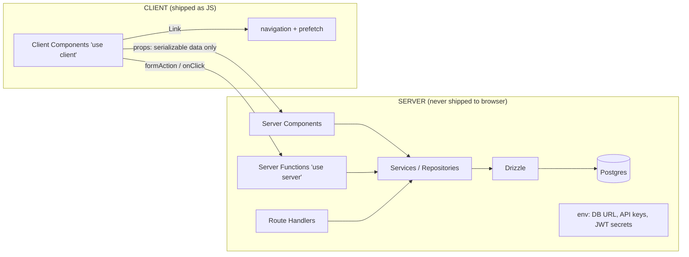
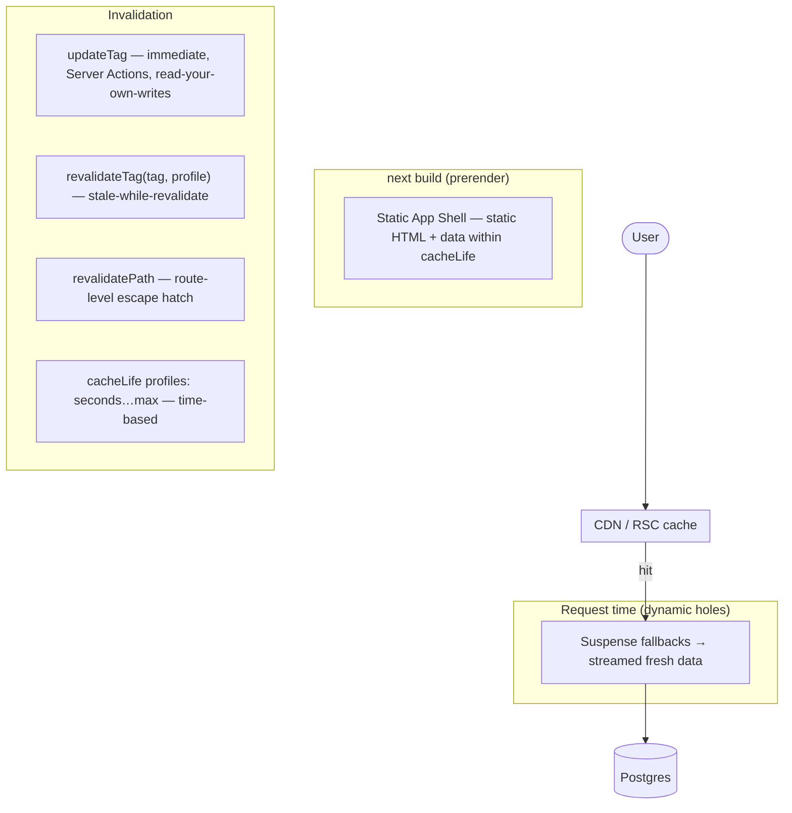
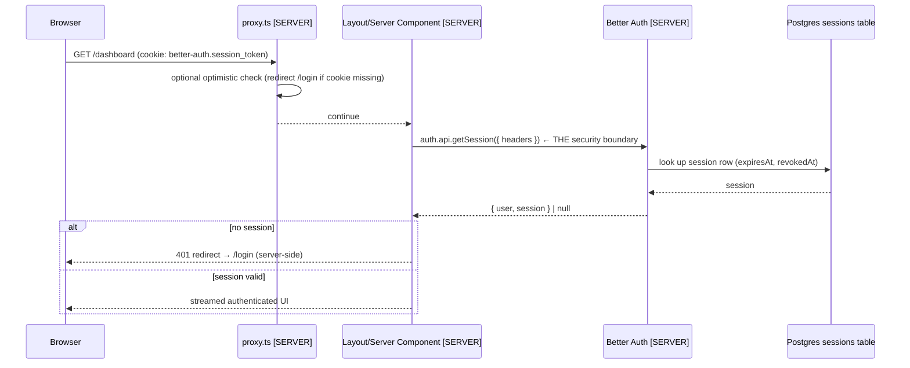
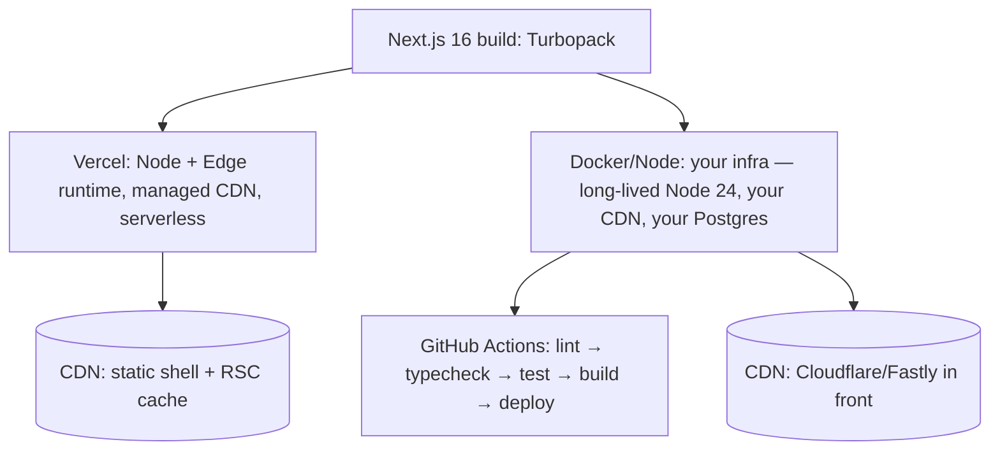

# The Modern Next.js Architecture Course

**Course context: September 2026 · Next.js 16.x (verified current stable: 16.3.6)**

> *"The objective is not 'I know Next.js.' The objective is: I understand the architecture and can design, build, debug, secure, optimize, test, and deploy a modern production Next.js application."*

---

## 1. Course Philosophy

This course is built on five principles:

1. **Mental models before APIs.** Next.js fails as a framework to learn if you memorize APIs without the model. Before any syntax, you will build an explicit model of *where code executes* (server vs browser), *when code executes* (build vs request vs client), and *who can see what* (client bundle vs server runtime vs database). Every API is then taught through that model with explicit `[SERVER]` / `[CLIENT]` / `[BOTH — BOUNDARY]` labels.

2. **Server-first by default.** The modern App Router is a *full-stack framework with a React client*, not "React + a build step." Every module teaches the question *"does this need to be a Client Component?"* — and the default answer is **no**. You will repeatedly see BAD architecture (whole pages as client components, self-fetched internal APIs, client-side authorization) before GOOD architecture.

3. **Current documentation only.** Every major technology in this course was verified against official documentation as of **September 28, 2026**. Where the ecosystem changed recently (Pages Router → App Router, `middleware.ts` → `proxy.ts`, the old fetch-cache model → Cache Components, `useSearchParams` sync → async request APIs, Auth.js → Better Auth), the course teaches the **modern** approach as primary and explains the **legacy** approach as "historical knowledge" for maintaining existing codebases.

4. **Tradeoffs, not dogma.** For every significant decision (Server Function vs Route Handler, Drizzle vs Prisma, Vercel vs Docker, Next.js caching vs TanStack Query, Better Auth vs Auth.js, Zustand vs Redux), you get a decision matrix: **WHEN, WHY, and the COST**. Nothing in this course is universally recommended.

5. **Measure first, optimize second.** The performance and debugging modules treat "fast" as a measurable property (Web Vitals, query plans, bundle budgets, TTFB) and walk through real investigations — including 15 deliberately broken examples you must diagnose.

### How the course is organized

- **26 numbered areas** (`00-overview` through `25-mastery`), roughly 60 modules.
- Every module follows the same anatomy:
  1. **Concept** — what it is, why Next.js has it
  2. **Mental Model** — dedicated section, always
  3. **Architecture** — diagrams (Mermaid)
  4. **Examples** — simplified first, then production code
  5. **Production Code** — labeled `FILE: src/...`, complete and runnable
  6. **Common Mistakes / Anti-Patterns**
  7. **Security Notes** and **Performance Notes**
  8. **Exercise** — Beginner / Intermediate / Production tiers
  9. **Architecture Challenge** — design problem, reasoning first, answer after
  10. **Official Documentation** — links
  11. **What You Should Know Before Continuing** — checklist
- All code is **TypeScript**.
- The entire course builds **one project**: the *Multi-tenant SaaS Commerce & Operations Platform* (capstone, Section 8 below), grown incrementally — never built at once.

---

## 2. Prerequisites

You are assumed to have completed a modern React course. Specifically:

| Skill | Expected level |
|---|---|
| JavaScript (ES2022+) | Confident: modules, async/await, closures, spread, optional chaining, `for...of`, destructuring |
| React 19 concepts | Components, props, state, hooks (`useState`, `useEffect`, `useRef`, `useMemo`, `useCallback`, `useContext`), custom hooks, lists & keys, `useTransition`/`useDeferredValue` awareness, Suspense awareness |
| HTML/CSS | Semantic HTML, Flexbox/Grid, responsive design |
| Git & terminal | Daily use |
| HTTP basics | Requests/responses, status codes, headers, cookies, POST vs GET, JSON |

What this course will **teach** you that plain React does not:

- React Server Components — how React renders on the server and serializes across the boundary
- Actions — how React ties mutations to the server (Server Functions / Server Actions)
- View Transitions, `useEffectEvent`, `<Activity>` (React 19.2)
- React Compiler 1.0 — automatic memoization, and when to trust it vs. not

TypeScript is taught *as needed for professional Next.js work* (type-safe props, generics, DTOs, discriminated unions, env typing, typed route params) — it is not a TS course.

---

## 3. Target Skill Level

**Mid-level engineer → senior full-stack Next.js engineer.**

By the end you will be able to:

- Architect a multi-tenant SaaS from scratch: routing, server/client boundaries, caching, auth, authorization, uploads, observability, deployment.
- Explain what happens on the wire for *any* request to a Next.js app (proxy → server component render → streaming → hydration → client navigation).
- Design and defend caching strategies: what is cached, where, for how long, who invalidates it, and what the user sees after invalidation.
- Secure an application against XSS, CSRF, SSRF, SQL injection, authorization bypass, open redirects, and secret leakage — with server-side enforcement as the only real boundary.
- Debug production incidents: stale caches, hydration mismatches, N+1 queries, leaked server code, race conditions.
- Evaluate and choose between the standard architectural alternatives in the ecosystem.

---

## 4. Learning Outcomes

After this course you will be able to answer, without looking it up:

1. **Architecture**: Why does Next.js exist? What problem does the App Router solve that plain React + a static host cannot? Why do Server Components exist, and what is actually serialized across the RSC boundary?
2. **Rendering**: When is a page static, dynamic, or a mix (PPR/static shell)? What happens at `next build` vs. at request time? Why is "static is faster" an incomplete sentence?
3. **Data**: Why should a Server Component query the database directly instead of hitting its own Route Handler? When *does* a Route Handler actually make sense (BFF, external consumers, webhooks, streaming)?
4. **Caching**: Given any piece of data, can you say precisely WHAT is cached, WHERE (browser / CDN / Next data cache / request memoization / DB cache layer), FOR HOW LONG (`cacheLife` profiles), WHO invalidates it (`updateTag` / `revalidateTag` / `revalidatePath`), and WHAT the user sees during invalidation (stale-while-revalidate vs. immediate expiry)?
5. **Mutations**: When to use a Server Function (action) vs. a Route Handler vs. an external API. How forms work with progressive enhancement. How validation errors round-trip. How optimistic UI works.
6. **Auth/Authz**: How cookie sessions work end-to-end. Why the Proxy is *not* your authorization boundary. 401 vs 403. RBAC + multi-tenancy with ownership checks that actually prevent cross-tenant reads.
7. **Security**: The full attack surface of a Next.js app and where each defense lives (client / server / DB / infra).
8. **Performance**: How to profile a slow page (dev logs, React DevTools profiler, Web Vitals, `EXPLAIN ANALYZE`, bundle analysis) and the ordered list of interventions.
9. **Testing**: A pyramid of Vitest unit tests, integration tests against a real Postgres, and Playwright E2E — testing behavior, not implementation.
10. **Deployment**: What changes when you deploy to Vercel vs. your own Node/Docker infra vs. edge runtimes — caching, filesystem, connections, env vars, background jobs.

---

## 5. Verified Modern Next.js Stack

> **Current Next.js version used in this course: 16.3.6** (verified on nextjs.org/docs, September 28, 2026). The 16.x line went stable **October 21, 2025**. Next.js 15.x is in maintenance (support ends October 2026).

Every row below was verified against official documentation or the project's official release channels as of **September 28, 2026**. Do not follow tutorials older than the "verified" column.

| Technology | Version (verified Sep 2026) | Official docs | Role in this course |
|---|---|---|---|
| **Next.js** | **16.3.6** (stable since Oct 2025) | https://nextjs.org/docs | The framework. App Router, RSC, Server Functions, Route Handlers, Proxy, Cache Components, Turbopack |
| **React** | **19.2** (App Router uses React canary built-in) | https://react.dev | Server Components, Actions, Suspense, View Transitions, `useEffectEvent`, `<Activity>` |
| **React Compiler** | **1.0** (stable, Oct 2025); stable support in Next.js 16 | https://react.dev/learn/react-compiler/introduction-to-react-compiler | Automatic memoization — a `create-next-app` prompt option |
| **TypeScript** | 5.x (minimum 5.1) | https://www.typescriptlang.org/docs/ | Language of every code sample |
| **Node.js** | **24 LTS** (recommended; 20.9+ is the Next.js minimum) | https://nodejs.org/docs | Server runtime, build toolchain |
| **Turbopack** | Stable; **default bundler** for `next dev` and `next build` | https://nextjs.org/docs/app/api-reference/turbopack | Dev HMR + production builds (webpack opt-out: `--webpack`) |
| **PostgreSQL** | **18** (released Sep 2025) | https://www.postgresql.org/docs/current/ | Primary database |
| **Drizzle ORM** | **v1.x** (stable since mid-2025) | https://orm.drizzle.team | Primary ORM (server-side data access) |
| **Prisma** | 7.x (alternative) | https://www.prisma.io/docs | Taught as the main alternative ORM |
| **Better Auth** | **1.6.x** (stable, weekly releases) | https://better-auth.com/docs | Primary authentication (cookie sessions in your DB) |
| **Auth.js (NextAuth)** | v4 maintenance / v5 never GA'd — **legacy** | https://authjs.dev | Taught as historical knowledge only |
| **Zod** | **4.x** (stable) | https://zod.dev | Runtime validation: forms, env, API boundaries, external data |
| **React Hook Form** | 7.x | https://react-hook-form.com | Client-side form state (paired with Zod resolver) |
| **Tailwind CSS** | **4.x** (CSS-first config, OKLCH) | https://tailwindcss.com/docs | Styling engine |
| **shadcn/ui** | Current (Tailwind v4 + React 19 compatible; registry-based) | https://ui.shadcn.com/docs | Component library (source you own) |
| **Radix UI** | Current | https://www.radix-ui.com/docs/overview | Primitives under shadcn/ui |
| **Motion (motion.dev)** | Current 12.x+ | https://motion.dev/docs/animation | Animation (CSS + React), View Transitions |
| **Vitest** | **5.x** (5.0 shipped Sep 3, 2026; requires Node ≥ 22.12) | https://vitest.dev | Unit + integration tests |
| **React Testing Library** | 16.x | https://testing-library.com/docs/react-testing-library/intro | Component behavior tests |
| **Playwright** | 1.x | https://playwright.dev | E2E tests |
| **MSW** | 2.x | https://mswjs.io | Mocking external APIs in dev/test |
| **TanStack Query** | 5.x | https://tanstack.com/query/latest/docs/overview | Client-side cache — evaluated, not assumed |
| **Zustand** | 5.x | https://zustand.docs.pmnd.rs | Chosen global client state (only where needed) |
| **i18n** | `next-intl` (current) | https://next-intl.dev | Internationalization module |
| **Docker** | Current | https://docs.docker.com | Production deployment path (non-Vercel) |

### Key "current" facts that outdated tutorials get wrong

| Topic | Old (≤15) | Current (16.x, this course) |
|---|---|---|
| Bundler | webpack default | **Turbopack default** (dev + build) |
| Request interception | `middleware.ts` (Edge default) | **`proxy.ts`** (Node.js runtime; `middleware.ts` deprecated) |
| Caching | implicit `fetch` caching, `revalidate` in segment config, `unstable_cache` | **Cache Components**: `'use cache'` + `cacheLife()` + `cacheTag()` (opt-in via `cacheComponents: true`) |
| On-demand invalidation | `revalidateTag(tag)` | `revalidateTag(tag, profile)` **and** `updateTag(tag)` (read-your-own-writes, Server Actions only) |
| Request APIs | sync `params`/`searchParams`/`cookies()`/`headers()` | **all async — required** |
| Linting | `next lint` | **removed** — run `eslint` directly (ESLint 9 flat config or Biome) |
| Project scaffolding | no linter choice / no React Compiler prompt | `create-next-app` prompts: TypeScript, **ESLint / Biome / None**, **React Compiler**, Tailwind, `src/`, App Router, alias, `AGENTS.md` |
| `next/image` | `priority` prop | verify current prop set in the Images module (16.x changed image preloading defaults) |
| Auth ecosystem | Auth.js v5 "the" choice | **Better Auth** for new projects (Auth.js now in maintenance under the Better Auth team; Vercel acquired Better Auth in Jul 2026) |

---

## 6. Technology Decision Matrix

Every "obvious" choice was actually decided. Here is the matrix.

### ORM: Drizzle v1 (primary) vs Prisma 7 (alternative)

| Criterion | Drizzle v1 | Prisma 7 |
|---|---|---|
| Schema | TypeScript files (same language as your code) | Separate `.prisma` schema language + generated client |
| SQL visibility | You write/read real SQL (query builder maps ~1:1) | Fluent API abstracts SQL |
| Edge-runtime / cold-start friendly | Yes (no engine binary, tiny runtime) | Improved in v7 (smaller bundle) but historically heavier |
| Types | Inferred from schema; full control | Excellent generated types |
| Migrations | `drizzle-kit` (generate SQL, review, apply) | `prisma migrate` (integrated studio) |
| Ecosystem momentum (2026) | Leading new Next.js SaaS projects | Still the largest installed base; Prisma Studio for inspection |
| Learning cost | Moderate (you see SQL) | Low (batteries-included) |

**Decision: Drizzle** — this course targets serverless/edge-aware full-stack architecture where connection behavior, cold starts, and readable SQL matter, and the TS-first schema aligns with the "types as the source of truth" theme. Prisma is taught fully in `09-database/06-prisma-alternative.md` — the concepts (schema, relations, migrations, pooling) transfer 1:1.

### Auth: Better Auth (primary) vs Auth.js (legacy) vs managed (Clerk/WorkOS)

| Criterion | Better Auth 1.6 | Auth.js (v4 maintained / v5 never GA'd) | Clerk/WorkOS (managed) |
|---|---|---|---|
| Session store | **Your database** (row per session → immediate revocation) | Database adapter or JWT | Vendor |
| Multi-tenancy/orgs | **Built-in** (orgs, members, roles) | DIY | Built-in |
| MFA / passkeys | Built-in (non-experimental) | Experimental (passkeys) | Built-in |
| TypeScript | First-class, inferred types | Manual type augmentation | Generated types |
| Data ownership | Yours | Yours | Vendor's |
| 2026 maintenance status | Actively developed (weekly releases); Vercel acquired the team Jul 2026 | Security-patch maintenance under the Better Auth team; maintainers point new projects to Better Auth | Active (commercial) |
| Cost | $0 | $0 | Free tier → paid |

**Decision: Better Auth** for the capstone SaaS. The course teaches the *underlying* concepts (identity, sessions, cookies, CSRF, rotation, revocation) **independently of the library** so you could rebuild the same flows on any stack. Managed auth is discussed for the "when to buy, not build" tradeoff.

### State management: local state + URL state + server state first; Zustand if genuinely needed

No global store by default. Order of preference: (1) React local state, (2) URL state, (3) server state (Next.js data fetching + Cache Components), (4) form state (React Hook Form), (5) **Zustand** for true cross-cutting client state (e.g., UI shell state across routes). Redux Toolkit is covered in the tradeoff module, not the main path.

### Testing: Vitest 5 + React Testing Library + Playwright + MSW 2

Vitest 5 (requires Node ≥ 22.12) for unit/integration, RTL for behavior-based component tests, Playwright for E2E, MSW for mocking *external* APIs (not your own server code — see the "when mocking stops" section in the testing module).

### Styling: Tailwind v4 + shadcn/ui

Tailwind v4's CSS-first config is native to the current `create-next-app`. shadcn/ui is taught as **source code you own** (registry + CLI copy model), not a black-box npm package — you will read its components, understand the Radix primitives underneath, and extend the design system.

---

## 7. Complete Course Roadmap

| Area | Modules | Builds (capstone stage) |
|---|---|---|
| **00 Overview** | Philosophy · Verified Stack · Core Mental Models · Roadmap | — |
| **01 Fundamentals** | Why Next.js & the mental model · Project setup (`create-next-app` deep dive) · Project structure · TypeScript for Next.js | **Stage 1: empty scaffold, correct structure** |
| **02 Routing (deep)** | App Router deep dive · Layouts/nesting/route groups · Dynamic & catch-all routes · `loading`/`error`/`not-found` · Redirects, parallel & intercepting routes · URL state · Instant Navigation & prefetching | **Stage 2: public site skeleton (landing, pricing, blog, catalog routes)** |
| **03 Server/Client Components** | Server Components deep dive · Client Components & boundaries · Serialization & prop constraints · Server-first architecture (bad vs good) | Boundaries established across the app |
| **04 Data Fetching** | Fetching in Server Components · Direct DB access & the service layer · Parallel fetching & waterfalls · Request lifecycle | **Stage 3: product catalog from Postgres** |
| **05 Caching (deep)** | Caching mental model (all cache layers) · Cache Components deep dive · `cacheLife` profiles · Revalidation (`updateTag`/`revalidateTag`/`revalidatePath`) · Static vs dynamic rendering · **Dashboard cache case study** · Previous model & migration | **Stage 10: full caching strategy** |
| **06 Streaming & Suspense** | Streaming deep dive · **Dashboard streaming lab** (Revenue / Orders / Activity / Analytics load independently) | Dashboard shell streams sections |
| **07 Server Functions & Actions** | Server Functions vs Server Actions (official terminology) · Forms & progressive enhancement · Validation & error round-trips · Optimistic UI & pending states · **Decision matrix: Action vs Route Handler vs external API** | **Stage 5–8 mutation paths (products, orders, profile)** |
| **08 Route Handlers & BFF** | Route Handlers deep dive · BFF architecture · API design & response contracts | Public API + BFF endpoints (webhooks, export) |
| **09 Database & ORM** | Postgres + Drizzle setup · Schema design & migrations · Queries & relations · Transactions, pagination, indexes · Connections & serverless pooling · Prisma alternative | **Stage 4: full data model (orgs, members, products, orders, users, sessions)** |
| **10 Authentication** | Identity/authn concepts · Better Auth architecture · Sessions & cookie security · Core flows (login/register/reset/verification/MFA concepts) · Auth with Cache Components | **Stage 5: real authentication** |
| **11 Authorization & RBAC** | RBAC + policy architecture · **Multi-tenancy (cross-tenant prevention)** · Frontend vs server boundaries, 401 vs 403 | **Stage 9: admin + user roles enforced server-side** |
| **12 Forms & Validation** | Forms deep dive · RHF + Zod integration · Server validation round-trips · Advanced forms (checkout, admin user management) | Product create/edit, profile, checkout |
| **13 UI & Design System** | Tailwind v4 · shadcn/ui architecture (read the source) · Design tokens & theming (dark mode) · Component patterns · Animation (Motion, View Transitions, reduced motion) · **Accessibility (throughout)** | **Stage 3: design system (Button → Toast, states, a11y)** |
| **14 SEO** | Metadata system (`generateMetadata`, OG images) · Structured data, sitemap, robots · SEO case studies (product page, blog) | **Stage 12: full SEO** |
| **15 Images & Fonts** | `next/image` deep dive · `next/font` deep dive | Product images, optimized typography |
| **16 File Uploads** | Multipart, validation, size/MIME, object storage, signed URLs, security | Product image uploads |
| **17 Data-Heavy Screens** | Search/filter/sort/pagination (URL-driven, cursor concepts) · Dashboard architecture | **Stages 7–8: Products table, Orders table, Admin users table, full dashboard** |
| **18 Performance** | Measure first · Server performance · Client performance (bundle, hydration, React Compiler) · Database performance (N+1, indexes) · Web Vitals instrumentation | **Stage 14: performance pass** |
| **19 Security** | Security model & responsibilities · Attack surface (XSS/CSRF/SSRF/CORS/SQLi/open redirect/…) · Headers, CSP, environment variables · Audit checklist | **Stage 15: security hardening** |
| **20 Testing** | Testing strategy & pyramid · Vitest + RTL (unit/integration, server code, actions, route handlers) · Playwright E2E (auth, authz, CRUD, navigation) · MSW & when mocking stops | **Stage 13: test suite** |
| **21 Observability & Analytics** | Structured logging, request IDs, error tracking, metrics, tracing concepts, failed-action monitoring · Analytics architecture & privacy | Monitoring wired into the app |
| **22 Deployment** | Deployment targets (Vercel vs Docker/Node vs other) · Node vs Edge runtimes · Docker & CI/CD · Background jobs · Internationalization (`next-intl`) | **Stage 15: deployed + CI/CD** |
| **23 Production Architecture** | Four backend architectures (Next-only, BFF, separate API, microservices) · State management evaluated · TanStack Query evaluated · **Architecture review checklist** (recurring) | Architecture decisions documented |
| **24 Capstone** | **PRD** (requirements, not implementation) · Design workshop (you design, then review) · Staged build (15 stages with folder trees & data-flow reviews) · Senior architect review | **The complete platform** |
| **25 Mastery** | Debugging lab (15 broken examples) · Anti-patterns compendium · Tradeoffs compendium · "What changed in modern Next.js" changelog · **Official documentation map** | Synthesis |

### Recommended study order

The roadmap order **is** the study order. Do not skip ahead to Caching (05) before Data Fetching (04) or to Authorization (11) before Authentication (10). The single most common way to learn this course wrong is to read it as a reference manual instead of a sequence — every module's "What You Should Know Before Continuing" section names exactly what you're missing if you skip.

---

## 8. Capstone Project Description

**"Acme Commerce Ops"** — a **multi-tenant SaaS Commerce & Operations Platform**.

> Why this shape? It forces every decision the course covers: public marketing (SEO, static, fast), authenticated commerce (cart, orders, uploads), a B2B operations console (RBAC, multi-tenancy, admin), heavy data screens (search/pagination/caching), and real production concerns (auth security, observability, deployment). A todo app would not.

### PUBLIC (no auth)
- Landing page (static, streamed, SEO-optimized, animated)
- Pricing page (comparison table, FAQ)
- Blog (dynamic metadata, sitemap, structured data, OG images)
- Product catalog (search, filter, sort, URL-driven pagination, cached)
- Product detail (gallery, `next/image`, structured data, social preview images)

### AUTH
- Registration, login, logout, password reset, email verification (concept + flow)
- Session management: secure cookies, rotation, expiration, revocation
- MFA concept module (TOTP)
- Rate limiting + account lockout concepts

### USER (authenticated, `member` role)
- Dashboard (streamed sections: Revenue / Orders / Recent Activity / Analytics)
- Profile & settings (forms, validation round-trips, optimistic updates)
- Products (own products: CRUD with file upload)
- Favorites, Cart, Orders (list + detail + tracking)
- Notifications (list + read/unread, badge)
- Dark mode (URL + state, accessible)

### ADMIN (`admin` role, server-enforced)
- Dashboard with analytics (cached, date-range filters)
- User management (search/filter/paginate table, suspend/restore, role change)
- Product management (all tenants, approve/delist)
- Order management (statuses, refunds concept)
- Organization/tenant management (multi-tenancy console)

### SYSTEM (cross-cutting)
- Search/filtering/sorting/pagination everywhere (URL state)
- File uploads (multipart → object storage → signed URLs)
- Notifications, dark mode, responsive UI
- Loading states (skeletons, streaming), error states (`error.tsx`, `not-found.tsx`)
- Optimistic mutations, caching with precise invalidation
- SEO, accessibility, testing, logging, monitoring, security headers, CI/CD

---

## 9. High-Level Architecture

```mermaid
flowchart TD
    B([Browser]) -->|1. GET / (initial load)| N[Next.js Server]
    N -->|2. Run proxy.ts| N
    N -->|3. Render Server Components| DB[(PostgreSQL 18)]
    N -->|3b. External APIs / CDN| EXT[External services]
    N -->|4. Stream HTML + RSC payload| B
    B -->|5. Hydrate Client Components only| B
    B -->|6. <Link> prefetch / client navigation| N
    B -->|7. POST Server Function (action)| N
    N -->|8. Validate → mutate → updateTag| DB
    N -->|9. Return new RSC payload (single roundtrip)| B
```

**The five execution surfaces** (repeated throughout the course):

```
Browser  →  Next.js (edge/CDN + server)
  ├── proxy.ts            [SERVER — network boundary, Node.js runtime]
  ├── Server Components   [SERVER — rendering + data access]
  │     ├── Database      [SERVER — Drizzle → PostgreSQL]
  │     ├── External APIs [SERVER — outbound fetch]
  │     └── Cache         [SERVER/CDN — Cache Components data + UI cache]
  ├── Server Functions    [SERVER — mutations, invoked by POST]
  ├── Route Handlers      [SERVER — HTTP APIs / BFF / webhooks]
  └── Client Components   [CLIENT — hydration, state, events, browser APIs]
```

---

## 10. Server/Client Architecture

The contract: **the server boundary is as large as possible; the client is a thin layer of interactivity.**



Rules enforced in every module:

1. **No `process.env` secrets in client bundles** — only `NEXT_PUBLIC_*` is inlined; the course shows the leak and how to catch it.
2. **No `next/headers`, `cookies()`, `params`, or DB imports reachable from a client component** — `server-only` package enforces it at build time.
3. **Props cross the boundary serialized** — functions, class instances, `Date`-heavy trees, etc., are constrained; the serialization module lists exactly what is allowed.
4. **Event handlers and browser APIs exist only in client components** — the server has no `window`, no `localStorage`, no event loop you control.

---

## 11. Caching Architecture

The modern (Next.js 16) model, taught in `05-caching/`:



**For every cached thing, the course answers five questions**: WHAT is cached (data value / UI fragment / whole page), WHERE (browser / CDN / Next data cache / request memoization / DB), FOR HOW LONG (`cacheLife` profile), WHO invalidates it (tag owner / mutation / time), WHAT the user sees after invalidation (stale-while-revalidate vs. hard wait).

The dashboard case study (`05-caching/06`) assigns a profile to each section — Revenue (`hours`), user-specific data (no cache — runtime data), permissions (request-sensitive), Analytics (`hours`, tagged), Recent Orders (tagged + `updateTag` after mutation) — and explains **why** for each.

---

## 12. Authentication Architecture



Principles:

1. **Proxy = UX, not security.** `proxy.ts` may do an *optimistic* "no cookie? redirect" to save a roundtrip — it is never the authorization boundary (official docs say so explicitly).
2. **The layout/server component check is the boundary.** Every protected route re-resolves the session server-side.
3. **Cookie sessions, not localStorage tokens.** HttpOnly + Secure + SameSite=Lax; rotation on reuse; immediate revocation by deleting the session row (Better Auth's model).
4. **Authorization is a separate module** (11): roles, permissions, resource ownership, multi-tenant scoping — enforced in the *service layer*, not the UI.

---

## 13. Database Architecture

```
Server Component / Server Function / Route Handler   [SERVER]
        ↓ (typed DTOs in/out)
Service / Repository layer (src/services/…)          [SERVER — the only place that knows SQL]
        ↓
Drizzle ORM                                          [SERVER]
        ↓ (pooled connections — pgbouncer or managed pooler in prod)
PostgreSQL 18                                        [SERVER/INFRA]
```

Rules:

1. **Database code lives server-side, always.** `server-only` import guard; no DB import reachable from any client component.
2. **The service layer is the seam** — Server Components never write raw queries; they call services that return plain DTOs (serializable, tenant-scoped).
3. **Multi-tenancy is enforced at the service layer**: every query carries `orgId` (from the session), not from client input.
4. **Connections are a deployment concern** (module 09-05): long-lived Node server → native pool; serverless → pooler (PgBouncer/managed) with `preparedStatements` caveats; edge → HTTP-based drivers only.

---

## 14. Deployment Architecture

Two first-class paths, taught fully; both run the same code.



| Concern | Vercel | Docker/Node (self-hosted) |
|---|---|---|
| Server execution | Serverless functions (Node.js runtime) + Edge | Long-lived Node process |
| Filesystem | Ephemeral per function → no app-filesystem storage; use object storage | Persistent (but still prefer object storage in prod) |
| DB connections | Pooler required (no long-lived connections) | Direct pool OK (or pooler at scale) |
| Cache (`use cache`) | In-memory per function instance + platform cache handlers (`'use cache: remote'` for durable) | In-memory per process; add `cacheHandlers` (e.g., Redis) for shared cache |
| Background jobs | Queues/external workers (function time limits) | Workers in-process or sidecar |
| Env vars | Platform UI/API | `.env` / secret manager |
| Migrations | Run in CI before deploy | Run in CI / container entrypoint (carefully) |

The course never assumes Vercel. Every "it just works on Vercel" behavior is explained as *a platform capability you must replicate or replace elsewhere* (official "Deploying to Platforms" guide is the reference).

---

## 15. Learning Strategy

1. **Read → build → break.** Every module: read the mental model, build the production example, then do the exercise. The debugging module (25) is the exam: 15 broken apps, diagnose before reading the fix.
2. **Label everything as you code.** In your capstone repo, comment every file with `[SERVER]` / `[CLIENT]`. If you can't label a file, stop and re-read 03-server-client-components.
3. **Architecture reviews at phase boundaries** (after 03, 05, 07, 11, 17, 22): stop coding and answer the review checklist in `23-production-architecture/04` about the current app state.
4. **The five caching questions** (WHAT/WHERE/HOW LONG/WHO/WHAT-AFTER) are answered in writing for every new cached surface you add.
5. **Measure, don't guess**: from module 18 on, every performance claim must come from a number (dev server Compile/Render logs, Web Vitals panel, `EXPLAIN ANALYZE`, bundle report).
6. **Skip policy**: optional deep-dives are marked ⚡ (e.g., Prisma alternative, i18n, analytics vendors). Core path never depends on an optional module.
7. **One capstone, grown over 15 stages** — see `24-capstone/03-staged-build.md` for the stage-by-stage folder trees and data-flow reviews.

---

## Repository Map

```
README.md                     ← you are here (course front matter)
00-overview/                  philosophy · verified stack · mental models · roadmap
01-fundamentals/              why Next.js · project setup · structure · TypeScript
02-routing/                   App Router deep, layouts, dynamic routes, URL state, navigation
03-server-client-components/  RSC, boundaries, serialization, server-first architecture
04-data-fetching/             fetching, service layer, parallelism, request lifecycle
05-caching/                   mental model, Cache Components, cacheLife, revalidation, case study
06-streaming-suspense/        streaming deep dive + dashboard lab
07-server-functions/          Server Functions/Actions, forms, optimistic UI, decision matrix
08-route-handlers-bff/        route handlers, BFF, API design
09-database/                  Postgres + Drizzle, schema, queries, pooling, Prisma
10-authentication/            concepts, Better Auth, sessions, flows, + Cache Components
11-authorization/             RBAC, multi-tenancy, 401/403
12-forms-validation/          forms, RHF+Zod, server round-trips, advanced
13-ui-design-system/          Tailwind v4, shadcn, tokens, components, animation, a11y
14-seo/                       metadata, structured data, sitemaps, case studies
15-images-fonts/              next/image, next/font
16-file-uploads/              multipart, object storage, signed URLs, security
17-data-screens/              search/filter/sort/pagination, dashboard architecture
18-performance/               methodology, server/client/DB performance, Web Vitals
19-security/                  model, attacks, headers/CSP/env, audit
20-testing/                   strategy, Vitest+RTL, Playwright, MSW
21-observability-analytics/   logging/metrics/tracing, analytics
22-deployment/                targets, runtimes, Docker/CI-CD, jobs, i18n
23-production-architecture/   architectures, state, TanStack Query, reviews
24-capstone/                  PRD, design workshop, staged build, review
25-mastery/                   debugging lab, anti-patterns, tradeoffs, changelog, docs map
```

**Status:** being written module-by-module in roadmap order. Each module ends with "What You Should Know Before Continuing" — that checklist is your progress tracker.
